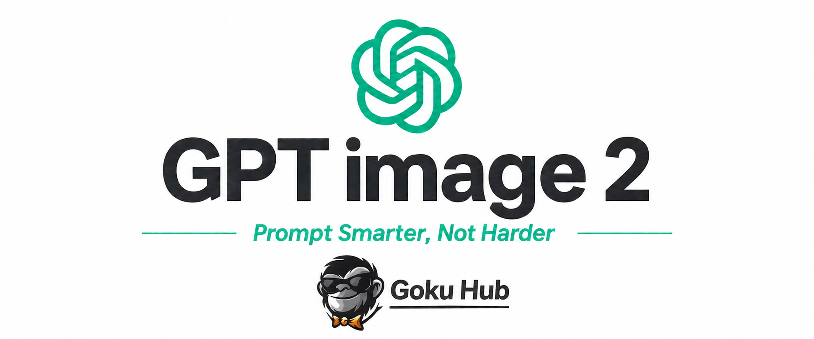
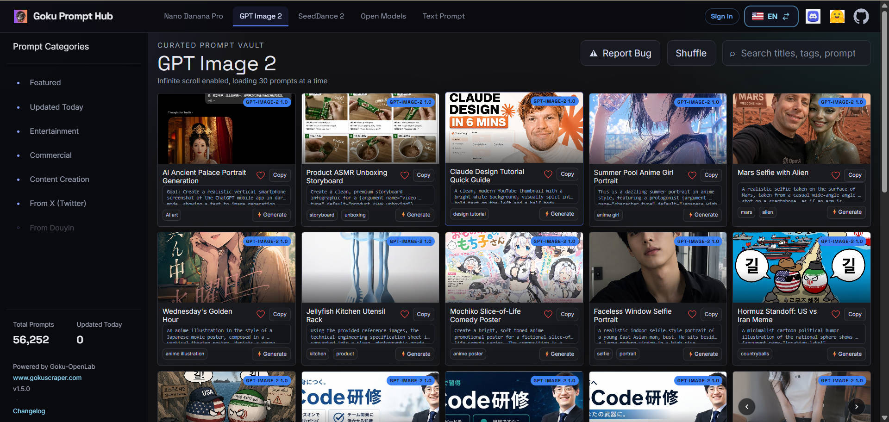

<a href="https://prompthub.gokuscraper.com">
  
</a>

# 🚀 GPT Image 2 Prompts

> 🎨 A curated collection of creative prompts for GPT Image 2

[](README.md) [](README_zh.md)


## 🌐 View in Web Gallery

<div align="center">

[](https://prompthub.gokuscraper.com)

</div>

**[👉 Browse on Goku Prompt Hub](https://prompthub.gokuscraper.com)**

Why use our gallery?

| Feature | GitHub README | Goku Prompt Hub |
|---------|--------------|---------------------|
| 🎨 Visual Layout | Linear list | Beautiful Masonry Grid |
| 🔍 Search | Ctrl+F only | Full-text search with filters |
| 🤖 AI One-Click Generation | - | AI one-click generation |
| 📱 Mobile | Basic | Fully responsive |
| 🏷️ Categories | - | Category browsing |

---
## 💾 HuggingFace Dataset

<div align="center">

[](https://huggingface.co/datasets/Goku-OpenLab/gpt-image-2-prompts-datasets)

</div>

Contains 15,672+ GPT Image 2 prompts and generated images, suitable for batch analysis and secondary creation.

---
## 📊 Statistics

<div align="center">

| Metric | Count |
|--------|-------|
| 📝 Total Prompts | **15672** |
| 🔄 Last Updated | **Wednesday, July 22, 2026 at 1:21:05 AM UTC** |

</div>

---
## 📋 All Prompts

### No. 1: Fauré Requiem Classical Thumbnail


#### 📖 Description

Create a 16:9 editorial YouTube thumbnail about classical music, with a dignified photorealistic studio portrait of an elderly 19th-century French composer res…

#### 📝 Prompt

```
Create a 16:9 editorial YouTube thumbnail about classical music, with a dignified photorealistic studio portrait of an elderly 19th-century French composer resembling Gabriel Fauré on the left half of the frame. He has wispy white hair, a high forehead, tired serious eyes, a large white handlebar mustache, and wears a formal black frock coat with satin lapels, a white high-collar shirt, and dark cravat. Use a muted warm brown textured studio backdrop with soft vignette lighting and empty negative space on the right for typography. Add exactly two text blocks: at the upper right, a large bold all-caps Spanish headline in bright golden yellow with dark drop shadow reading {argument name="headline text" default="«EL ARRULLO DE LA MUERTE»"}, arranged across three stacked lines; at the lower right, a smaller bold white caption with subtle black shadow reading {argument name="composer and work text" default="Gabriel Fauré\nRéquiem, Op. 48"}, arranged across two lines. The composition should feel like a serious music essay cover: solemn, refined, slightly dramatic, high contrast between the black suit and brown background, clean typography, no extra logos, no watermark, no additional text.
```

#### 🖼️ Generated Images

##### Image 1

<div align="center">

</div>

**[🐵 Try it on Goku Prompt Hub](https://prompthub.gokuscraper.com)**

---

### No. 2: Kawaii Japanese Chalkboard Sign


#### 📖 Description

Goal: Create a hand-drawn Japanese chalkboard sign advertising {argument name="service type" default="cleaning"}, with a cute, friendly, handmade storefront-bo…

#### 📝 Prompt

```
Goal: Create a hand-drawn Japanese chalkboard sign advertising {argument name="service type" default="cleaning"}, with a cute, friendly, handmade storefront-board look.

Canvas: Horizontal blackboard poster in a 3:2 aspect ratio, dark matte black background with visible chalk texture, slightly cropped at the bottom as if photographed close-up.

Layout: Large title across the top in thick white chalk: 「クリーニング」. Add small decorative chalk lines, dots, swirls, and sparkle icons around the title in yellow, mint, and blue. On the left middle, place a pink speech-bubble outline containing the text 「こんな方に」 in white and 「おすすめ！」 in mint green. Beneath the bubble, draw one cute black cat mascot outlined in white chalk, winking, with round cheeks, whiskers, triangular ears, and one raised paw with pink paw pads. On the right middle, create one rectangular mint-green chalk outline information box with rounded corners. Inside it, list exactly 4 bullet points, each preceded by a pink paw-print icon: 1) 「忙しくて手が回らない…」 2) 「常に人を呼べる家にしておきたい…」 3) 「掃除が苦手 or 体力的に大変…」 4) 「普段使用しない建物など…」. Separate the bullet rows with dashed yellow divider lines. Across the lower center, add a wide curved ribbon banner in teal outline and black fill, with bold yellow chalk text: 「お任せ下さい!!」. Below the ribbon, include smaller white chalk text: 「分かってるけど後回しな場所です」 with a pink wavy underline.

Visual style: Japanese kawaii chalk art, rough hand-lettering, imperfect strokes, dusty chalk smudges, playful but readable typography, high contrast white/yellow/mint/pink on black. Use decorative sparkles, dots, corner borders, paw prints, and short emphasis marks, but keep the design organized like a professional shop sign.

Constraints: Use exactly 1 cat mascot, 1 speech bubble, 1 main information box, 4 paw-print bullet items, and 1 ribbon banner. Keep all visible text in Japanese exactly as specified. No photorealistic objects, no digital glossy effects, no watermark.
```

#### 🖼️ Generated Images

##### Image 1

<div align="center">

</div>

**[🐵 Try it on Goku Prompt Hub](https://prompthub.gokuscraper.com)**

---

### No. 3: Convert Portrait to Ghibli Style


#### 📖 Description

Convert this portrait to {argument name="Anime style" default="Studio Ghibli Animation Style"}. {argument name="Color" default="Soft Colors"}, hand-drawn lines…

#### 📝 Prompt

```
Convert this portrait to {argument name="Anime style" default="Studio Ghibli Animation Style"}. {argument name="Color" default="Soft Colors"}, hand-drawn lines with a warm background
```

#### 🖼️ Generated Images

##### Image 1

<div align="center">

</div>

##### Image 2

<div align="center">

</div>

**[🐵 Try it on Goku Prompt Hub](https://prompthub.gokuscraper.com)**

---

### No. 4: Enchanted Violet Garden Maiden


#### 📖 Description

A highly detailed anime fantasy portrait of a beautiful young woman seated at a stone table in an enchanted flower garden at golden hour, framed from the waist…

#### 📝 Prompt

```
A highly detailed anime fantasy portrait of a beautiful young woman seated at a stone table in an enchanted flower garden at golden hour, framed from the waist up in a vertical composition. She has {argument name="hair color" default="platinum blonde"} hair that is long, silky, glossy, and carefully groomed, with smooth flowing strands, soft waves, delicate shine, no frizz, no messy texture, and an elegant partial updo with a braided side twist and a gold hair ornament. Her visible styling should emphasize healthy, luxurious hair with clean strand definition and luminous highlights. She wears an ornate fantasy dress in {argument name="outfit colors" default="black, white, and violet"}, featuring a high black collar with gold filigree, white floral lace over the bodice, translucent puffed sleeves with lace cuffs, jeweled purple crystal ornaments, and elegant arm accessories. A large faceted violet gemstone pendant rests at her chest, with matching purple earrings and decorative accents. Her pose is graceful and refined, one hand lightly raised near her chin and the other holding a small bouquet of purple flowers. Surround her with blooming violet flowers in the foreground and background, glowing butterflies, drifting petals, and a dreamy cathedral-like garden with gothic arches and spires softly blurred in the distance. Place an open book on the table in the lower foreground. Use warm backlighting, rim light through the hair, soft magical bloom, pastel lavender and pink atmosphere, sparkling particles, shallow depth of field, ultra-detailed textures, polished anime illustration, romantic fantasy mood, ethereal elegance, and a luxurious painterly finish.
```

#### 🖼️ Generated Images

##### Image 1

<div align="center">

</div>

**[🐵 Try it on Goku Prompt Hub](https://prompthub.gokuscraper.com)**

---

### No. 5: Raw Flash Night Portrait


#### 📖 Description

Create a 9:16 vertical raw iPhone-style flash portrait, shot as if on an {argument name="camera model" default="iPhone 17 Pro"} with a 24mm lens. The look shou…

#### 📝 Prompt

```
Create a 9:16 vertical raw iPhone-style flash portrait, shot as if on an {argument name="camera model" default="iPhone 17 Pro"} with a 24mm lens. The look should feel unedited, high contrast, imperfect, and real, with the harsh direct-flash character of a late-night phone photo. Set the scene in a {argument name="location" default="dim bedroom"} at night with a quiet but slightly chaotic after-hours mood. Keep the ambient light very low and neutral, letting the phone flash dominate the image. The flash should create sharp highlights across the face, glossy skin reflections, deep shadow falloff in the background, subtle grain, mild flash blowout, and a touch of wide-angle lens distortion. Frame the subject tightly from the face through the upper torso, close to the camera and slightly from below, with an imperfect handheld crop. The subject has a {argument name="inspiration" default="BLACKPINK Lisa-inspired"} presence: clean facial features, a bold direct gaze, and a confident, slightly teasing expression. She leans a little toward the camera with relaxed shoulders. Her lips look soft but controlled, and her eyes stay intense and locked on the viewer. Style her with slightly messy straight hair and bangs. Dress her in a minimal tight grey thin-strap top. Keep the image focused on raw phone realism: direct flash, visible texture, high contrast, bedroom darkness, casual framing, and the feeling of a real spontaneous selfie rather than a polished studio portrait.
```

#### 🖼️ Generated Images

##### Image 1

<div align="center">

</div>

**[🐵 Try it on Goku Prompt Hub](https://prompthub.gokuscraper.com)**

---

### No. 6: Handcrafted Paper-Cut Diorama Illustration


#### 📖 Description

Convert this image into a {argument name="style" default="soft, handcrafted paper-cut layered illustration style"}, inspired by papercraft diorama aesthetics.…

#### 📝 Prompt

```
Convert this image into a {argument name="style" default="soft, handcrafted paper-cut layered illustration style"}, inspired by papercraft diorama aesthetics. Use smooth rounded shapes, simplified cute character proportions, and {argument name="facial details" default="minimal facial details (dot eyes, blush cheeks)"} to create a warm, charming look. Apply stacked paper layers with visible depth, subtle shadows between layers, and clean cut edges that resemble {argument name="material" default="laser-cut cardstock"}.
```

#### 🖼️ Generated Images

##### Image 1

<div align="center">

</div>

**[🐵 Try it on Goku Prompt Hub](https://prompthub.gokuscraper.com)**

---

### No. 7: Shonen Street Anime Makeover


#### 📖 Description

Please create secondary creations based on the real photos uploaded by users, transforming the characters in the photos into Japanese-style passionate shonen m…

#### 📝 Prompt

```
Please create secondary creations based on the real photos uploaded by users, transforming the characters in the photos into Japanese-style passionate shonen manga / urban street anime character posters.

Please preserve each person's true identity features, including face shape, facial proportions, hairstyle basics, skin tone, sense of age, body type, and overall temperament. Please recreate a brand-new full-body anime illustration so that all characters are fully visible, from head to toe.

Art style reference: Japanese-style shonen manga color pages, urban street anime posters, clean and powerful black line art, distinct anime-style features, sharp and layered hair, clear clothing folds, slight pencil draft feel, partial watercolor or marker coloring, low-saturation tones, paper textures.

Please freely design your character {argument name="fashion style" default="Tokyo street fashion"} outfits, with a youthful, relaxed, cool vibe, and practical wearability. You can use oversized jackets, cropped tops, loose T-shirts, cargo pants, wide-leg pants, pleated skirts, canvas shoes, platform shoes, shoulder bags, headphones, necklaces, phones, coffee mugs, and more. In multi-person scenes, outfits should have colors or accessories that echo each other, but not exactly the same.

Please freely design positions and poses that have a more anime poster feel; do not take ordinary side by side photos. It can be one in front and one behind, back-to-back, walking candid shots, leaning against a wall, sitting on steps and standing in misalignment, one looking at the camera and one looking to the side, one walking in front and one looking back. The overall picture should have character relationships and a sense of storyboarding.

Please freely create a {argument name="background scene" default="Japanese Urban Comic Scene"} based on the character's temperament, number of people, poses, and outfits. It can be at the corners of Tokyo's streets and alleys, convenience store entrances, subway station exits, under old apartment buildings, school rooftops, street stairs, in front of vintage shop windows, next to vending machines, outside coffee shops, under streetlights at night, streets after rain, under city overpasses, old poster walls, comic-style city blocks, and more.

Backgrounds can include elements such as line art, spray painting, graffiti, old posters, house numbers, street stickers, handwritten text, ink drips, arrows, stars, crowns, small expressions, brick walls, steps, glass windows, street signs, vending machines, railings, wires, streetlights, and more. The background should have spatial layers and a sense of life.

Overall atmosphere: Japanese shonen manga, urban street vibe, youth, relaxed, cool, slightly rebellious, fashion magazine illustration style, manga color pages.
```

#### 🖼️ Generated Images

##### Image 1

<div align="center">

</div>

##### Image 2

<div align="center">

</div>

##### Image 3

<div align="center">

</div>

**[🐵 Try it on Goku Prompt Hub](https://prompthub.gokuscraper.com)**

---

### No. 8: Dreamy Korean Idol Window Portrait


#### 📖 Description

{argument name="aspect ratio" default="9:16"} vertical — {argument name="subject" default="Korean idol portrait photography"}, single subject soft black mist f…

#### 📝 Prompt

```
{argument name="aspect ratio" default="9:16"} vertical — {argument name="subject" default="Korean idol portrait photography"}, single subject  soft black mist filter effect, lowered contrast, gentle highlight bloom, subtle glow, soft diffusion, slightly faded blacks  minimal indoor setting near window, white curtains, clean light-toned background  young Korean female idol, natural minimal makeup, dewy realistic skin texture, subtle imperfections  outfit: {argument name="outfit" default="oversized white button-up shirt + short bottoms"}, slightly loose fit, soft and casual styling, no revealing elements  hair: long dark hair, slightly messy, natural volume, softly flowing  pose: relaxed standing or slight lean, body subtly angled, one leg slightly forward, shoulders relaxed; one hand lightly touching collar or resting near neckline, the other relaxed; gentle body curve without exaggeration  expression: soft cute smile, slightly playful eyes, direct or slightly off-camera gaze  camera: close to mid-body framing, eye-level, intimate distance, slight handheld feel  lighting: diffused natural daylight, soft shadows, gentle light wrapping around face and body  mood: cute yet subtly sensual, intimate, everyday softness, quiet romantic atmosphere  quality: ultra-realistic, fine film grain, slight softness at edges, natural imperfections, dreamy understated tone
```

#### 🖼️ Generated Images

##### Image 1

<div align="center">

</div>

**[🐵 Try it on Goku Prompt Hub](https://prompthub.gokuscraper.com)**

---

### No. 9: Girl Stroking Fawn in Meadow


#### 📖 Description

A hyper-realistic, fully 4K resolution outdoor portrait photo shows a fair-skinned young woman with a brown high ponytail and wispy hair on both sides of her c…

#### 📝 Prompt

```
A hyper-realistic, fully 4K resolution outdoor portrait photo shows a fair-skinned young woman with a brown high ponytail and wispy hair on both sides of her cheek, bending down to gently stroke a young sika deer. She wears a warm, sincere, and toothy smile; her skin is soft, glowing, and moist, clearly revealing natural pores and textures. She wears deep red lipstick, with subtle contours under her eyes, and small gold earrings capturing the light. A flowing multi-pattern silk shawl is loosely wrapped around her shoulder and arm, blending geometric tribal prints, blue-and-white herringbone stripes, navy blue color blocking, and tan leopard print patchwork, draped over a navy spaghetti strap vest that reveals one shoulder. She pairs it with high-waisted ivory wide-leg pants, the fabric naturally ruffled and drapes. Her right hand affectionately rested on the deer's back, her fingers gently burrowing into its fur. 
This deer is a young sika deer with large, alert, upright ears showing fine internal fur details and visible veins. Its reddish-brown fur has distinct white spots, dark glassy eyes reflecting highlights, and a moist black nose standing calmly, its body slightly turned left toward the camera, positioned in the lower left foreground of the frame. 
Environment: An open grassy park with soft-focused green lawns in the background, scattered deciduous trees, and a faintly visible low wooden fence on the right edge. Natural overcast light, softly diffused uniform illumination, with soft, realistic shadows and precise skin subsurface scattering. 
Technical specifications: Uses a full-frame SLR camera paired with an 85mm portrait lens at an f/2.2 aperture, medium to close-up composition, shallow depth of field, and smooth, delicate bokeh effects. The focus is sharply focused on the subject's eyes and the deer's face, with a line of view angle. Ultra-high detail, clear and delicate textures (fabric texture, fur, skin), natural color grading, green tones slightly dull and warm skin tones, soft and realistic contrast, no artificial skin smoothing or plastic skin feel, authentic editorial lifestyle photography aesthetics. Aspect ratio 4:5, full 4K detail level.
```

#### 🖼️ Generated Images

##### Image 1

<div align="center">

</div>

**[🐵 Try it on Goku Prompt Hub](https://prompthub.gokuscraper.com)**

---

### No. 10: Umbrella Abyss Silent Figure


#### 📖 Description

Create a hyper-realistic surreal cinematic vertical artwork of a solitary {argument name="subject" default="young adult man"} standing completely still in the…

#### 📝 Prompt

```
Create a hyper-realistic surreal cinematic vertical artwork of a solitary {argument name="subject" default="young adult man"} standing completely still in the exact center of an enormous infinite white room. He faces the camera frontally with a calm, unreadable expression, hands in the pockets of a long black wool overcoat layered over a black hoodie, black trousers, and black sneakers. Use {argument name="face detail" default="a softly blurred anonymous face"} while keeping the pose and body realistic. Around him, gravity-defying glossy black water rises upward from the reflective floor in elegant liquid arcs and twisting splash forms, like dark ink sculpted into waves on both sides of his body, with many suspended droplets and beads frozen midair. Above him and receding deep into the background, show exactly 35 open black umbrellas floating upside-down or suspended in rows at varying depths, including one very large umbrella centered above his head, with curved J handles visible; the umbrellas create a tunnel-like perspective. Heavy rain falls vertically throughout the scene from ceiling to floor, streaking across the frame. The environment is minimalist and monochrome: bright white luminous walls, glossy mirror-like floor, faint vertical light panels along the sides, deep perspective vanishing point behind the subject, and strong reflections of the man, umbrellas, raindrops, and black water on the wet floor. Visual style: ultra-realistic, high-detail, surreal fashion editorial, dark cinematic mood, cool gray-white lighting, sharp central subject, slight depth-of-field blur on distant umbrellas and foreground splashes, dramatic contrast between black clothing/liquid and the white room. Composition: vertical 3:4 portrait, centered symmetry, full-body view, low-to-mid camera height, no text, no logos, no watermark.
```

#### 🖼️ Generated Images

##### Image 1

<div align="center">

</div>

**[🐵 Try it on Goku Prompt Hub](https://prompthub.gokuscraper.com)**

---

### No. 11: Retro Summer Backlight Portrait


#### 📖 Description

Use the accompanying images as primary facial references while preserving recognizable identity essence, facial proportions, natural asymmetry, facial harmony,…

#### 📝 Prompt

```
Use the accompanying images as primary facial references while preserving recognizable identity essence, facial proportions, natural asymmetry, facial harmony, natural facial features, and authentic skin texture.

A high-end compact digital digital camera photo from the early 2000s, featuring extreme motion blur and soft dreaminess, using a mix of flash and natural daylight, shot outdoors under a deep cobalt blue midday sky. The camera is positioned at an extremely low angle directly beneath the subject, looking upward. She raised one forearm across her face to shield her face from the glaring sunlight, while softly laughing, with only part of her eyes and upper cheek visible between her fingers. Her head was slightly lowered toward the camera, and the hair scattered from her messy bun shone brilliantly under the strong backlight. Intense sunlight captures stray hair, shifting sweatshirt fabrics, subtle body movements, and slight camera shakes—all of which together form the physical causes of Dream Lens's soft focus in motion.

She wore a large oversized washed navy fleece sweatshirt with thick ribbed cuffs and a subtle vintage fading effect. Apart from minimalist small studs, there are no jewelry. The pristine blue sky fills almost the entire background, emphasizing a carefree outdoor atmosphere.

Premium retro ultra-thick optical lenses feature low resolution, pronounced spherical aberration, deliberate soft focus drift, intense veil flare, optical halo, reduced sharpness, enhanced shadows, enhanced blacks, soft vintage optical effects, heavy JPEG softness, raw unfiltered CCD digital camera color response, and very subtle warm white balance. The heavy vintage lens produces creamy optical soft focus rather than digital blur, giving the image the impression of viewing through thick vintage glass.

Controlled bursts of slight highlight. Small, irregular cut-off white highlights naturally appear in glowing messy hair, moist lips, fingertips, sweatshirt fibers, lashes, and bright skies. The flash combines strong daylight, producing a soft gradient through thick optical lenses while maintaining physical accuracy, with no flicker, flash filters, or starburst effects.

Healthy, moisturized, and radiant skin, with real pores faintly visible under the dreamy lens's soft focus. The warm rosy tones are concentrated on the cheeks and naturally rosy, hydrated lips, with only subtle accents on the bridge of the nose and chin.

Makeup: Fresh luxurious glassy skin makeup with naturally feather-like upward brushed eyebrows, cool gray contact lenses with softly reflective highlights, sharply defined lashes, blended warm gray eyeshadow, and distinct shimmering highlights applied above the cheekbones, nose bridge, tip, philtrum, inner eye corners, brow bone, and chin center. The shimmering highlights remain among the most clearly recognizable makeup elements, while preserving the true skin texture beneath them.

Despite the reduced contrast, the colors retain depth and richness. A washed navy blue sweatshirt, warm, sunlit skin, bright cobalt blue sky, golden contoured glowing hair, and soft peach-colored lips remain clean, shiny, vivid, and naturally separated, without becoming dull or oversaturated.

Lighting uses physics-based accurate material reflections. Direct flash gently dissolves facial shadows, while sunlight from above creates a strong contour glow around the hair. The skin displays a broad, shiny mirror highlighter with smooth transitions, lips showing a moist reflective highlight, hair catching slender golden reflections, while the fleece fabric maintains a soft matte finish with subtle fiber textures.

Natural handheld composition, dramatic wormhole perspective, slight Dutch tilt, slight imperfections, and nostalgic, sophisticated summer snapshots with a carefree, spontaneous atmosphere.

--ar 4:5

Negative cues: identity change, beauty filters, plastic skin, waxy skin, matte skin, oily skin, harsh sharpness, dry sharpening, excessive micro-contrast, HDR, ultra-sharp faces, plain colors.
```

#### 🖼️ Generated Images

##### Image 1

<div align="center">

</div>

##### Image 2

<div align="center">

</div>

**[🐵 Try it on Goku Prompt Hub](https://prompthub.gokuscraper.com)**

---

### No. 12: Double Exposure Fashion Poster Design


#### 📖 Description

multi-exposure poster design featuring an {argument name="subject" default="Over-sized body young Indian woman"} portrait. wavy shoulder hair bouncy part of th…

#### 📝 Prompt

```
multi-exposure poster design featuring an {argument name="subject" default="Over-sized body young Indian woman"} portrait. wavy shoulder hair bouncy part of the middle of hair,, wearing dark sunglasses, {argument name="outfit" default="red formal coat pant with white shirt"} , and a silver chain necklace with black heels. The composition features a large, expressive close-up portrait of the woman left, blending into a full-body shot of the same women walking confidently forward on the right, photography like model .The background is a dramatic, ethereal scene In the left bottom corner add a small triangle with a stylized "⚔️" inside it and a text "{argument name="text" default="AvelyrahnAi"}" beneath it. Keep the face 100% same as in the uploaded picture. Over-sized body portrait.
```

#### 🖼️ Generated Images

##### Image 1

<div align="center">

</div>

**[🐵 Try it on Goku Prompt Hub](https://prompthub.gokuscraper.com)**

---

### No. 13: Vast Plain Two Sheep Grazing


#### 📖 Description

An aerial drone shot of an expansive, perfectly flat, {argument name="terrain color" default="vibrant green"} grassy plain stretching endlessly to a distant ho…

#### 📝 Prompt

```
An aerial drone shot of an expansive, perfectly flat, {argument name="terrain color" default="vibrant green"} grassy plain stretching endlessly to a distant horizon. In the lower foreground, exactly two {argument name="animal" default="fluffy white sheep"} are standing and grazing. Bright, clear daylight casts sharp, dark shadows from the animals towards the left. Above the horizon is a {argument name="sky condition" default="clear, pale blue sky with a few faint, wispy clouds"}. The composition emphasizes the vast emptiness and scale of the landscape compared to the small animals.
```

#### 🖼️ Generated Images

##### Image 1

<div align="center">

</div>

**[🐵 Try it on Goku Prompt Hub](https://prompthub.gokuscraper.com)**

---

### No. 14: Grotesque Insect-Spider Stage Spectacle


#### 📖 Description

Using the provided sketch as the composition and creature-design base, transform it into a finished cinematic scene: render the sketched monster as a realistic…

#### 📝 Prompt

```
Using the provided sketch as the composition and creature-design base, transform it into a finished cinematic scene: render the sketched monster as a realistic grotesque insect-spider stage creature on the same circular pedestal, keeping the central pose, multiple legs, spikes, open mouth, and domed display/stage concept. Change the rough notebook drawing into {argument name="visual style" default="dramatic black-and-white vintage horror photography"} with high contrast, film grain, smoky atmosphere, and a strong overhead spotlight. Replace the simple sketched arch with an ornate theater proscenium: exactly 2 tall side curtains, 2 carved side columns, and 2 small floor lanterns near the stage. Add a formal theater audience in the foreground, seen from behind, with exactly 20 visible spectators in period eveningwear watching the creature. Make the image vertical, like a staged performance photograph from {argument name="era" default="the 1930s"}. Keep the mood eerie, theatrical, and grand; do not include notebook paper, pencil lines, handwritten symbols, modern objects, or color.
```

#### 🖼️ Generated Images

##### Image 1

<div align="center">

</div>

**[🐵 Try it on Goku Prompt Hub](https://prompthub.gokuscraper.com)**

---

### No. 15: Melancholic Girl by Rainy Car Window


#### 📖 Description

A cinematic night street scene in heavy rain, shot from outside a car with a close three-quarter view of the rear side window. A young woman with {argument nam…

#### 📝 Prompt

```
A cinematic night street scene in heavy rain, shot from outside a car with a close three-quarter view of the rear side window. A young woman with {argument name="hair color" default="dark brown"} shoulder-length wet hair leans her folded arms on the open car window frame and rests her head on them, gazing outward with a quiet, melancholic mood. She wears a {argument name="top color" default="white"} long-sleeve blouse. The car body fills the right half of the frame, covered in dense sparkling raindrops, with the window trim and door surface sharply detailed. The woman’s face is partially obscured by shadow and framing, creating anonymity and mystery. The left half of the image shows an out-of-focus city street with exactly 2 warm amber streetlights visible as glowing orbs near the top and middle distance, plus multicolored bokeh from traffic and signage in red, blue, white, and orange. Wet asphalt reflects the lights in long streaks. Visible rain streaks fall through the scene. Use a shallow depth of field, strong orange-and-teal color contrast, glossy reflections, moody noir atmosphere, realistic photography, high contrast, soft filmic bloom, and a slightly overprocessed AI-photo feel with occasional high-frequency sparkle and rain noise. Square composition.
```

#### 🖼️ Generated Images

##### Image 1

<div align="center">

</div>

**[🐵 Try it on Goku Prompt Hub](https://prompthub.gokuscraper.com)**

---

### No. 16: Red Alert Allied Building Style


#### 📖 Description

{argument name="building style" default="Red Alert 2 Allied Consruction Building"}!

#### 📝 Prompt

```
{argument name="building style" default="Red Alert 2 Allied Consruction Building"}!
```

#### 🖼️ Generated Images

##### Image 1

<div align="center">

</div>

**[🐵 Try it on Goku Prompt Hub](https://prompthub.gokuscraper.com)**

---

### No. 17: Stylish Dreamer on Vintage Bus


#### 📖 Description

A fashionable young woman sits at the front edge of an old-fashioned vintage bus, wearing a red long trench coat, a wool brimless beanie, round blue reflective…

#### 📝 Prompt

```
A fashionable young woman sits at the front edge of an old-fashioned vintage bus, wearing a red long trench coat, a wool brimless beanie, round blue reflective sunglasses, a layered necklace, and rugged brown leather boots. She has wavy blonde hair and a confident and dreamy expression, gazing up at the sky. The bus paint peeled off, showing greenish and rust-red tones. Bright and clear blue sky, very few city buildings, soft daylight, cinematic color grading, shallow depth of field, high-end stylish travel atmosphere, edited photography, hyper-realistic, 4K resolution, sharp focus, natural skin texture, dramatic composition, cinematic still frame aesthetics.
```

#### 🖼️ Generated Images

##### Image 1

<div align="center">

</div>

**[🐵 Try it on Goku Prompt Hub](https://prompthub.gokuscraper.com)**

---

### No. 18: Luxury Bathroom Portrait Photography


#### 📖 Description

Ultra-realistic luxury portrait photography, confident athletic man standing in front of a premium modern bathroom mirror, leaning forward with both hands rest…

#### 📝 Prompt

```
Ultra-realistic luxury portrait photography, confident athletic man standing in front of a premium modern bathroom mirror, leaning forward with both hands resting on a {argument name="surface" default="polished black marble countertop"}. The subject wears a {argument name="outfit" default="perfectly fitted black dress shirt"} with the top buttons open, revealing a subtle silver chain necklace. {argument name="grooming" default="Short dark hair styled neatly with a clean fade"}, strong masculine facial structure, sharp jawline, warm confident smile, flawless skin texture, natural grooming.
The composition captures both the man and his blurred reflection in the mirror, creating a sophisticated dual-perspective effect. Warm cinematic LED mirror lighting frames the subject on both sides, producing soft highlights on the face and realistic shadows. Luxury dark-stone interior, matte black bathroom accessories, premium modern architecture, minimalist high-end design.
Eye-level camera angle, direct eye contact with the camera through the mirror, shallow depth of field, ultra-detailed skin pores, realistic fabric texture, subtle watch visible on the wrist, natural hand positioning on the countertop. Professional fashion editorial photography, luxury lifestyle campaign, cinematic color grading, soft warm tones, photorealistic reflections, HDR quality, 85mm lens, f/1.8 aperture, ultra-sharp focus on the face, creamy bokeh background, magazine-cover quality, 8K resolution, masterpiece, highly detailed, realistic lighting, premium men's fashion advertisement.
```

#### 🖼️ Generated Images

##### Image 1

<div align="center">

</div>

**[🐵 Try it on Goku Prompt Hub](https://prompthub.gokuscraper.com)**

---

### No. 19: Summer Roadside Girl in White


#### 📖 Description

Description: A snapshot of a young East Asian woman traveling by a country road in summer. The person is around early twenties, with a light, gentle, and youth…

#### 📝 Prompt

```
Description: A snapshot of a young East Asian woman traveling by a country road in summer. The person is around early twenties, with a light, gentle, and youthful aura. Her long black-brown hair is tied into low twin ponytails, her face is petite, and her features are clean. The first impression is fresh, relaxed, and a daily snapshot with a retro CCD photoshoot. The subject is a young woman standing at the edge of the road, her body tilted to the right of the frame, her head slightly tilted to the left, her face facing the camera, and her eyes quietly and directly at the photographer. Her expression was a slight smile and natural relaxation, not a deliberately staged commercial expression. Her long black-brown hair is styled into low twin ponytails, strands slightly tousled by the wind, with fine bangs and a few loose strands close to her cheeks, and light pink hair accessories or hair ties behind her ears that add a soft, youthful charm. Facial makeup is very light, skin tends to be fair, and under strong sunlight there is slight overexposure and a powdery effect, preserving the true texture of the skin without smoothing to the plastic-like feel. She wears a white sleeveless high-neck loose dress or long top, made of lightweight cotton, with natural pleats and creases on the front, and a puffy white long skirt at the hem. The entire outfit is heavily whitened by sunlight, with slight details lost but the fabric texture still visible. On her right shoulder, she carries a small white shoulder bag, the body fitting against her waist, arms hanging naturally, her right hand near the lower edge of the frame, fingers relaxed without any deliberate styling, body facing the camera but shifting her center of gravity, creating a tilted pose captured casually. The setting is an outdoor country road or a mountain path, with a clear summer afternoon sky and a vast blue sky tinged with thin white clouds. The figure stands at the right edge of the asphalt road, with a black road extending into the distance. The road surface has a yellow centerline, and on the right are continuous silver guardrails and a row of white streetlights that slope into the distance, creating a clear sense of depth. On the left side of the painting are grass, a shoulder shoulder, a concrete boundary, and a gray utility pole. The wire runs through the top of the image, creating a touch of everyday clutter. Not far behind the figure is an inverted triangular traffic sign, with a light gray metallic finish on the back, creating an accidental street composition. In the distance, there are low green hillsides, fields, and thickets. The background is overall clear but slightly blurred due to the old digital camera quality, not modern large aperture blur. The spatial relationship is closer to casual travel records: the foreground features people and roadside grass, the middle is roads, guardrails, signs, and streetlights, and the distantly are hills, sky, and clouds. The mood is a blend of summer, freshness, rural travel, Japanese photoshoots, and millennial retro snapshots. The image has an imperfect but very authentic relaxed temperament, like a friend casually taking a photo with an old digital camera by the roadside. The figure's posture is slightly tilted, the composition is accidental, the sunlight is strong, the air bright, and the white dress, blue sky, and green hillside together form a clean yet slightly faded youthful feel. Overall, it's not a retouched studio shoot or a movie lighting, but rather a roadside documentary photo with a sense of life documentation, carrying a nostalgic vibe of 2000s card drives, travel albums, and old photos from social media. Photography and image quality: Using older CCD digital cameras or early consumer-grade compact cameras, similar to low-resolution home cameras with straight-out effects, image resolution is relatively limited, details slightly gelatinized, edges lacking sharpness, and old sensor noise and compression marks appear in dark areas and grassy areas. Portrait contours are not as sharp and clean as modern HD cameras, but have a bit of soft focus, slight out-of-focus, compression, and digital smudging. The lens could be a small sensor wide-angle lens; close-up shots cause slight spatial stretching, with the person approaching the lens and the background road and streetlights shrinking into the distance. The lighting is a clear afternoon with direct hard sunlight, with the sun positioned higher and in the upper right of the frame, strongly illuminating the figure's white clothes and bare arms. The white dress and top show obvious overexposure, with highlights turning white and fabric details partially absorbed by sunlight. The face is also illuminated by strong light, but due to the tilt of the head and the obstruction of the hair, there is a slight transition of shadow on the face, faint gaze in the eyes, faint reflections on the bridge of the nose, cheeks, and forehead, and the edges of the hair strands are drawn out by sunlight to create a faint brilliance and rim light. The shadowed areas of grass and roadside are much darker than the figures, creating a strong contrast. The shadows in the grass on the left lean toward greenish and gray, while the black asphalt on the right road absorbs light, making the shadow edges harder (Hard shadows). The overall color is CCD direct-output, the sky leans blue, the green vegetation is dense but slightly grayish, the figure's white dress is cool white with a slight blue tint, the image has a slightly faded film filter and low dynamic range, bright areas tend to overflow and dark areas lack transparency. The photos retain slight gray haze, low resolution, digital grain, compression noise, local overexposure, slight vignetting, and unpolished imperfections, emphasizing authentic travel shots rather than modern high-definition commercial portraits. Composition: Vertical 3:4 portrait composition, viewed from the top of the person's head to beneath the hem of the skirt, near the half-body to seven-part roadside portrait. The figure occupies most of the center-right area of the frame, the head is positioned slightly to the left in the upper half of the frame, and the body tilts from upper left to lower right, forming an unstable but natural dynamic line. The camera is used for close-up shots from a head-up or slightly low position; the lens is not completely horizontal, and the overall image has a slight tilt, creating a spontaneous composition of the people, roads, and signs. The triangular traffic sign is positioned behind the character's head, serving as a prominent geometric background element, with the sign and utility poles forming vertical lines behind the figure; The right road, guardrail, and a row of streetlights extend into the distance, creating a strong sense of spatial depth; The grass and utility pole on the left provide foreground and edge cover, while the sky has a large blank space, making the scene appear open. The depth of field is not obviously blurred; both the subject and background retain some recognizability, but due to the old camera's image quality and compression, the distant hillsides, streetlights, and clouds have a slight softening effect. The overall composition should not be overly neat; keep the realistic candid effect of the person tilting their head, body tilting, signs pressing behind their heads, and the edge of the road close to their bodies. Ratio: 3:4
```

#### 🖼️ Generated Images

##### Image 1

<div align="center">

</div>

##### Image 2

<div align="center">

</div>

**[🐵 Try it on Goku Prompt Hub](https://prompthub.gokuscraper.com)**

---

### No. 20: Tiny Mini-Me Selfie Magic


#### 📖 Description

Using the provided reference selfie, keep the original photo composition, outfit, lanyard, badge, hand pose, indoor ceiling background, perspective, and real-w…

#### 📝 Prompt

```
Using the provided reference selfie, keep the original photo composition, outfit, lanyard, badge, hand pose, indoor ceiling background, perspective, and real-world lighting mostly unchanged. Remove the solid face-obscuring square and reconstruct a plausible natural face for the person, matching the hairstyle, head angle, skin tone, and selfie lighting. Add exactly 7 tiny 3D animated “mini-me” versions of the same person in a cute Pixar-like style, integrated into the scene with realistic contact shadows, depth, reflections, and matching warm light: 1 standing on the left shoulder with arms crossed, 1 standing on top of the badge waving, 1 hugging the right edge of the badge with eyes closed, 1 peeking out from the shirt collar, 1 sitting on the lanyard near the badge in a thinking pose, 1 sitting on the front yellow lanyard strap looking upward, and 1 hanging from the lower lanyard strap with both hands. Make the mini characters wear simplified matching dark clothing and tiny lanyards, interacting naturally with the real objects. Add a subtle magical sparkle atmosphere without changing the realistic selfie base. Overall mood: playful, adorable, and convincing as a miniature world inside the original photo.
```

#### 🖼️ Generated Images

##### Image 1

<div align="center">

</div>

**[🐵 Try it on Goku Prompt Hub](https://prompthub.gokuscraper.com)**

---

### No. 21: Korean Minimalist Fashion Portrait


#### 📖 Description

A polished photorealistic vertical full-body fashion portrait of an adult woman standing calmly in a minimalist sunlit room. She has long straight black hair w…

#### 📝 Prompt

```
A polished photorealistic vertical full-body fashion portrait of an adult woman standing calmly in a minimalist sunlit room. She has long straight black hair with a soft center part, fair chok-chok skin, gentle hazel-gray eyes, soft pink lips, and a quiet composed expression with chok-chok skin. She wears {argument name="outfit" default="a fitted white short-sleeve T-shirt under a sheer beige mesh slip dress with delicate seam details, layered over relaxed faded blue ripped jeans and cream platform sneakers"}. A small silver necklace adds subtle detail. The room has {argument name="room walls" default="warm ivory walls"}, a large window with sheer curtains, pale carpet, and soft morning sunlight casting long shadows. Clean Korean editorial fashion mood, natural skin texture, fine hair detail, airy negative space, muted beige palette, cinematic composition
```

#### 🖼️ Generated Images

##### Image 1

<div align="center">

</div>

##### Image 2

<div align="center">

</div>

##### Image 3

<div align="center">

</div>

##### Image 4

<div align="center">

</div>

**[🐵 Try it on Goku Prompt Hub](https://prompthub.gokuscraper.com)**

---

### No. 22: Rebel Beauty Streetwear Campaign


#### 📖 Description

Photorealistic close-up beauty campaign portrait of a stunning young Western woman with long, voluminous curly dark hair, defined cheekbones, thick expressive…

#### 📝 Prompt

```
Photorealistic close-up beauty campaign portrait of a stunning young Western woman with long, voluminous curly dark hair, defined cheekbones, thick expressive eyebrows, and flawless luminous skin. Her features are sharp yet feminine, with a confident, slightly rebellious expression.

She wears a premium black and {argument name="color scheme" default="hot-pink"} baseball cap featuring bold, glowing {argument name="accent color" default="hot-pink"} 3D lettering “{argument name="name" default="SHARON"}” on the front, designed like a high-end streetwear brand logo. Trendy translucent pink-tinted round glasses sit perfectly on her face. A beige band-aid is placed on the bridge of her nose and another on her left cheek, adding a stylized edgy aesthetic. A lit cigarette rests between her slightly parted lips, revealing perfect white teeth.

Highly detailed miniature anime-style figurines (cute detective-inspired girl character: short brown bob haircut, oversized sparkling blue eyes, round glasses, bright red overalls, white shirt, yellow gloves) interact playfully across the composition: one sitting on the brim of the cap, one climbing her ear, one pulling her lower lip, one tucked inside her shirt collar, and one posed on her shoulder. A bold, oversized cyan pencil is tucked under the cap strap, acting as a striking graphic element.

Wardrobe styling: luxury streetwear aesthetic — black structured jacket layered over a crisp white-and-pink striped collared shirt, finished with a neatly tied pink scarf.

Color palette: deep blacks, vibrant hot-pink highlights, electric cyan accents, and warm yellow pops for contrast.

Lighting: high-end studio lighting with soft frontal illumination and dramatic rim lighting for depth and separation. Clean white seamless background.

Composition: ultra-sharp focus, editorial framing, luxury fashion advertisement style, cinematic depth, hyper-realistic textures (visible skin pores, detailed fabric weave, individual hair strands), 8K resolution, extremely intricate detailing.

Mood: bold, playful, high-fashion, Gen-Z luxury streetwear campaign, blending realism with surreal miniature storytelling.
```

#### 🖼️ Generated Images

##### Image 1

<div align="center">

</div>

**[🐵 Try it on Goku Prompt Hub](https://prompthub.gokuscraper.com)**

---

### No. 23: Sailor Girl by the Window


#### 📖 Description

A black-and-white manga-style illustration of a Japanese high school girl in a sailor uniform, shown from the chest up in side profile, standing by a classroom…

#### 📝 Prompt

```
A black-and-white manga-style illustration of a Japanese high school girl in a sailor uniform, shown from the chest up in side profile, standing by a classroom or school hallway window. She has long straight {argument name="hair color" default="black"} hair with glossy inked highlights, loose strands blowing gently to the right as if caught by a breeze. Her face is intentionally obscured by a large centered rectangular gray censor block covering the eyes, nose, and most of the face. She wears a traditional {argument name="school uniform" default="navy sailor uniform"} with a dark sailor collar, triple stripe trim, long sleeves, and a neatly tied neckerchief. The composition is vertical and tightly cropped, with the girl occupying most of the frame, her head slightly bowed and posture calm, introspective, and melancholic. The background shows 1 window frame, 1 exterior railing, and 1 simplified school building structure rendered with thin architectural linework. Use clean pen-and-ink line art, high-contrast shading, halftone screentone textures, delicate crosshatching, sparse minimalist background detail, and elegant manga panel aesthetics. Monochrome only, white paper background, subtle cinematic lighting, emotional slice-of-life atmosphere, highly detailed hair and fabric folds.
```

#### 🖼️ Generated Images

##### Image 1

<div align="center">

</div>

##### Image 2

<div align="center">

</div>

##### Image 3

<div align="center">

</div>

**[🐵 Try it on Goku Prompt Hub](https://prompthub.gokuscraper.com)**

---

### No. 24: Sunlit Gothic Library Anime Breakfast


#### 📖 Description

Create a detailed anime-style fantasy illustration of two elegant characters having breakfast together in a sunlit gothic library. The scene shows {argument na…

#### 📝 Prompt

```
Create a detailed anime-style fantasy illustration of two elegant characters having breakfast together in a sunlit gothic library. The scene shows {argument name="character pair" default="a petite young woman with very long black hair and a tall silver-haired man"} seated at a wooden breakfast table, both with their faces intentionally obscured by soft rectangular blur masks. The woman sits on the left wearing a deep navy silk robe or kimono-inspired morning gown with black lace trim, a blue gemstone necklace, earrings, and an ornate blue flower hair accessory; she holds a fork in one hand and rests her cheek on the other hand in a relaxed morning pose. The man sits on the right, much taller and broad-shouldered, with spiky pale silver hair, earrings, a pendant necklace, an open black shirt, and a dark embroidered robe with silver ornamental patterns; he holds a plate of scrambled eggs in one hand and a spoon in the other as if serving or eating. The table contains exactly 12 visible breakfast and table items: 1 plate of scrambled eggs with tomato and greens in front of the woman, 1 plate of scrambled eggs held by the man, 1 cup of coffee or tea on a saucer, 1 white lidded teapot or sugar pot, 1 small clear glass bottle, 1 small ornate metal condiment holder, 1 plate of sliced bread, 1 platter with greens, sliced meat, and a halved boiled egg, 1 glass bowl of green and dark purple grapes, 1 basket of croissants, 1 large round loaf or pastry at the front right, and 1 brown teapot at the far right. Add a folded newspaper on the table with the readable English headline {argument name="newspaper headline" default="CELESTIAL LIBRARY"}. The background is an ornate old-world library with tall bookshelves, carved wood furniture, gothic arched windows, long blue-and-gold hanging banners, a decorative sign that also reads Celestial Library, vases of purple flowers, small bottles and curios, and warm morning sunlight streaming through the windows. Use a rich painterly anime rendering style with intricate linework, cinematic lighting, warm gold highlights, cool blue shadows, soft dust-filled atmosphere, high detail in fabrics and food, and a cozy yet aristocratic fantasy mood. Use a horizontal 4:3 composition, waist-up framing of the two characters, the table in the foreground, and the library receding behind them. Avoid modern objects except the newspaper, avoid extra people, and keep the image text minimal and mostly decorative.
```

#### 🖼️ Generated Images

##### Image 1

<div align="center">

</div>

**[🐵 Try it on Goku Prompt Hub](https://prompthub.gokuscraper.com)**

---

### No. 25: Dark Idol Cover Poster


#### 📖 Description

Create a high-end artist editorial poster with a strong sense of fashion magazine, musical visuals, and experimental typography. Theme: [Artist / Music / Album…

#### 📝 Prompt

```
Create a high-end artist editorial poster with a strong sense of fashion magazine, musical visuals, and experimental typography.

Theme: [Artist / Music / Album / Stage / Identity / Performance Theme]
Direction: [Dark Idol cover poster / Double silhouette artist poster / Glit-back gradient portrait / Dark performance editorial poster]
Artist type: [Male idol / Female artist / Dancer / Electronic musician / Underground singer / Fashion performer]
Main Title: [Short Title]
Subtitle: [Short Subtitle]
Finesse: [Optional editorial details]
Emotion: [Dark / Lonely / Sharp / Mysterious / Cold / Emotional / Experimental / Cinematic]
Color Palette: [Black-White-Gray / Black-Red / Soft Solid / Dark Silver]
Aspect ratio: [9:16]

Posters should feel like high-end music magazine covers, artist posters, album concepts, stage visuals, or fashion editorial covers.

Using black-and-white photography, strong contrast, realistic human textures, expressive eyes, natural hair, editorial styling, bold typography, grain, print texture, and controlled white space. Typography should not be merely decoration—it should shape the entire visual structure.

Choose a direction:

1. Dark Idol cover poster
   Use close-ups or close-up black-and-white portraits of artists, dark shadows, messy hair, cold expressions, a strong accent color (like deep red), and huge vertical headlines.

2. Dual silhouette artist poster
   A massive black side silhouette is used as the main structure, with smaller full-body artists placed inside or beneath it. Maintain a minimalist, emotional feel that matches the album cover.

3. Faulty gradient portraits
   Use clear headshots and shoulder portraits, gradually dissolving into horizontal scan lines, digital distortion, or signal blur. Maintain a minimalist, gray, futuristic, and experimental layout.

4. Dark Performance Editorial Poster
   Use full-body or nearly full-body performers in tense stage positions. Add dark spaces, fine perspective lines, body tension, dramatic shadows, and large titles spanning the composition.

Maintain a high-end, editorial, cinematic, and design-driven outcome.

Avoid cheap template designs, pop poster clichés, messy collages, too many stickers, overused streetwear graphics, fake plastic-like skin, terrible human anatomy, twisted faces, random text blocks, weak typography, cartoon style, and authentic copyrighted magazine logos.

Only one completed poster is generated.
```

#### 🖼️ Generated Images

##### Image 1

<div align="center">

</div>

**[🐵 Try it on Goku Prompt Hub](https://prompthub.gokuscraper.com)**

---

### No. 26: Tiffany Luxury Poster Design


#### 📖 Description

The two attached images show a single woman. Using this image. A Japanese product created by a professional designer {argument name="brand name" default="Tiffa…

#### 📝 Prompt

```
The two attached images show a single woman. Using this image. A Japanese product created by a professional designer {argument name="brand name" default="Tiffany & Co."} Create four visual patterns for poster ads. Add the copy "{argument name="Catchphrase" default="With Love, Since 1837\nInner strength is not about finding it, but about building it." }" For clothing, use {argument name="brand name" default="Tiffany & Co."} Change clothes to match the visuals and adjust the background. Anyway, be mindful of the image quality like an advertisement, the camera squeezing, and the lighting.
```

#### 🖼️ Generated Images

##### Image 1

<div align="center">

</div>

##### Image 2

<div align="center">

</div>

**[🐵 Try it on Goku Prompt Hub](https://prompthub.gokuscraper.com)**

---

### No. 27: Summer Skincare Ad


#### 📖 Description

A radiant young woman with dewy, glowing skin lies on a soft {argument name="towel style" default="blue-and-white striped"} towel under bright natural sunlight…

#### 📝 Prompt

```
A radiant young woman with dewy, glowing skin lies on a soft {argument name="towel style" default="blue-and-white striped"} towel under bright natural sunlight, holding a {argument name="color" default="pastel blue"} sunscreen tube labeled “LUMASKIN Sun Veil SPF Cream” gently against her cheek. She has a relaxed expression, minimal makeup, and slightly tousled dark hair styled in a loose bun. Surrounding her are fresh summer elements: bowls of blueberries and raspberries, sliced grapefruit on a plate, and a glass of pink fruit-infused drink with berries and ice. The composition is a top-down flat lay with vibrant colors, crisp shadows, and a fresh, summery skincare advertisement aesthetic, high detail, soft highlights, and a clean lifestyle beauty photography style.
```

#### 🖼️ Generated Images

##### Image 1

<div align="center">

</div>

**[🐵 Try it on Goku Prompt Hub](https://prompthub.gokuscraper.com)**

---

### No. 28: Industrial Packaging Design Sheet


#### 📖 Description

Using the attached image, create a professional industrial packaging design illustration sheet for the packaging of {argument name="product name" default="[PRO…

#### 📝 Prompt

```
Using the attached image, create a professional industrial packaging design illustration sheet for the packaging of {argument name="product name" default="[PRODUCT NAME]"}

Feature a centered hero 3D render with realistic materials, soft studio lighting, and commercial-grade finish quality.
Surround the hero render with technical views: front, side, top, bottom, angled perspective, and flat layout.

Include structural construction sketches, fold lines, seam details, and dimension arrows with measurements in millimeters.
Show materials and finishes (matte, glossy print, plastic, paper, glass, etc.) using handwritten-style annotations.
Add color swatches, realistic product illustrations, and subtle shadows.

Background should resemble {argument name="background style" default="clean sketchbook paper"}, combining realistic rendering with pencil sketch overlays.
Modern industrial design aesthetic, ultra-detailed, portfolio-ready presentation.
```

#### 🖼️ Generated Images

##### Image 1

<div align="center">

</div>

##### Image 2

<div align="center">

</div>

**[🐵 Try it on Goku Prompt Hub](https://prompthub.gokuscraper.com)**

---

### No. 29: Cyber Mage Anime Girl


#### 📖 Description

A dynamic anime illustration of a {argument name="character age vibe" default="teen girl"} with long {argument name="hair color" default="dark brown"} twin tai…

#### 📝 Prompt

```
A dynamic anime illustration of a {argument name="character age vibe" default="teen girl"} with long {argument name="hair color" default="dark brown"} twin tails tied with 2 oversized pink ribbon bows shaped like cat ears, vivid blue eyes, and a serious confident expression. She is posed in an exaggerated chuunibyou-style stance, one hand spread dramatically in front of the camera with strong foreshortening and all five fingers clearly visible, the other hand framing one eye, as if casting a spell or controlling a digital field. She wears a white lab coat over a dark navy school uniform with a collared shirt, vest, tie, and pleated skirt. The scene is a futuristic neon laboratory or cyber-magic room filled with glowing purple and blue light, floating holographic interface fragments, a bright horizontal audio waveform crossing the background, and a curved row of 11 translucent rectangular cards or panels floating on the left side. On the right side, a ring of 10 floating cat-face emoji icons glows in pink, purple, and blue, with different cute and mischievous expressions. Add one large glass bottle in the lower left foreground. Her long hair streams outward with motion, and purple energy ribbons swirl around her body. Use dramatic cinematic lighting, high contrast, glossy highlights, detailed fingers, intense perspective, sparkling particles, and polished high-end anime key visual rendering in a mystical cyberpunk palette of violet, indigo, and magenta.
```

#### 🖼️ Generated Images

##### Image 1

<div align="center">

</div>

**[🐵 Try it on Goku Prompt Hub](https://prompthub.gokuscraper.com)**

---

### No. 30: Streamer Thanks Fan for Rocket Gift


#### 📖 Description

{ "type": "mobile live stream app screenshot", "aspect_ratio": "9:16", "subject": { "description": "{argument name=\"subject description\" default=\"beautiful…

#### 📝 Prompt

```
{
  "type": "mobile live stream app screenshot",
  "aspect_ratio": "9:16",
  "subject": {
    "description": "{argument name=\"subject description\" default=\"beautiful young Asian woman with long dark hair wearing an off-the-shoulder white top\"}",
    "action": "smiling warmly at the camera, holding up a white paper sign with both hands",
    "sign_content": "{argument name=\"sign text\" default=\"Thank you, Brother Zhazao, for your big rocket! \"} with a small hand-drawn heart"
  },
  "background": "cozy softly lit bedroom, warm fairy lights, shelves with a teddy bear and decorative lamps",
  "ui_elements": {
    "top_header": {
      "broadcaster_profile": {
        "avatar": "female portrait",
        "name": "{argument name=\"broadcaster name\" default=\"Xiaoya\"}",
        "subtitle": "235,000 likes for this session"
      },
      "follow_button": "Follow",
      "top_viewers_count": 3,
      "total_viewers": "26,000",
      "close_button": "X"
    },
    "floating_badges": [
      "Hourly List",
      "More live >",
      "Gift Pavilion 0/24"
    ],
    "gift_overlay": {
      "position": "middle left",
      "style": "purple pill shape",
      "content": "{argument name=\"gift sender name\" default=\"Brother Zhazamao\"} Send {argument name=\"gift name\" default=\"Big Rocket\"}",
      "icon": "3D rocket",
      "multiplier": "x1"
    },
    "chat_area": {
      "position": "bottom left",
      "message_count": 6,
      "messages": [
        "Sweetheart: Singing is great!" ,
        "Happy Every Day: So Beautiful",
        "{argument name=\"gift sender name\" default=\"Brother Zhazamao\"} Send {argument name=\"gift name\" default=\"Big Rocket\"} 🚀 x1",
        "Cute Duo: The streamer is really beautiful",
        "Baby loves you: Support, support, support",
        "Aloof Male God: Here it comes."
      ]
    },
    "bottom_toolbar": {
      "input_placeholder": "Say something...",
      "icon_count": 5,
      "icons": ["microphone", "ellipsis", "heart", "gift box", "ellipsis"]
    }
  }
}
```

#### 🖼️ Generated Images

##### Image 1

<div align="center">

</div>

**[🐵 Try it on Goku Prompt Hub](https://prompthub.gokuscraper.com)**

---

### No. 31: Anime Girl Floating In Deep Space


#### 📖 Description

A dramatic anime sci-fi action illustration of a floating girl in deep space, centered in a full-body dynamic pose as if lunging toward the viewer. She has {ar…

#### 📝 Prompt

```
A dramatic anime sci-fi action illustration of a floating girl in deep space, centered in a full-body dynamic pose as if lunging toward the viewer. She has {argument name="hair color" default="black"} short slightly messy bob hair and wears a sleek black futuristic visor headset with 2 glowing horizontal cyan display bars across the eyes, a small red HUD readout showing a heart icon and “356 bpm,” and a small yellow “42” indicator on the lower left of the visor. The headset has 2 upright bunny-ear antennae and round ear-cover side modules. Her expression is calm and confident with only the lower half of her face visible. She wears a long dark high-collar coat with a fitted silhouette, subtle armored folds, and 1 thin glowing blue seam running vertically down the front, along with black gloves and black boots. Her left arm is thrust toward the camera holding 1 oversized futuristic energy pistol with a massive barrel, faceted mechanical body, and intense electric-blue glowing core and muzzle, rendered with strong foreshortening. In her right hand she holds 1 dark katana-like sword angled backward. The coat flares outward in motion, creating a sense of zero gravity and speed. Background is a star-filled cosmic field with a bright orange-and-blue nebula halo directly behind her head and torso, plus several small rocky asteroids scattered around the frame. Dark palette overall with neon blue highlights, high contrast rim lighting, cinematic composition, ultra-detailed anime painting, sharp linework, glossy tech surfaces, action poster energy, vertical portrait format.
```

#### 🖼️ Generated Images

##### Image 1

<div align="center">

</div>

**[🐵 Try it on Goku Prompt Hub](https://prompthub.gokuscraper.com)**

---

### No. 32: Hand-Drawn Sticker Illustration Style


#### 📖 Description

Hand-drawn sticker-style illustration [theme/object], bold and clean outlines, bright solid colors, expressive and cute design, slightly exaggerated features,…

#### 📝 Prompt

```
Hand-drawn sticker-style illustration [theme/object], bold and clean outlines, bright solid colors, expressive and cute design, slightly exaggerated features, interesting and modern aesthetics, high contrast, playful personality, minimalist yet eye-catching
```

#### 🖼️ Generated Images

##### Image 1

<div align="center">

</div>

##### Image 2

<div align="center">

</div>

**[🐵 Try it on Goku Prompt Hub](https://prompthub.gokuscraper.com)**

---

### No. 33: Golden Sunrise Deer Valley


#### 📖 Description

Create a cinematic, ultra-realistic nature landscape at magical sunrise: a pristine alpine valley with a shallow winding river in the foreground, framed by den…

#### 📝 Prompt

```
Create a cinematic, ultra-realistic nature landscape at magical sunrise: a pristine alpine valley with a shallow winding river in the foreground, framed by dense evergreen pine forests and jagged snow-dusted mountain peaks in the background. The sun is low on the left horizon, casting warm golden light, long rays, glowing mist, and soft volumetric fog through the trees and across the valley. In the river, show exactly 4 spotted deer drinking or grazing at the water’s edge: three grouped near the center with heads lowered, and one smaller deer farther right near the riverbank. The foreground is filled with vibrant wildflowers, especially purple lupines and small yellow blossoms, with lush green grasses, stones, and river rocks. Use {argument name="time of day" default="golden sunrise"}, {argument name="main animals" default="four spotted deer"}, {argument name="mountain style" default="jagged alpine peaks with light snow"}, {argument name="flower colors" default="purple and yellow wildflowers"}, and {argument name="mood" default="magical, peaceful, cinematic"}. Make the composition wide and immersive, with strong depth from flowers in the foreground to river, forest, misty valley, and towering mountains. Photorealistic detail, natural colors, dramatic warm lighting, soft haze, high dynamic range, serene wilderness atmosphere, no text, no people, no buildings, no watermark.
```

#### 🖼️ Generated Images

##### Image 1

<div align="center">

</div>

**[🐵 Try it on Goku Prompt Hub](https://prompthub.gokuscraper.com)**

---

### No. 34: Rocket Hovers Low Over Neighborhood


#### 📖 Description

A photorealistic scene of a massive metallic rocket hovering horizontally at a very low altitude over a {argument name="setting" default="residential neighborh…

#### 📝 Prompt

```
A photorealistic scene of a massive metallic rocket hovering horizontally at a very low altitude over a {argument name="setting" default="residential neighborhood with palm trees"}. The side of the silver spacecraft clearly displays the text {argument name="company name" default="SPACEX"}. Bright orange flames and thick smoke erupt from the rear engines. The foreground features a dark concrete rooftop, while the background shows small multi-story buildings nestled among tropical vegetation under hazy {argument name="lighting" default="sunset"} lighting, creating a surreal juxtaposition of advanced aerospace technology and everyday life.
```

#### 🖼️ Generated Images

##### Image 1

<div align="center">

</div>

**[🐵 Try it on Goku Prompt Hub](https://prompthub.gokuscraper.com)**

---

### No. 35: Dark Editorial Fashion Portrait


#### 📖 Description

Create an artistic close-up portrait of a young, beautiful woman with a dark editorial fashion aesthetic. The face shape is a slender oval shape, with soft, sy…

#### 📝 Prompt

```
Create an artistic close-up portrait of a young, beautiful woman with a dark editorial fashion aesthetic. The face shape is a slender oval shape, with soft, symmetrical features. The skin appears bright, smooth, and clean, with a porcelain-like texture and a luxurious velvet matte finish. Her jawline is clear and feminine, her nose is small and well-proportioned, her lips are full, and she presents an elegant reddish-brown nude color.
Expressions and posture
The woman sits, her body slightly tilted to the side of the camera. Her head turned to one side, chin slightly raised, creating an impression of confidence, mystery, and sophistication. Her calm and serious facial expression conveys an aura of coolness, elegance, and sophistication. Her eyes were not looking directly at the camera because they were covered by large sunglasses.
Equipment
A sophisticated oversized black blazer.
Pure black strapless underneath.
The blazer's loose cut and clear shoulder contours create a stylish and elegant impression.
No flickering patterns to keep the focus on the face and the mood of the photo.
Accessories
Silhouette glossy black sunglasses.
Black small earrings.
A thin, almost hidden silver or cannon-copper necklace.
No excessive accessories.
Makeup
A soft, dark, cool, and sharp makeup look
A flawless matte base with high coverage.
The skin looks very smooth, with no visible pores.
The jawline and the area around the nose have soft and clear facial contours.
Thick, natural eyebrows with straight, slightly curved curves.
Very subtle dark brown and black eyeshadow.
Thin eyeliner.
Naturally curled lashes.
A nude-toned very light blush.
The lips are a deep nude brown with a velvet matte finish.
The overall makeup presents a luxurious, mysterious, and high-end fashion look.
Hairstyle
Very thick, jet-black hair.
Elegant messy hair bun.
Her hair is styled into a loose bun paired with messy, fluffy hair ties.
A few strands of hair were deliberately left out, hanging over her face.
Fine bangs that flatter the face hang down on both sides of the face.
The hairstyle is a bit messy but still stylish.
The hair is soft with a hint of natural shine.
Venue
The interior space has a dark, minimalist feel.
The interior decor features a classical modern style.
At the back, there is a large mirror with a decorative frame.
Decorations with withered plants or dark leaves are subtle.
Few items are needed to keep the focus on the main subject.
The atmosphere is tranquil, prestigious, and luxurious.
Background
The background is dark tones, mainly dark brown, black, and warm gray.
Background details are slightly blurred.
There are subtle classic decorative elements.
High contrast between the face and the background.
Create a luxurious dark aesthetic.
Light and shadow
Low-light cinematography.
The main light source comes from a single soft light in front.
Soft directional lighting.
Subtle shading creates dimension at the cheekbones and jawline.
No glare from the light.
Soft highlights on the nose, lips, and neck.
The background is darker than the main subject.
High contrast yet still soft.
The mood is mysterious, elegant, and sophisticated.
Artistic portraits of light and shadow.
Soft shadows.
The atmosphere is dark and emotional.
Professional studio portraits.
Camera settings
Close-up portrait.
85mm lens, f/1.8
Shallow shadows with deep depth.
Face and front hair are clearly focused.
A creamy, blurry background (smooth outside focus).
Hyperrealistic.
High-detail skin texture.
HDR, fashion magazine photography.
Luxurious dark aesthetics.
8K quality.
```

#### 🖼️ Generated Images

##### Image 1

<div align="center">

</div>

##### Image 2

<div align="center">

</div>

**[🐵 Try it on Goku Prompt Hub](https://prompthub.gokuscraper.com)**

---

### No. 36: Skincare Splash Macro Shot


#### 📖 Description

Top-down flat lay of {argument name="product" default="skincare bottle"} perfectly centered, encircled by {argument name="ingredients" default="fresh slices an…

#### 📝 Prompt

```
Top-down flat lay of {argument name="product" default="skincare bottle"} perfectly centered, encircled by {argument name="ingredients" default="fresh slices and whole pieces"} shown as fresh slices and whole pieces. Glossy wet aesthetic with a water splash frozen mid-air around the product, dewy droplets clinging to the label and packaging surface. Seamless warm beige backdrop, soft directional sunlight casting crisp realistic shadows. Premium skincare ad styling, ultra-realistic macro product photography, 100mm lens look, f/8 razor-sharp focus, clean uncluttered composition, no extra text, 8K, 1:1 aspect.
```

#### 🖼️ Generated Images

##### Image 1

<div align="center">

</div>

**[🐵 Try it on Goku Prompt Hub](https://prompthub.gokuscraper.com)**

---

### No. 37: Epic Fast Food Crossover Poster


#### 📖 Description

{"type":"promotional fast-food crossover poster","style":"hyper-polished commercial advertising, glossy 3D product render, high contrast, dramatic lighting, ul…

#### 📝 Prompt

```
{"type":"promotional fast-food crossover poster","style":"hyper-polished commercial advertising, glossy 3D product render, high contrast, dramatic lighting, ultra-detailed, social media ad design, near-photoreal with stylized brand graphics","format":"vertical poster","aspect_ratio":"2:3","scene":{"background":"split vertically down the middle, left half glowing green and right half glowing red, with radiant light streaks, lens flares, floating particles, and a bright seam of light at the center","surface":"wet reflective black tabletop with scattered ice cubes, coffee beans, cookie pieces, splashes, and condensation"},"branding":{"top_left":{"logo":"McDonald's golden arches","subtext":"McDonald’s","small_text":"Established 1955"},"top_right":{"logo":"Starbucks siren logo","subtext":"Starbucks","small_text":"Coffee Masters Since 1971"},"top_center":"white x symbol between the two brands"},"headline":{"main":"{argument name=\"headline text\" default=\"McDonald’s x Starbucks\"}","subheadline":"SWEET DUEL, DOUBLE JOY","banner_text":"FIRST EVER CO-BRAND | ICONIC PAIRING"},"products":{"count":2,"items":[{"position":"left foreground","name":"McFlurry with Oreo","cup":"white and red McDonald's McFlurry cup with Oreo cookie graphics and yellow arches logo","topping":"swirl of vanilla soft serve with glossy chocolate sauce","mix_ins":"visible Oreo cookie chunks around and on the cup","spoon":"black McFlurry spoon inserted into the dessert dome area","temperature":"cold with ice and splash effects"},{"position":"right foreground","name":"iced Starbucks chocolate drink","cup":"clear plastic Starbucks cup with domed lid and green siren logo","drink":"rich blended or iced chocolate coffee beverage with dark chocolate drizzle coating the inside of the cup","topping":"whipped cream topped with chocolate syrup","temperature":"cold with condensation, ice cubes nearby, dramatic chocolate splash around the base"}]},"badges":{"count":2,"items":[{"position":"left mid","shape":"green starburst seal","text":"NEW RELEASE"},{"position":"right mid","shape":"red starburst seal","text":"LIMITED OFFER"}]},"character":{"count":1,"position":"bottom left corner","description":"small cheerful McDonald's mascot-style golden arches character with big cartoon eyes, smiling face, white gloves, red shoes, posing while holding a tiny burger"},"bottom_cta":{"main_bar":"LIMITED TIME ONLY | TRY NOW","accent":"yellow lightning bolt at the right end"},"feature_row":{"count":3,"items":[{"icon":"snowflake in circle","text":"ICE COOL"},{"icon":"coffee bean in circle","text":"BOLD FLAVOR"},{"icon":"heart in circle","text":"PERFECT MATCH"}]},"floating_elements":{"count":6,"types":["coffee beans","Oreo cookies","ice cubes","water splashes","chocolate splashes","spark particles"]},"color_palette":{"primary":["McDonald's green branding glow","Starbucks red promotional glow","white text","yellow accents","dark brown chocolate","black coffee","icy blue highlights"]},"composition":"symmetrical versus-style layout with both drinks dominating the center, oversized embossed typography across the upper middle, energetic splash effects around each beverage, dense commercial poster layering, crisp readable text, premium co-branded launch aesthetic"}
```

#### 🖼️ Generated Images

##### Image 1

<div align="center">

</div>

**[🐵 Try it on Goku Prompt Hub](https://prompthub.gokuscraper.com)**

---

### No. 38: Fantasy Harbor Adventurers


#### 📖 Description

Create a richly detailed vertical fantasy harbor illustration in a grand painterly anime concept-art style, set in a sunlit Mediterranean-inspired port city. T…

#### 📝 Prompt

```
Create a richly detailed vertical fantasy harbor illustration in a grand painterly anime concept-art style, set in a sunlit Mediterranean-inspired port city. The scene shows exactly three prominent foreground adventurers walking toward the viewer on a stone quay: at center, {argument name="main character" default="a commanding female naval captain"} in a navy-blue and gold-trimmed long military coat, white trousers, tall black boots, ornate epaulettes, a tricorne hat, a rapier at her side, and long dark hair blowing dramatically in the sea wind; at left, a young navigator in a beige waistcoat and boots holding an unfolded parchment map; at right, a rugged sailor adventurer in a loose shirt, vest, belts, gloves, tall boots, and a sheathed sword. Keep their faces softly indistinct and painterly rather than sharply defined. Behind them, place one massive ornate sailing ship moored to the dock, with carved blue-and-gold stern decorations, tall masts, rigging, multiple cream-colored sails, decorative blue heraldic patterns on the sails, and strings of colorful pennants. The background is a steep white coastal city climbing a hill, packed with small white stone houses with red roofs, crowned by exactly two tall lighthouse-like towers. Add a busy dock atmosphere with ropes, crates, barrels, bollards, canvas awnings, and small distant sailors and townspeople, but keep the three adventurers dominant. The sky is bright blue with sweeping white clouds and exactly three clearly visible seagulls in flight. Use {argument name="art style" default="highly detailed Japanese fantasy illustration with watercolor-gouache texture, crisp linework, cinematic composition, and romantic adventure mood"}. Lighting should be clear midday sunlight with sparkling blue water, strong highlights, soft shadows, and a sense of ocean breeze. Composition: vertical 2:3 poster framing, low eye-level perspective, the captain centered and full body, the large ship filling the left half, market awnings on the right, and the hill city rising in the distance. Add a small handwritten artist signature and date in the lower-right corner reading {argument name="signature text" default="June 4, 2026 Oyazi"}.
```

#### 🖼️ Generated Images

##### Image 1

<div align="center">

</div>

**[🐵 Try it on Goku Prompt Hub](https://prompthub.gokuscraper.com)**

---

### No. 39: Elegant Luxury Fashion Portrait


#### 📖 Description

Elegant luxury fashion editorial portrait of a {argument name="subject" default="handsome man"} seated gracefully on a vintage black velvet chaise lounge, wear…

#### 📝 Prompt

```
Elegant luxury fashion editorial portrait of a {argument name="subject" default="handsome man"} seated gracefully on a vintage black velvet chaise lounge, wearing a {argument name="outfit" default="deep burgundy satin suit with subtle sheen and flowing tailored fabric"}, soft styled hair, confident gaze toward camera, minimalist light gray studio backdrop. Behind him, a massive black-and-white geometric low-poly mural portrait of the same man dominates the wall, creating a striking contrast between realism and abstract art. High-fashion magazine aesthetic, luxury interior styling, dramatic composition, soft cinematic lighting, premium textures, photorealistic skin, shallow depth of field, sophisticated color grading, Vogue-style campaign, ultra-detailed, clean shadows, modern gallery atmosphere, centered composition, elegant and timeless mood.
```

#### 🖼️ Generated Images

##### Image 1

<div align="center">

</div>

**[🐵 Try it on Goku Prompt Hub](https://prompthub.gokuscraper.com)**

---

### No. 40: Gucci Love Parade Fashion Poster


#### 📖 Description

{"type":"luxury fashion campaign poster","brand":"{argument name=\"brand name\" default=\"GUCCI\"}","event":"{argument name=\"event name\" default=\"GUCCI LOVE…

#### 📝 Prompt

```
{"type":"luxury fashion campaign poster","brand":"{argument name=\"brand name\" default=\"GUCCI\"}","event":"{argument name=\"event name\" default=\"GUCCI LOVE PARADE\"}","visual_style":"high-end editorial fashion advertising, cinematic nighttime photography combined with bold graphic typography, vintage Hollywood glamour, deep emerald green and warm neon street lighting, cream serif type, polished magazine campaign layout","canvas":"wide horizontal poster, approximately 16:9 aspect ratio","layout":{"split_composition":"left half is a solid deep forest-green editorial typography block; right half is a nighttime Hollywood street fashion photograph; the central oversized typography overlaps slightly across both halves","text_elements":{"count":9,"items":[{"text":"EVENT: GUCCI LOVE PARADE","position":"upper left","style":"small white uppercase sans serif"},{"text":"DATE: 2021","position":"upper left below event line","style":"small white uppercase sans serif"},{"text":"LOCATION: LOS ANGELES","position":"upper left below date line","style":"small white uppercase sans serif"},{"text":"CTA: DISCOVER THE COLLECTION →","position":"upper left below location line","style":"small white uppercase sans serif with arrow"},{"text":"GUCCI","position":"upper center-left","style":"large elegant cream serif"},{"text":"LOVE","position":"dominant center-left","style":"extremely large elegant cream serif, cropped at left edge"},{"text":"PARADE*","position":"lower center-left","style":"large cream serif with asterisk"},{"text":"SINCE 1921 | GUCCI | FLORENCE, ITALY","position":"bottom left","style":"tiny white uppercase sans serif"},{"text":"GUCCI LOVE PARADE | CAMPAIGN POSTER | EDITION 01","position":"bottom right","style":"tiny white uppercase sans serif"}]},"right_photo":{"setting":"Los Angeles Hollywood Boulevard at night, classic cars parked along the street, glowing theater marquee and vertical neon signage in the background","top_caption":"GUCCI LOVE PARADE / 2021 / LOS ANGELES, CALIFORNIA","year_graphic":"large translucent cream text 2021 in the upper right with small text SINCE 1921 beneath it","subject":"one full-body fashion model standing front-facing in the street, face intentionally softened and indistinct, centered on the right half","outfit":{"count":5,"items":["long colorful botanical-print robe or dress with pink, green, orange and cream pattern","dramatic pale pink feather cuffs on both sleeves","matching pale pink feather trim around the hem","layered necklaces and jewelry","structured beige monogram handbag held at the side"]},"footwear":"rose-gold platform high heels","pose":"upright confident runway stance, arms relaxed, legs slightly apart"}},"typography":"use Didot or Bodoni-like luxury serif for the main words, clean condensed sans serif for informational captions","color_palette":{"count":5,"items":["deep emerald green","warm cream typography","neon yellow and cyan lights","muted asphalt black","pink feather accents"]},"lighting":"cinematic night street lighting with warm highlights, realistic shadows, subtle film grain","rendering":"photorealistic fashion campaign photograph integrated with crisp editorial graphic design, sharp high-resolution print poster","custom_text":{"main_word":"{argument name=\"main title word\" default=\"LOVE\"}","year":"{argument name=\"year\" default=\"2021\"}","location":"{argument name=\"location\" default=\"LOS ANGELES\"}"}}
```

#### 🖼️ Generated Images

##### Image 1

<div align="center">

</div>

**[🐵 Try it on Goku Prompt Hub](https://prompthub.gokuscraper.com)**

---

### No. 41: Neon Convenience Store Girl


#### 📖 Description

A {argument name="age" default="22"} year old {argument name="ethnicity" default="East Asian"} girl, with a round, youthful face, bright big eyes paired with n…

#### 📝 Prompt

```
A {argument name="age" default="22"} year old {argument name="ethnicity" default="East Asian"} girl, with a round, youthful face, bright big eyes paired with natural lashes, soft pink cheeks, soft pink lip gloss, loose braids on both sides with wisps. Wearing {argument name="clothing" default="Light Purple Oversized Hoodie"}. Background: The blurry interior of a Japanese convenience store at night, with neon lights reflecting to add color. Expression: Playful, lively, sincere, and joyful. Aesthetics: Douyin/TikTok influencer portraits, soft beauty filter texture, warm-toned skin, natural light. Hyperrealistic, 8K, 16:9
```

#### 🖼️ Generated Images

##### Image 1

<div align="center">

</div>

**[🐵 Try it on Goku Prompt Hub](https://prompthub.gokuscraper.com)**

---

### No. 42: Cinematic B&W Female Photographer Portrait


#### 📖 Description

Cinematic black-and-white urban portrait of a {argument name="subject" default="young female photographer"} standing on a city sidewalk, holding a mirrorless c…

#### 📝 Prompt

```
Cinematic black-and-white urban portrait of a {argument name="subject" default="young female photographer"} standing on a city sidewalk, holding a mirrorless camera with both hands. Delicate natural makeup, expressive sharp eyes, loosely tied dark hair with wispy strands framing her face. {argument name="outfit" default="black turtleneck top"} with a camera strap draped around her neck. Urban street backdrop with blurred passersby and ambient lights melting into creamy bokeh. {argument name="lens" default="85mm portrait lens"} look, shallow depth of field, soft natural light, high-contrast monochrome tones, true-to-life skin texture, candid documentary atmosphere, heavy film grain, timeless aesthetic.
```

#### 🖼️ Generated Images

##### Image 1

<div align="center">

</div>

**[🐵 Try it on Goku Prompt Hub](https://prompthub.gokuscraper.com)**

---

### No. 43: Dreamy Newborn Collage With Privacy Blur


#### 📖 Description

Goal: Create a 2x2 square collage of four highly realistic fine-art newborn photography portraits featuring the same newborn baby, with the baby’s face intenti…

#### 📝 Prompt

```
Goal: Create a 2x2 square collage of four highly realistic fine-art newborn photography portraits featuring the same newborn baby, with the baby’s face intentionally covered by a soft-edged square privacy blur in each panel while preserving a warm, dreamy, premium studio look.

Canvas: Square 1:1 image, divided into exactly 4 equal panels with no visible border lines, each panel a different themed newborn setup. Photorealistic DSLR newborn portrait style, shallow depth of field, soft diffused lighting, warm highlights, creamy bokeh, extremely detailed fabrics and props.

Subject: The same {argument name="baby age" default="newborn baby"} appears in all four panels, tiny and peacefully posed, with delicate hands and feet visible. Use {argument name="skin tone" default="warm light-to-medium newborn skin tone"}. The face in every panel must be obscured by a centered square blur/privacy block matching nearby skin colors, so no facial details are visible.

Layout and exact panel count: Use exactly 4 panels.
1. Top-left panel: A dreamy night-sky moon setup. The baby sleeps curled on a large ivory crescent moon prop, wrapped in a soft powder-blue knit swaddle with a matching blue sleeping cap. The background is deep navy with small golden stars, fluffy white clouds, and glowing fairy lights. Include the baby’s folded arms and blue pom-pom wrap details.
2. Top-right panel: A woodland nest setup. The baby is wrapped in muted sage-green fabric and nestled inside a chunky woven basket or nest, wearing a beige knit bonnet. Surround the baby with dark green foliage, small wildflowers, warm golden firefly-like lights, tree bark textures, and an enchanted forest atmosphere. Visible tiny hands and bare feet peek out from the wrap.
3. Bottom-left panel: A soft ivory-and-blush princess setup. The baby lies on a plush white feathered blanket, dressed in pale pink lace and embroidered tulle with pearls and delicate beadwork, wearing a matching ornate bonnet. Surround with pastel pink flowers, white feathers, cream clouds, soft drapery, and a fairytale nursery background with very bright airy lighting.
4. Bottom-right panel: A floral garden basket setup. The baby rests on a pink knitted cushion in a wicker basket, wearing a sheer blush lace outfit and a pink floral crown. Surround with roses, pale pink blossoms, greenery, and a softly blurred white garden bench or crib in the background. The baby’s arms rest in front, with a serene posed newborn photography composition.

Visual style: Luxury newborn photography, whimsical fairytale themes, ultra-realistic fabric texture, soft pastel palette, cinematic warm glow, high detail, gentle vignetting, creamy background blur, professional studio retouching.

Constraints: Generate exactly four distinct themed newborn portraits in one 2x2 collage. Keep all faces covered by square privacy blur blocks. No text, no watermark, no logos, no extra panels, no adult hands, no distorted limbs. Overall mood should be tender, magical, and elegant. Use {argument name="overall color mood" default="soft pastel blue, sage green, ivory, and blush pink"} and {argument name="lighting style" default="warm diffused fairy-tale studio lighting"}.
```

#### 🖼️ Generated Images

##### Image 1

<div align="center">

</div>

**[🐵 Try it on Goku Prompt Hub](https://prompthub.gokuscraper.com)**

---

### No. 44: Masterpiece Watercolor Portrait Art


#### 📖 Description

Masterpiece watercolor portrait style, loose yet highly controlled watercolor washes, fine expressive brushwork, transparent layered pigments, soft edge transi…

#### 📝 Prompt

```
Masterpiece watercolor portrait style, loose yet highly controlled watercolor washes, fine expressive brushwork, transparent layered pigments, soft edge transitions, delicate skin rendering, subtle ink-like line accents, natural paper texture visible, muted earthy color palette, warm neutral tones, atmospheric background with organic paint blooms and backruns, realistic proportions, painterly realism, elegant light diffusion, handcrafted illustration aesthetic, high-detail traditional watercolor on textured cotton paper, gallery-quality portrait painting.
```

#### 🖼️ Generated Images

##### Image 1

<div align="center">

</div>

##### Image 2

<div align="center">

</div>

##### Image 3

<div align="center">

</div>

**[🐵 Try it on Goku Prompt Hub](https://prompthub.gokuscraper.com)**

---

### No. 45: Premium Fast Food Ad


#### 📖 Description

A high-end fast-food advertising poster promoting [Product Type / Food Item / FMCG], featuring oversized typography, clean commercial composition, and a modern…

#### 📝 Prompt

```
A high-end fast-food advertising poster promoting [Product Type / Food Item / FMCG], featuring oversized typography, clean commercial composition, and a modern, minimalist brand aesthetic.

Style and Art Direction:
Minimalist commercial advertising aesthetics,
High-end FMCG event design,
Editorial-style fast food brand visual,
Modern social media poster composition,
Clean studio advertising style,
Pinterest trendy food event aesthetics,
High-end Behance style layout poster,
Bold geometric brand system,
Product-centered minimalist commercial design,
High-contrast editorial food photography.

Main Body:
Two high-end pallets/containers containing [products],
Diagonals are placed in the composition,
Crispy and delicate food textures,
Professional commercial food styling,
The realistic feel of live studio shooting,
Dynamic asymmetric positioning,
High-end FMCG products demonstrate quality,
High-detail texture rendering,
An attractive commercial appearance.

Layout and Composition:
Maintain the same composition structure as the reference image:
The brand logo is located at the center of the top,
The upper tray is located diagonally in the upper left area,
The lower tray is located diagonally to the lower right area,
The oversized layout blends behind and between the products,
Large cut letters extend beyond the frame,
Powerful negative space balance,
Editorial-style asymmetrical composition,
Clean visual rhythm,
Dynamic zigzag gaze movement,
High-end spacing layer.

Layout:
Ultra-thick geometric sans-serif font,
Extra-large edited text composition,
The combination of solid filling and contour typography,
Large-scale editorial fonts,
Minimalist text and maximum visual impact,
Modern FMCG layout hierarchy,
A clean and modern brand style,
Typography as a compositional element.

Depth and Luminous Effects:
Professional commercial studio lighting,
Soft and lifelike shadows,
Clean ceiling lighting,
High-detail texture enhancement,
Crispy surface highlight,
High-end food photography depth,
Minimalist soft gray projection,
Luxurious advertising lighting style.

Additional design details:
Minimalist and clean background,
Subtle paper tray brand graphics,
High-end packaging design,
Editorial poster balance,
Powerful use of blank space,
High-end commercial authenticity,
Modern social media activity aesthetics,
Minimalist visual clutter,
Clear product separation,
Clean advertising retouches.

Color Palette:
Major brands dominate by color,
High-contrast warm tones and food tones,
Clean white/light gray background,
Minimalist and controllable color tones,
Consistent brand layout colors,
Bold, modern color blocks.

Quality:
Ultra-high-resolution commercial rendering,
8K high-end advertising quality,
Behance-level event presentation,
Pinterest's popular fast-moving consumer goods aesthetic,
Professional editorial composition,
Luxurious commercial posters feel realistic,
High-end layout integration,
Award-winning advertising art direction.
```

#### 🖼️ Generated Images

##### Image 1

<div align="center">

</div>

##### Image 2

<div align="center">

</div>

**[🐵 Try it on Goku Prompt Hub](https://prompthub.gokuscraper.com)**

---

### No. 46: F-35 Aviation Reference Infographic


#### 📖 Description

Create a high-end square "reference aviation infographic" centered around the legendary Lockheed Martin F-35 Lightning II, designed as a beautifully curated ae…

#### 📝 Prompt

```
Create a high-end square "reference aviation infographic" centered around the legendary Lockheed Martin F-35 Lightning II, designed as a beautifully curated aerospace knowledge handbook page rather than a military poster.

The overall composition should feel like a blend of a modern visual encyclopedia, an elite aircraft field guide, and a high-end editorial infographic system.

Visual direction:

• 1:1 square composition  
• Soft light-toned aerospace background with subtle blueprint textures  
• An elegant soft palette featuring charcoal black, titanium gray, deep navy blue, and soft steel blue  
• Refined editorial and typesetting hierarchies  
• Rounded corner modular information cards with clean spacing  
• Soft realistic shadows and high-end UI style dividers  
• Minimalist technical icon graphics  
• Extremely detailed central aircraft renderings presented from a dramatic top-down view of the third quarter  
• Thin, precise marking lines point to aircraft systems and structural features  
• Clean and orderly "knowledge-first" layout, high information density but breathing room  

Main Themes Presented:

A stunning, ultra-detailed illustration/render of the Lockheed Martin F-35 Lightning II is centered, featuring realistic titanium body reflections, invisible silhouettes, glowing cockpit glass, engine intake details, and aerodynamic surface panels.

Adding scientific annotations and enlarging detail circles around the aircraft, explain:

• Dual afterburner engines  
• Titanium alloy body structure  
• Intake cone system  
• Cockpit cover design  
• Heat-resistant surface panels  
• Reconnaissance camera system  
• Mach speed aerodynamics  
• Wing geometry and stability systems  

Includes modular infographic sections, such as:

• Aircraft overview  
• Technical specifications  
• Speed/altitude/range statistics  
• Engine and propulsion system  
• Historical mission overview  
• Flight performance charts  
• Compared to the top speed of other aircraft  
• Fuel and thermal management systems  
• Why airplanes are revolutionary  
• Strengths vs. limitations  
• Pilot operating conditions  
• Task workflow charts  
• Engineering innovation  
• Develop fast timelines  
• Threats and operational risks  
• "Five Amazing Facts" section  
• Heritage and its impact on modern aerospace engineering  

Add a small, high-end visualization module, for example:

• Highly comparative charts  
• World quest map  
• Speed gauge graphics  
• Engine airflow diagram  
• Thermal imaging visualization  
• Stealth/aerodynamic breakdown  
• Miniature side profile blueprint view  

Style Keywords:

"High-End Aerospace Encyclopedia"  
"Editorial Aircraft Handbook"  
"High-End Aviation Infographic"  
"Science Aerospace Poster"  
"Museum-Quality Aircraft Reference Page"  
"Modular Aviation Knowledge System"  
"Clean Military Technology Editorial Design"  

Avoid:

• Action movie poster aesthetics  
• Explosion or battle scenes  
• Aggressive propaganda style  
• Excessive darkness and roughness  
• General Technology poster layout  

The final result should resemble a professionally published aerospace reference book page, created specifically for collectors, aviation enthusiasts, and educational visual archives.
```

#### 🖼️ Generated Images

##### Image 1

<div align="center">

</div>

**[🐵 Try it on Goku Prompt Hub](https://prompthub.gokuscraper.com)**

---

### No. 47: Moody Editorial Braided Hair Portrait


#### 📖 Description

Create a square editorial fashion portrait of {argument name="character name" default="a young woman"} seated elegantly on a dark polished studio floor, full b…

#### 📝 Prompt

```
Create a square editorial fashion portrait of {argument name="character name" default="a young woman"} seated elegantly on a dark polished studio floor, full body visible, posed cross-legged with one knee raised and one leg folded underneath. Keep the face area softly anonymized or unchanged-looking, with no exaggerated expression. She wears a fitted modern black ribbed long-sleeve top with oval shoulder cutouts, loose soft gray washed denim jeans, and chunky gray-and-white platform sneakers. Her hair is {argument name="hair color" default="waist-length wavy milky brown"}, styled half-up with a prominent crown braid and long curled waves falling over one shoulder. Add small dangling silver earrings. The background is a large grayscale mural or photographic backdrop showing an enlarged close-up of braided hair, creating a dramatic monochrome hair-texture composition behind her. Use moody studio lighting, muted gray and black tones, realistic fabric texture, soft shadows, slight floor reflection, high-fashion artistic portrait mood, centered composition, 1:1 aspect ratio. Include exactly 3 main outfit pieces: black cutout top, gray loose jeans, chunky gray-white sneakers. Avoid text, logos, props, extra people, bright colors, or changing the natural seated pose.
```

#### 🖼️ Generated Images

##### Image 1

<div align="center">

</div>

**[🐵 Try it on Goku Prompt Hub](https://prompthub.gokuscraper.com)**

---

### No. 48: Sakamoto Ryoma on Japan Future


#### 📖 Description

Create an X (Twitter) post page with the content {argument name=&quot;person&quot; default=&quot;Sakamoto Ryoma&quot;} passionately discussing the future of Ja…

#### 📝 Prompt

```
Create an X (Twitter) post page with the content {argument name=&quot;person&quot; default=&quot;Sakamoto Ryoma&quot;} passionately discussing the future of Japan.
```

#### 🖼️ Generated Images

##### Image 1

<div align="center">

</div>

**[🐵 Try it on Goku Prompt Hub](https://prompthub.gokuscraper.com)**

---

### No. 49: Gothic Art Nouveau Ink Illustration


#### 📖 Description

Create a vertical black-and-white gothic Art Nouveau illustration on a 2:3 canvas, like an extremely detailed ink drawing with fine crosshatching and delicate…

#### 📝 Prompt

```
Create a vertical black-and-white gothic Art Nouveau illustration on a 2:3 canvas, like an extremely detailed ink drawing with fine crosshatching and delicate ornamental linework. Show exactly two human figures standing in profile inside a tall arched frame: on the left, a young girl with very long straight black hair, pale skin, a knee-length black velvet dress with a white collar and cuffs, white socks, and black Mary Jane heels; on the right, a tall slim adult man with slicked dark hair, a black pinstripe three-piece suit, white shirt, dark tie, pocket square, black leather gloves, and polished black dress shoes. The girl raises one hand toward the man's face while holding a small bowl in her other hand; the man bends down toward her hand and holds another small bowl at chest level. Include exactly two small bowls, both filled with dark red berries or pomegranate-like fruit, the only strong color accent in the image. Obscure both faces with soft rectangular gray blur blocks, one over the girl's face and one over the man's face, leaving hair, clothing, and poses visible. Behind them, place exactly one ornate Christian cross centered between the figures, with radiating fine lines and a floral base. Surround the scene with an elaborate symmetrical Art Nouveau border: one large central oval/arch, two tall side columns, four pale rounded corner panels filled with curling vine filigree, and dense black side bands with thin white floral scrollwork. Use {argument name="illustration style" default="gothic Art Nouveau monochrome ink engraving"}, {argument name="left character" default="young girl in a black velvet dress"}, {argument name="right character" default="tall man in a black pinstripe suit"}, {argument name="red accent object" default="dark red berries in two small bowls"}, and {argument name="face treatment" default="soft rectangular gray blur blocks over both faces"}. Keep the composition elegant, vertical, symmetrical, melancholic, highly detailed, with thin decorative lines, no modern objects, no readable text, and no watermark.
```

#### 🖼️ Generated Images

##### Image 1

<div align="center">

</div>

**[🐵 Try it on Goku Prompt Hub](https://prompthub.gokuscraper.com)**

---

### No. 50: Cool Girl Car Fashion Portrait


#### 📖 Description

An ultra-realistic trendy aesthetic portrait of a stylish young woman sitting casually in the backseat of a car during daytime, relaxed confident pose with one…

#### 📝 Prompt

```
An ultra-realistic trendy aesthetic portrait of a stylish young woman sitting casually in the backseat of a car during daytime, relaxed confident pose with one arm resting above her head and soft natural expression. She has shoulder-length dark wavy hair, soft makeup, glowing skin, and a calm effortless vibe. Wearing a fitted light grey crop t-shirt and oversized faded charcoal baggy jeans, casual street-style fashion, sitting comfortably in a modern car interior near the window with city streets and green trees visible outside. Natural daylight entering through the car window creates soft shadows and realistic highlights, cozy candid photography feel, effortless cool-girl energy, Instagram aesthetic, cinematic lifestyle photography, realistic skin texture, soft neutral color grading, moody yet playful atmosphere, high detail, sharp focus, editorial streetwear vibe, modern youth fashion, photorealistic, casual confidence, trendy social media aesthetic, 8k ultra detailed.
```

#### 🖼️ Generated Images

##### Image 1

<div align="center">

</div>

**[🐵 Try it on Goku Prompt Hub](https://prompthub.gokuscraper.com)**

---

### No. 51: Aalto Sketchbook Blue Ink Studies


#### 📖 Description

{"type":"architectural sketchbook collage","medium":"blue ballpoint pen and ink on warm off-white paper","style":"observational travel sketch, detailed hand-dr…

#### 📝 Prompt

```
{"type":"architectural sketchbook collage","medium":"blue ballpoint pen and ink on warm off-white paper","style":"observational travel sketch, detailed hand-drawn linework, cross-hatching, architectural study notes, loose perspective construction lines, monochrome cobalt blue ink","subject":{"building":"{argument name=\"building name\" default=\"Säynätsalo Town Hall\"}","architect":"{argument name=\"architect name\" default=\"Alvar Aalto\"}","year":"{argument name=\"year text\" default=\"1952\"}","theme":"Nordic modernist civic architecture, brick, timber, glass, pine forest, courtyard stairs, handmade architectural details"},"canvas":{"aspect_ratio":"4:3 landscape","background":"cream sketchbook paper with subtle paper texture","composition":"one page filled edge to edge with eight integrated sketch studies, overlapping but separated by soft margins and implied panel boundaries"},"layout":{"handwritten_title":{"position":"upper left","text_lines":["SÄYNÄTSALO","TOWN HALL","ALVAR AALTO","1952"],"style":"small uppercase blue handwritten lettering"},"sections":[{"position":"upper left to center-left","count":1,"description":"large exterior street view of the town hall among tall pine trees, brick and dark timber volumes, parked car in foreground, outdoor café umbrellas and stairs near entrance"},{"position":"upper center","count":1,"description":"prominent blocky brick tower and adjacent lower building, tall trees behind, exterior staircase and lamp posts, dense horizontal brick hatching"},{"position":"upper right","count":1,"description":"long rectilinear courtyard walkway with benches along both sides, tall window walls, planters, geometric paving, vertical façade rhythm and potted plants"},{"position":"lower left","count":1,"description":"close-up of a wooden double door with vertical grain, two curved sculptural pull handles, round lock hardware, small sign on left reading STOP Lokauto Salli"},{"position":"center","count":1,"description":"radial wooden ceiling or roof structure detail seen from below, beams radiating from a dark square central opening, small hanging pendant lights"},{"position":"middle right","count":1,"description":"brick stair detail with metal handrail and brackets, handwritten note beside it reading LIGHT, MATERIALS, RHYTHM."},{"position":"lower center","count":1,"description":"small interior study of a simple table or lectern against brick walls and wood floor, with tools or papers on top, handwritten note reading WOOD, BRICK NATURE. AALTO."},{"position":"lower right","count":1,"description":"outdoor terraced steps and planted slope beside brick walls, forest path, lamp post, round drain cover, perspective lines leading into trees"}],"total_sketch_panels":8,"visible_notes_count":4,"visible_notes":["SÄYNÄTSALO TOWN HALL ALVAR AALTO 1952","STOP Lokauto Salli","LIGHT, MATERIALS, RHYTHM.","WOOD, BRICK NATURE. AALTO."]},"rendering_instructions":"Use only blue ink lines, no watercolor or color fill. Emphasize architectural material textures: brick courses, vertical wood grain, paving grids, pine needles, foliage, railings, and shadows through hatching. Keep the sketches cohesive as if drawn on a single travel sketchbook page, with realistic but slightly imperfect hand perspective and handwritten annotations. No photorealism, no clean CAD lines, no digital UI elements.","customization":{"ink_color":"{argument name=\"ink color\" default=\"cobalt blue\"}","paper_color":"{argument name=\"paper color\" default=\"warm off-white\"}"}}
```

#### 🖼️ Generated Images

##### Image 1

<div align="center">

</div>

**[🐵 Try it on Goku Prompt Hub](https://prompthub.gokuscraper.com)**

---

### No. 52: Anime Scarecrow Girl in Golden Field


#### 📖 Description

Create a highly detailed cinematic anime-realism image of a life-size scarecrow version of {argument name="character archetype" default="a Japanese schoolgirl"…

#### 📝 Prompt

```
Create a highly detailed cinematic anime-realism image of a life-size scarecrow version of {argument name="character archetype" default="a Japanese schoolgirl"} standing in a golden rural field, posed in a T-shape with exactly 2 outstretched arms. The figure has a burlap cloth face with exactly 2 large dark button eyes, no mouth, and a quiet uncanny expression; long messy {argument name="hair color" default="straw-blonde"} hair is made from loose straw strands cascading past the shoulders and down the back. Dress the scarecrow in a worn off-white sailor-style school uniform with a blue neckerchief, a buttoned cardigan-like top, and a long pleated skirt; include frayed straw edges at the cuffs and hem, visible stitching, dirt stains, and exactly 1 square patch sewn onto the lower front of the skirt. Add exactly 1 small round wooden parasol or target-like hat tilted above the head, and exactly 1 dark antique book tied with rope hanging at the waist like a pouch. The lower body is a single wooden support pole with exactly 1 white sneaker attached near the ground. Place the scarecrow beside a rustic wooden fence in a wheat or cornfield, with a distant farmhouse and silo on the left horizon, wild grasses and a few blurred white flowers in the foreground. Use a low-angle vertical composition, bright midday sunlight, vivid blue sky with scattered white clouds, warm pastoral colors, shallow depth of field, intricate straw texture, realistic fabric weathering, and a magical yet slightly eerie atmosphere. Avoid text, logos, extra characters, or modern city elements.
```

#### 🖼️ Generated Images

##### Image 1

<div align="center">

</div>

**[🐵 Try it on Goku Prompt Hub](https://prompthub.gokuscraper.com)**

---

### No. 53: Scandinavian Folk Art Painting


#### 📖 Description

Scandinavian folk-art painting of {argument name="subject" default="[SUBJECT]"} on a pure white background, soft muted colors, decorative floral accents, cozy…

#### 📝 Prompt

```
Scandinavian folk-art painting of {argument name="subject" default="[SUBJECT]"} on a pure white background, soft muted colors, decorative floral accents, cozy Nordic simplicity, handcrafted texture.
```

#### 🖼️ Generated Images

##### Image 1

<div align="center">

</div>

##### Image 2

<div align="center">

</div>

##### Image 3

<div align="center">

</div>

##### Image 4

<div align="center">

</div>

**[🐵 Try it on Goku Prompt Hub](https://prompthub.gokuscraper.com)**

---

### No. 54: Silver Wolf Gaming Vibes


#### 📖 Description

Draw me a {argument name="action" default="game console"} with {argument name="character" default="silver wolf"}

#### 📝 Prompt

```
Draw me a {argument name="action" default="game console"} with {argument name="character" default="silver wolf"}
```

#### 🖼️ Generated Images

##### Image 1

<div align="center">

</div>

**[🐵 Try it on Goku Prompt Hub](https://prompthub.gokuscraper.com)**

---

### No. 55: Bunny Agents Ruins Discovery


#### 📖 Description

A dynamic, anime-style illustration from a low angle depicts two young women in rabbit-themed bodysuits. The perspective is from below, as if the camera is til…

#### 📝 Prompt

```
A dynamic, anime-style illustration from a low angle depicts two young women in rabbit-themed bodysuits. The perspective is from below, as if the camera is tilted upwards, and they are looking slightly down at the viewer. The girl on the left has short, curly pigtails, large red rabbit ears, and wears a shiny red, high-slit bodysuit with puff sleeves, long opera gloves, a heart-shaped front panel, and four round, silver button-like discs. The girl on the right has long, straight brown hair, light-colored rabbit ears, and wears a matching shiny white and light pink bodysuit with puff sleeves, long gloves, a heart-shaped front panel, and four round, silver discs. Both women are slender with long legs and expressive, large anime eyes, their expressions a mixture of surprise and curiosity, their gazes meeting and slightly turning towards the viewer. Their hands hang naturally at their sides, almost touching at the center. Place them before a vast, ruined cathedral or a magnificent, dilapidated stone building, with a backdrop of broken arches, skeletal metal frames, shattered windows, and collapsed rubble, rendered in a soft, anime-style style. Use a dramatic Dutch angle and strong perspective to make the building tilt with the camera, making the characters appear tall and close to the viewer. Behind the ruins is a clear blue sky and huge white clouds. The characters are rendered with clean cel-shaded backgrounds, rich in detail and painterly quality, with sharp lines, vibrant yet slightly weathered colors, and a highly cinematic composition. Add three text elements in the upper right corner as a graphic design overlay: the small uppercase text &quot;ARINKO AGENTS,&quot; the large, bold Japanese &quot;Heiwajima,&quot; and a large white handwritten signature-style font overlaid on the background.
```

#### 🖼️ Generated Images

##### Image 1

<div align="center">

</div>

**[🐵 Try it on Goku Prompt Hub](https://prompthub.gokuscraper.com)**

---

### No. 56: Golden Hour Quiet Luxury Fashion


#### 📖 Description

Create a high-end minimalist fashion editorial photography piece in a modern apartment with warm and neutral tones. A fashionable young East Asian woman with l…

#### 📝 Prompt

```
Create a high-end minimalist fashion editorial photography piece in a modern apartment with warm and neutral tones. A fashionable young East Asian woman with long chestnut wavy hair was casually leaning against the beige wall by a large window. She wore a light beige structured button-down shirt worn openly over a fitted black threaded vest, paired with high-waisted cream-colored pleated wide-leg pants, a thin black belt with gold buckles, black leather loafers with gold horsebit details, delicate gold earrings, and a layered gold pendant necklace. A small black leather shoulder bag draped over her shoulder.

The room features soft beige walls, a wooden cabinet with stacked books and vintage cameras, an art poster reading "Art Changes Everything," a canvas tote bag leaning against the wall, and a framed magazine cover on the floor. Warm golden morning light streams through the windows, casting dramatic geometric shadows on walls, floors, and clothes.

Full-body composition, relaxed, stylish pose with hands in pockets, high-end quiet luxury aesthetic, Nordic interior design, neutral tones, clean styling, natural makeup, delicate skin textures, editorial fashion photography, hyper-realistic, high-end lifestyle magazine quality, shallow depth of field, cinematic lighting effects, high detail, 85mm lens, f/2.8, lithography realism, 8K resolution, vertical 4:5 aspect ratio.

Negative prompts:
Low quality, blurry, oversaturated colors, unnecessary limbs, deformed hands, poor anatomy, cartoons, CGI, chaotic backgrounds, glaring flashes, heavy makeup, unrealistic skin, cropped feet, duplicated objects, watermarks, logos, text overlays, noisy images, low resolution.
```

#### 🖼️ Generated Images

##### Image 1

<div align="center">

</div>

**[🐵 Try it on Goku Prompt Hub](https://prompthub.gokuscraper.com)**

---

### No. 57: Mediterranean Villa Panoramic Film Look


#### 📖 Description

Create an ultra-wide 3:1 panoramic photograph with a nostalgic analog film look, showing a sunlit {argument name="building style" default="white modernist stuc…

#### 📝 Prompt

```
Create an ultra-wide 3:1 panoramic photograph with a nostalgic analog film look, showing a sunlit {argument name="building style" default="white modernist stucco villa"} cropped across the lower left, with a deep shadowed balcony opening and thin vertical metal railing. In the foreground, dense {argument name="flower color" default="bright red"} flowering bougainvillea climbs along the roofline and lower edge, partially obscuring the architecture. On the right side, a tall {argument name="tree type" default="fan palm"} rises dramatically against a rich {argument name="sky color" default="deep cobalt blue"} cloudless sky. Use harsh Mediterranean midday sunlight, strong contrast, saturated colors, slight underexposure in shadows, soft lens blur at the edges, subtle film grain, faint dust specks, and a vintage slide-film or disposable-camera aesthetic. Compose the scene low-angle, with the building occupying the left half, the flowers across the lower center, and the palm filling the upper right, no people, no text, dreamy travel-photography mood.
```

#### 🖼️ Generated Images

##### Image 1

<div align="center">

</div>

**[🐵 Try it on Goku Prompt Hub](https://prompthub.gokuscraper.com)**

---

### No. 58: Louis Vuitton Fashion Editorial


#### 📖 Description

A luxurious fashion illustration in the style of Louis Vuitton advertisements. A fashionable young woman walks forward with a side profile, holding a designer'…

#### 📝 Prompt

```
A luxurious fashion illustration in the style of Louis Vuitton advertisements. A fashionable young woman walks forward with a side profile, holding a designer's classic monogram handbag. Her face is soft and detailed, with short curly black hair and natural makeup, lips that are slightly glowing and tinged with faint freckles. She wore a black turtleneck top, paired with a light beige elegant coat and matching pleated pants. Minimalist gold jewelry (small circle earrings and a delicate necklace).

This work is a semi-realistic illustration with clean line art and soft shading, with highly rich details. The background is minimalist white, with soft pastel gradient shadow silhouettes behind her (blue gradient turning warm beige), with subtle high-end classic monogram motifs inside the shadows.

Centered composition, high-end magazine and blockbuster fashion aesthetics, modern, elegant, and high-end brand style. Add a prominent "LV" logo in the center, and use clean typography below to add "LOUIS VUITTON" text.

Soft lighting, smooth textures, exquisite color palette, and ultra-high quality.
```

#### 🖼️ Generated Images

##### Image 1

<div align="center">

</div>

**[🐵 Try it on Goku Prompt Hub](https://prompthub.gokuscraper.com)**

---

### No. 59: Authentic Japanese Girl Selfie


#### 📖 Description

{argument name="subject" default="young Japanese girl with long black hair tied in a low ponytail, soft wispy bangs, fair skin, natural glossy lips, and subtle…

#### 📝 Prompt

```
{argument name="subject" default="young Japanese girl with long black hair tied in a low ponytail, soft wispy bangs, fair skin, natural glossy lips, and subtle everyday makeup"}. Wearing a {argument name="outfit" default="light blue short-sleeve school blouse with a gray plaid tie and matching plaid skirt"}, taking a casual selfie with one arm extended toward the phone camera. Head slightly tilted, relaxed expression, looking naturally into the lens. Cozy indoor room with {argument name="lighting" default="warm ambient lighting"} and a simple neutral background. Captured as an authentic handheld smartphone selfie, natural phone-camera perspective, slight wide-angle distortion from the front camera, realistic skin texture, true-to-life colors, soft mobile HDR processing, unedited everyday snapshot, authentic iPhone camera quality, natural indoor lighting, candid social-media aesthetic, no professional posing, no studio lighting, no cinematic color grading, photorealistic, high-quality mobile photography. Style: Natural Smartphone Selfie. Aspect ratio: 4:5. Camera: Handheld smartphone front camera. Lighting: Warm indoor ambient lighting. Quality: Photorealistic, high detail, authentic mobile camera look. Mood: Casual, natural, youthful, everyday. Negative prompt: DSLR look, studio lighting, cinematic grading, beauty filter, anime, cartoon, CGI, illustration, plastic skin, overprocessed HDR, unrealistic colors, heavy bokeh, watermark, logo, text, blur, low quality.
```

#### 🖼️ Generated Images

##### Image 1

<div align="center">

</div>

##### Image 2

<div align="center">

</div>

**[🐵 Try it on Goku Prompt Hub](https://prompthub.gokuscraper.com)**

---

### No. 60: Bonsai Master Simulator


#### 📖 Description

{"type":"pixel art mobile game UI mockup","theme":"cozy Japanese bonsai cultivation simulator","style":{"rendering":"detailed 2D pixel art, polished retro game…

#### 📝 Prompt

```
{"type":"pixel art mobile game UI mockup","theme":"cozy Japanese bonsai cultivation simulator","style":{"rendering":"detailed 2D pixel art, polished retro game aesthetic, crisp sprites, warm lighting, soft atmospheric background","aspect_ratio":"9:16 portrait","camera":"straight-on view of a traditional Japanese room interior framing the bonsai in the center"},"subject":{"main_object":"bonsai tree in a rectangular dark blue ceramic pot","bonsai":{"species_look":"pine-like bonsai with layered rounded foliage pads","trunk":"thick twisted brown trunk with exposed roots","placement":"on a low wooden display table","soil":"mossy green surface with 2 small visible stones"}},"environment":{"setting":"traditional Japanese tatami room with open shoji view to a garden","background_elements":["wooden beams and wall trim","hanging lantern on the left","mountains in the distance","stone lantern in the garden","pink cherry blossom tree on the right","soft blue sky with clouds"],"mood":"calm, handcrafted, meditative"},"ui":{"top_bar":{"count":5,"elements":["small bonsai icon button at top left","level badge showing \"Lv.12\"","coin counter showing \"2,450\"","blue gem counter showing \"120\"","pink blossom currency counter showing \"35\""],"top_right":"menu button with 3 horizontal lines"},"status_panel":{"position":"upper left below top bar","count":3,"rows":[{"label":"健康度","icon":"leaf","filled":5,"total":8,"color":"green"},{"label":"水分","icon":"water droplet","filled":5,"total":8,"color":"blue"},{"label":"美しさ","icon":"sparkle flower","filled":4,"total":8,"color":"gold"}]},"action_buttons":{"position":"right side vertical stack","count":5,"buttons":[{"label":"水やり","icon":"watering can","color":"blue"},{"label":"剪定","icon":"shears","color":"green"},{"label":"日光","icon":"sun","color":"gold"},{"label":"肥料","icon":"fertilizer jar","color":"purple"},{"label":"道具","icon":"pot or tools container","color":"cream"}]},"info_panel":{"position":"lower middle above navigation","count":2,"sections":[{"label":"Day 12 / 春","subitems":["flower icon","hourglass icon","text \"次の成長まで\"","countdown timer \"02:14:32\""]},{"label":"成長記録","subitems":["small bonsai thumbnail","text \"+2cm\"","green bar chart with 10 ascending bars"]}]},"bottom_navigation":{"position":"bottom","count":5,"tabs":["ホーム","図鑑","ショップ","実績","設定"],"icons":["bonsai","book","shop awning","trophy","gear"],"active_tab":"ホーム"}},"composition":"central bonsai hero object, UI panels framing the scene without covering the tree, game-ready mockup that looks like a screenshot from a finished mobile app","color_palette":{"dominant":["warm wood brown","tatami beige","moss green","sky blue","cherry blossom pink","muted gold"],"accent_buttons":["dusty blue","sage green","mustard gold","soft purple","cream"]},"quality":"clean, legible interface, professional indie game prototype, charming and highly cohesive"}
```

#### 🖼️ Generated Images

##### Image 1

<div align="center">

</div>

**[🐵 Try it on Goku Prompt Hub](https://prompthub.gokuscraper.com)**

---

### No. 61: Polaroid Graduation Memory


#### 📖 Description

A realistic instant film Polaroid photo lying flat on a light wooden tabletop, photographed from directly above. The instant print has a thick white border wit…

#### 📝 Prompt

```
A realistic instant film Polaroid photo lying flat on a light wooden tabletop, photographed from directly above. The instant print has a thick white border with a wider bottom margin and slight natural wear, with the photo area showing an indoor Japanese high school classroom group portrait. Inside the photo, about 35 graduating students in dark school uniforms are gathered in 4 loose rows in front of a green chalkboard, posing casually and tightly packed together. Most are teenage boys in black gakuran-style jackets or dark blazers with white shirts and ties, and several teenage girls wear dark blazers with blue plaid skirts. One girl near the front left stands out in a white cardigan and blue plaid skirt. Many students hold up peace signs, some crouch in front, and a few sit or recline on the wooden floor in the front row. Faces are intentionally obscured with soft square mosaic blurs, but the overall feeling is candid, nostalgic, and celebratory. On the chalkboard, hand-drawn Japanese graduation messages in chalk include large central text reading "3年B組" and celebratory doodles and writing around it such as graduation-themed congratulations. The classroom has white walls, a round wall clock above the chalkboard, a fluorescent ceiling light fixture, and subdued indoor lighting. The image should feel like a slightly dim early-2000s or 2010s snapshot with mild grain, soft focus, authentic flash photography, and natural color fading, emphasizing a sentimental end-of-school memory preserved as a physical instant print.
```

#### 🖼️ Generated Images

##### Image 1

<div align="center">

</div>

**[🐵 Try it on Goku Prompt Hub](https://prompthub.gokuscraper.com)**

---

### No. 62: Sydney Sweeney Full Stream Interview


#### 📖 Description

{ "type": "YouTube livestream UI", "top_nav": { "logo": "YouTube Premium", "search": "{argument name=\"search query\" default=\"bilal fraiha\"}", "icons": 3 },…

#### 📝 Prompt

```
{
  "type": "YouTube livestream UI",
  "top_nav": {
    "logo": "YouTube Premium",
    "search": "{argument name=\"search query\" default=\"bilal fraiha\"}",
    "icons": 3
  },
  "player": {
    "subjects": [
      "{argument name=\"female guest\" default=\"Sydney Sweeney\"} in white cardigan",
      "bearded man in beige jacket laughing"
    ],
    "bg": "couch, 2 silver play buttons, ram logo 'SARDI'",
    "overlays": {
      "chat": {"pos": "left", "count": 15, "desc": "colored usernames, white text"},
      "goal": {"pos": "top right", "text": "TONIGHT'S GOAL: 0 to 25"},
      "banner": {"pos": "bottom center", "text": "K {argument name=\"streamer name\" default=\"MOREBILAL\"}"}
    },
    "controls": {"count": 10}
  },
  "details": {
    "title": "{argument name=\"video title\" default=\"FULL STREAM | سيدني سويني مع بلال\"}",
    "channel": "{argument name=\"channel name\" default=\"More Bilal No Filter\"}",
    "buttons": 5
  }
}
```

#### 🖼️ Generated Images

##### Image 1

<div align="center">

</div>

**[🐵 Try it on Goku Prompt Hub](https://prompthub.gokuscraper.com)**

---

### No. 63: 2027 BMW iM3 Electric Beast Unleashed


#### 📖 Description

{"type":"premium automotive launch poster","format":"vertical 9:16 advertising poster","brand":"{argument name=\"brand name\" default=\"BMW\"}","vehicle":{"mod…

#### 📝 Prompt

```
{"type":"premium automotive launch poster","format":"vertical 9:16 advertising poster","brand":"{argument name=\"brand name\" default=\"BMW\"}","vehicle":{"model":"{argument name=\"vehicle model\" default=\"BMW iM3\"}","year":"{argument name=\"model year\" default=\"2027\"}","body":"modern electric performance sedan, four doors, aggressive M-inspired front fascia","color":"{argument name=\"car color\" default=\"bright metallic yellow\"}","details":"black roof and window trim, sculpted hood, sharp LED headlights, black kidney grille with small M badge, sporty lower intakes, flush door handles, large black multi-spoke aerodynamic wheels with silver highlights, low stance, European-style front license plate reading M-MM 029E"},"composition":{"background":"clean light gray studio backdrop with soft vertical gradient","top_text":{"count":2,"items":["large bold title BMW centered at the very top","widely spaced line B M W - i M 3 - 2 0 2 7 beneath it"]},"typography_background":{"count":3,"items":["oversized pale gray vertical BMW letters on the left","oversized pale gray iM3 letters in the center behind the car","oversized pale gray 2027 numbers stacked vertically on the right"],"style":"huge semi-transparent geometric sans-serif lettering used as graphic backdrop"},"main_render":"three-quarter front view of the yellow 2027 BMW iM3 parked slightly left of center, photorealistic studio lighting, glossy paint, realistic reflections","floor":"high-gloss reflective white floor with mirror reflection of the car, dark curved tire skid marks sweeping across the foreground, light smoke drifting behind the rear wheel suggesting electric performance launch","lower_information_block":{"headline":"{argument name=\"headline text\" default=\"2027 BMW iM3\"}","paragraph":"Introducing the pinnacle of electric performance and futuristic design. The 2027 BMW iM3 redefines M driving dynamics with precision handling, instantaneous electric power, and cutting-edge innovation. Experience the future of electric mobility without compromise.","stats_count":4,"stats":[{"label":"POWER (EST.)","value":"750 HP"},{"label":"0-100 KM/H","value":"2.9 SECS"},{"label":"TOP SPEED","value":"290 KM/H"},{"label":"RANGE (EST.)","value":"520 KM"}],"dividers":"thin vertical gray separator lines between the four stat columns"}},"style":"sleek photorealistic automotive product render blended with minimalist editorial brochure design, crisp black sans-serif typography, premium EV performance branding, high contrast yellow car against pale monochrome background, ultra clean commercial finish"}
```

#### 🖼️ Generated Images

##### Image 1

<div align="center">

</div>

**[🐵 Try it on Goku Prompt Hub](https://prompthub.gokuscraper.com)**

---

### No. 64: Blue Mary Cyberpunk Fighter Poster


#### 📖 Description

Goal: Create a dramatic cinematic fighting-game character poster for {argument name="character name" default="Blue Mary"}, inspired by a dark cyberpunk arcade…

#### 📝 Prompt

```
Goal: Create a dramatic cinematic fighting-game character poster for {argument name="character name" default="Blue Mary"}, inspired by a dark cyberpunk arcade character-select splash screen.

Canvas: Wide 16:9 horizontal banner, high-detail semi-realistic anime/game key art, dark navy and black palette with electric blue highlights, gritty particles, glass shards, rain-like specks, and strong rim lighting.

Layout: Split the composition into 3 major visual zones: left seated character pose, center title typography, and right action character pose. Add thin futuristic HUD interface graphics around the edges.

Subject details: Show exactly 2 full/partial depictions of the same athletic blonde female fighter. Depiction 1 on the left: she lounges on a rough wooden bench in a shadowy industrial room beside tall window panes, leaning back casually with one knee raised, wearing a red halter crop top, loose blue pants with a white star-in-circle emblem on the thigh, brown belt, black fingerless gloves, brown boots, and an olive-green jacket slipping off her shoulders. Depiction 2 on the right: she stands in a dynamic forward-punch fighting pose, torso angled toward camera, one gloved fist thrust toward the viewer, wearing the same red halter crop top, loose blue pants, brown belt, and black fingerless gloves, with short blonde bob hair lit by blue rim light. Faces may be covered by soft rectangular blur blocks if a censored/anonymous look is desired.

Central typography: Place a huge distressed title reading {argument name="main title text" default="BLUE MARY"} in the middle, with “BLUE” in bright electric blue above “MARY” in weathered white. Under it, add the quote {argument name="subtitle quote" default="フッ…… Let's fight!"} in white italic serif/script styling with a thin blue underline.

HUD and text elements: Include exactly 6 visible interface text clusters: 1) top-left cluster with “BLUE MARY”, small bars, “CODE: BM-01”, “TARGET: YOU”, “STATUS: LOCKED ON”, “SYSTEM: OVERWRITE”, and “> READY TO FIGHT”; 2) mid-left ID block with boxed “BM” and “BLUE MARY”; 3) bottom-left small “EST. 1994” plus barcode; 4) top-right cluster with “BLUE MARY”, a globe icon, “I WON'T LOSE.” and “NOT TO ANYONE.”; 5) right-edge vertical label “BM-01”; 6) bottom-right cluster with “TARGET: YOU”, “STATUS: LOCKED ON”, plus minimal crosshair/slider marks.

Visual style: High-contrast glossy digital painting, realistic fabric and skin shading, sharp muscular anatomy, dramatic blue explosion and shattered-glass burst behind the right figure, moody warehouse lighting on the left, polished fighting game promotional art, intense cinematic depth and motion.

Constraints: Use exactly 2 character depictions, exactly 6 HUD text clusters, no extra characters, no watermark, keep all typography legible, preserve the dark blue combat-interface atmosphere.
```

#### 🖼️ Generated Images

##### Image 1

<div align="center">

</div>

**[🐵 Try it on Goku Prompt Hub](https://prompthub.gokuscraper.com)**

---

### No. 65: Chibi Girl City Paper Art


#### 📖 Description

A cute chibi-style girl sticker with a white border, wearing a brown jacket and dark wide-leg pants, sitting on a bench along a riverside promenade. Paper-cut…

#### 📝 Prompt

```
A cute chibi-style girl sticker with a white border, wearing a brown jacket and dark wide-leg pants, sitting on a bench along a riverside promenade. Paper-cut art background featuring the Shanghai skyline with the Oriental Pearl Tower, Shanghai Tower, and cherry blossom trees. Soft pastel colors, layered paper diorama aesthetic, warm and whimsical travel illustration style. A cute chibi-style girl sticker with a white border, wearing a black crop top and wide-leg pants, holding a bag and looking back over her shoulder. Paper-cut 3D diorama background of a narrow Taipei alleyway with scooters, AC units, overhead wires, and Taipei 101 visible in the misty distance. Muted blue-grey tones, realistic paper sculpture texture, urban travel illustration style.
```

#### 🖼️ Generated Images

##### Image 1

<div align="center">

</div>

##### Image 2

<div align="center">

</div>

**[🐵 Try it on Goku Prompt Hub](https://prompthub.gokuscraper.com)**

---

### No. 66: Cyberpunk Double Exposure Portrait


#### 📖 Description

[Chinese] { "Prompt": "A hyper-realistic film-level double-exposure profile portrait of a young man, with a focused expression, rich skin texture details, and…

#### 📝 Prompt

```
[Chinese]
{
  "Prompt": "A hyper-realistic film-level double-exposure profile portrait of a young man, with a focused expression, rich skin texture details, and sharp eyes. His face seamlessly blends with the futuristic city skyline emerging from silhouettes, with skyscrapers and urban buildings forming his neck and jawline. The stark contrast between deep blue and vivid red symbolizes conflict and strength. Abstract digital scratches, shattered glass textures, and light-leaking effects cover the face, creating a dramatic effect. Clean white background, ultra-fine lighting, professional movie poster style, high contrast, clear focus, 8K resolution, realistic hair, editorial poster composition, modern graphic design aesthetics, dramatic atmosphere, ultra-high definition, photo-level realism. ",
  "negative_prompt": "Blurry, low resolution, distorted faces, excess limbs, oversaturated colors, noisy backgrounds, bland lighting, cartoonish, low detail",
  "resolution": "8K",
  "style": "Cinematic feel, double exposure, photo-level realism, editorial posters",
  "background": "Clean white",
  "lighting": "High contrast, dramatic blue-red split lighting"
}

[English]
{
  "prompt": "A hyper-realistic cinematic double exposure portrait of a young man in side profile, intense focused expression, detailed skin texture and sharp eyes. His face seamlessly blended with a futuristic city skyline emerging from his silhouette, skyscrapers and urban buildings forming his neck and jawline. Strong contrast of deep blue and vibrant red tones symbolizing conflict and power. Abstract digital scratches, fractured glass textures, and light leaks overlaying the face for a dramatic effect. Clean white background, ultra-detailed lighting, professional movie poster style, high contrast, sharp focus, 8K resolution, realistic hair strands, editorial poster composition, modern graphic design aesthetics, dramatic mood, ultra-HD, photorealistic.",
  "negative_prompt": "blurry, low resolution, distorted face, extra limbs, oversaturated colors, noisy background, flat lighting, cartoonish, low detail",
  "resolution": "8K",
  "style": "cinematic, double exposure, photorealistic, editorial poster",
  "background": "clean white",
  "lighting": "high contrast, dramatic blue and red split lighting"
}
```

#### 🖼️ Generated Images

##### Image 1

<div align="center">

</div>

**[🐵 Try it on Goku Prompt Hub](https://prompthub.gokuscraper.com)**

---

### No. 67: Magical Mini Me World


#### 📖 Description

Turn this photo into a magical "mini me" world, where your own miniature animated version comes vividly to life around you. These adorable 3D-style mini-charac…

#### 📝 Prompt

```
Turn this photo into a magical "mini me" world, where your own miniature animated version comes vividly to life around you. These adorable 3D-style mini-characters interact with your daily life—climbing onto your shoulder, sitting on your bag, waving their hands, playing, and mimicking your poses—creating a playful yet emotionally rich social media story-like scene full of personality and storytelling. The original photos remain unchanged, while these miniature figures bring the images to life through depth, movement, realistic shadows, and a soft aesthetic atmosphere. Ratio 4:5
```

#### 🖼️ Generated Images

##### Image 1

<div align="center">

</div>

##### Image 2

<div align="center">

</div>

**[🐵 Try it on Goku Prompt Hub](https://prompthub.gokuscraper.com)**

---

### No. 68: Breakfast Shop Action Portrait


#### 📖 Description

Using the attached portrait photo as a reference for appearance, create a realistic action portrait. The figure squats in a bright, modern breakfast shop, usin…

#### 📝 Prompt

```
Using the attached portrait photo as a reference for appearance, create a realistic action portrait. The figure squats in a bright, modern breakfast shop, using a highly dynamic low-angle wide-angle view, with one hand reaching toward the camera and the other arm raised upward. She wore a pink baseball cap, black box-rimmed glasses, a pure white T-shirt, loose pink pants, and white sneakers. The face is fully visible and maskless, preserving recognizable facial features from reference photos, warm skin tone, naturally soft expressions, and authentic physiological structure. Surrounded by swirling breakfast rolls, pancake shards, vegetables, sesame crumbs, and cream splatters, the scene freezes in midair, creating playful and dynamic commercial food photography moments. Warm indoor lighting, crisp dynamic solidification details, realistic reflections on black floors, natural skin textures, authentic depth of field, and refined editorial realism.

Negative cues: masks, medical masks, cloth masks, mouth covered, nose covered, false identity, distorted facial features, asymmetrical eyes, unnatural lips, plastic skin, blurred face, deformed hands, extra fingers, ethnic change, stiff shadows, low detail, watermark, logo, text, title, signature
```

#### 🖼️ Generated Images

##### Image 1

<div align="center">

</div>

**[🐵 Try it on Goku Prompt Hub](https://prompthub.gokuscraper.com)**

---

### No. 69: Vibrant Anime Tech AI Poster


#### 📖 Description

Create a vibrant Japanese promotional poster for {argument name="brand name" default="Sousaku.ai"} announcing {argument name="product name" default="GPT Image…

#### 📝 Prompt

```
Create a vibrant Japanese promotional poster for {argument name="brand name" default="Sousaku.ai"} announcing {argument name="product name" default="GPT Image 2.0"}. Use a vertical 3:4 layout with a flashy anime-tech advertising style, bright cyan, blue, purple, pink, and white gradients, glowing sparkles, lens flares, halftone dots, and dynamic diagonal light streaks. On the right side, feature a large half-body anime girl mascot in a futuristic streetwear outfit, silver-white long wavy hair with cool blue highlights, pale skin, blue eyes, a confident smile, and one hand thrust toward the viewer with an extended pointing finger in strong foreshortened perspective. She wears a glossy white and blue jacket over a dark inner outfit, a black choker, layered accessories, and a visible badge or tag with an S logo and the text Sousaku.ai. Her face area is covered by a plain square censor block. On the left, place a large stacked headline in bold Japanese display typography with thick outlines and drop shadows reading exactly: "Sousaku.aiに", "GPT Image 2.0", "が来た！". Below it, add a blue ribbon banner with white text reading "話題の現最強モデル". Under that, add a rounded blue header box with white text reading "GPT Image 2.0のここがすごい！". Beneath the header, create 4 rounded rectangular feature panels stacked vertically, each with a pastel icon circle on the left, Japanese text in the center, and a sample image thumbnail on the right. Panel 1: icon is a speech bubble with a Japanese flag, headline text in pink-red "日本語プロンプトOK", smaller black explanatory text in 3 lines, and a thumbnail of a traditional Japanese street with a pagoda and cherry blossoms. Panel 2: icon is a yellow lightning bolt, headline text in orange "即座に高品質生成", smaller black explanatory text in 3 lines, and a thumbnail of a futuristic neon city at night. Panel 3: icon is an artist palette and brush, headline text in green "多彩な表現力", smaller black explanatory text in 3 lines, and a thumbnail of an anime fantasy girl in a snowy or bright scenic setting, with the face lightly obscured. Panel 4: icon is a magic wand with sparkles, headline text in purple "高い一貫性と精度", smaller black explanatory text in 2 lines, and a thumbnail row containing exactly 3 close-up anime character portrait variants side by side, each face obscured. At the very bottom, add a bold call-to-action on a dark blue strip reading exactly "→ {argument name="call to action" default="Sousaku.ai で試してみよう"}" with the brand name in large yellow letters and the remaining text in white. Make the overall composition dense, polished, glossy, and eye-catching like a social media announcement poster for a new AI image model.
```

#### 🖼️ Generated Images

##### Image 1

<div align="center">

</div>

**[🐵 Try it on Goku Prompt Hub](https://prompthub.gokuscraper.com)**

---

### No. 70: Handsome Man Mirror Selfie


#### 📖 Description

Ultra-realistic mirror selfie of a handsome {argument name="ethnicity" default="Indian"} man using the uploaded face as the 100% exact facial reference with no…

#### 📝 Prompt

```
Ultra-realistic mirror selfie of a handsome {argument name="ethnicity" default="Indian"} man using the uploaded face as the 100% exact facial reference with no changes to facial characteristics. Vertical 9:16 composition, mid-torso to upper-thigh crop. Camera positioned at chest height facing the mirror, creating a straight-on perspective with a subtle downward visual axis from the subject's lowered gaze. The subject stands upright with relaxed shoulders, holding a smartphone naturally in his right hand at sternum level while taking the mirror selfie. Thick wavy black hair, neatly groomed full beard, clear skin with natural texture, realistic eyes, and a calm, confident expression. Wearing a premium casual outfit in neutral tones. Soft cinematic indoor lighting with realistic reflections on the mirror, shallow depth of field, luxurious modern interior, ultra-detailed textures, HDR, DSLR photography, 85mm lens, f/1.8, photorealistic, natural skin tones, sharp focus, 8K quality.
```

#### 🖼️ Generated Images

##### Image 1

<div align="center">

</div>

**[🐵 Try it on Goku Prompt Hub](https://prompthub.gokuscraper.com)**

---

### No. 71: F3 Wind Tunnel Smoke Flow Test


#### 📖 Description

A hyper-realistic, high-detail image of {argument name="vehicle type" default="Black Formula 3 Race Car"} undergoing aerodynamic testing in a wind tunnel. The…

#### 📝 Prompt

```
A hyper-realistic, high-detail image of {argument name="vehicle type" default="Black Formula 3 Race Car"} undergoing aerodynamic testing in a wind tunnel. The car features "F3" and "FIA FORMULA 3 CHAMPIONSHIP" stickers, along with the number "1." A rider wearing a helmet sits in the cockpit. Two distinct, thick white smoke sprays from the left nozzle, following an aerodynamic trajectory through the car's nose, halo protection device (halo), and side box. The setting is set in a dim industrial wind tunnel, featuring metal panel walls and grid flooring. On the dark wall in the upper left, a large black sign displays white text: "{argument name="main sign text" default="Fluid Visualization Experiment (Observation of Flow by Smoke) Visualizing airflow around the vehicle using smoke. F3 WIND TUNNEL TEST"}”。 In the lower right front corner, there is a computer monitor showing the side smoke visualization of the race car. The screen text reads: "{argument name="monitor text" default="wind speed: 50 m/s yoー angle: 0 deg smoke: ON"}". Next to the monitor was a black box with a hose attached, labeled with: "{argument name="equipment label" default="スモー크 ジェネレータータ"}". Dramatic cinematic lighting highlights smoke trails and the glossy finish of the cars.
```

#### 🖼️ Generated Images

##### Image 1

<div align="center">

</div>

**[🐵 Try it on Goku Prompt Hub](https://prompthub.gokuscraper.com)**

---

### No. 72: Samsung Galaxy S26 Ultra Poster


#### 📖 Description

Create a premium commercial advertising poster for {argument name="product name" default="Samsung Galaxy S26 Ultra"} in a sleek modern Samsung flagship style.…

#### 📝 Prompt

```
Create a premium commercial advertising poster for {argument name="product name" default="Samsung Galaxy S26 Ultra"} in a sleek modern Samsung flagship style. Use a vertical poster canvas with a dark futuristic navy-black background, soft gradients, subtle blue and silver glow accents, glossy reflections, and high-end studio lighting. Place the white SAMSUNG logo in the top-left corner. Center a large bold headline reading “Galaxy S26 Ultra”, with a smaller glowing blue subtitle “The Latest AI Phone” beneath it and the tagline “Power. Precision. Intelligence.” below that. In the center, show two premium silver smartphones standing upright: the left phone shows the back with a matte silver finish and a multi-lens camera cluster with exactly 5 visible camera/sensor circles arranged near the top-left; the right phone shows the front display with thin bezels, a centered punch-hole camera, and an abstract metallic geometric wallpaper in silver, black, and lavender tones. Add a silver S Pen standing diagonally to the left of the phones. Behind the devices, add a glowing partial blue halo ring and a horizontal light flare at the base, with the phones reflected on a glossy floor. Along the lower third, create a clean spec bar with exactly 6 feature items in two rows of three, separated by thin vertical dividers and simple outline icons: 1) phone icon with “6.9” Dynamic AMOLED display”, 2) camera icon with “200MP pro-grade camera”, 3) chip icon with “Snapdragon® 8 Elite Gen 5 for Galaxy”, 4) pen icon with “Built-in S Pen”, 5) battery icon with “5000mAh battery”, 6) shield/lock icon with “Privacy Display”. At the bottom center, add the call-to-action “Now available” and the supporting line “Galaxy AI built for your everyday.” with two small sparkle symbols. Use crisp white and pale blue typography, centered alignment, premium spacing, realistic product rendering, metallic edges, and no extra text or watermarks.
```

#### 🖼️ Generated Images

##### Image 1

<div align="center">

</div>

**[🐵 Try it on Goku Prompt Hub](https://prompthub.gokuscraper.com)**

---

### No. 73: Gentleman with Luxury Watch


#### 📖 Description

A high-end 8K cinematic {argument name="color style" default="black-and-white"} portrait of a {argument name="subject" default="man"} in a {argument name="clot…

#### 📝 Prompt

```
A high-end 8K cinematic {argument name="color style" default="black-and-white"} portrait of a {argument name="subject" default="man"} in a {argument name="clothing" default="sharp, professional suit"}, looking away from the camera with a focused, stoic expression. He is standing in a three-quarter profile against a solid, deep black background. The man has styled, dark wavy hair and a clean-shaven face with refined, natural skin textures. He is wearing a dark, tailored blazer over a crisp white dress shirt with an open collar. His hands are positioned at chest level: his left hand is adjusted by his right hand, prominently displaying a large, detailed luxury silver chronograph watch with a black face. The lighting is dramatic and directional, creating high-contrast highlights on the side of his face, the fabric of his lapel, and the metallic shine of the watch and ring. Hyper-realistic details capture the individual hairs, the weave of the suit fabric, and a sharp, lifelike glint in his eyes.
```

#### 🖼️ Generated Images

##### Image 1

<div align="center">

</div>

**[🐵 Try it on Goku Prompt Hub](https://prompthub.gokuscraper.com)**

---

### No. 74: Faceless Confession Night Office


#### 📖 Description

{"type":"anime visual novel romance game screenshot","format":"16:9 widescreen CG with interactive dialogue UI","scene":{"setting":"luxury high-rise office at…

#### 📝 Prompt

```
{"type":"anime visual novel romance game screenshot","format":"16:9 widescreen CG with interactive dialogue UI","scene":{"setting":"luxury high-rise office at night, floor-to-ceiling windows, glowing city skyline and tower lights outside, desk with monitors and small plant in the background, soft bokeh, cinematic depth of field","mood":"intimate confession scene, emotional, dreamy, premium dating sim atmosphere","camera":"first-person player viewpoint, close-up medium shot, character leaning toward the viewer across the desk, slight wide-angle perspective"},"character":{"name":"{argument name=\"character name\" default=\"花音\"}","appearance":"young adult anime woman with shoulder-length pale blonde hair, soft layered bob, fair skin, elegant slim build, wearing a cream blazer over a white V-neck blouse, delicate office-lady styling","pose":"leaning forward with shoulders slightly drawn in, face very close to the viewer, gentle vulnerable body language","face":"faceless smooth skin-colored oval where facial features would be, intentionally blank and uncanny while preserving hair, ears, neck, and body details"},"lighting_and_style":{"style":"high-quality Japanese anime game CG, polished visual novel art, glossy highlights, soft bloom, romantic purple-blue night lighting, warm rim light on hair and blazer, detailed painterly background","color_palette":"deep navy and cobalt city lights contrasted with warm ivory clothing and translucent violet UI"},"ui":{"dialogue_box":{"position":"bottom third of the screen","style":"large translucent rounded rectangle, purple glassmorphism gradient, glowing pink-violet top edge, thin luminous border, soft sparkles and floral particles on the left","speaker_name":"{argument name=\"speaker name\" default=\"花音\"}","dialogue_text":"{argument name=\"dialogue text\" default=\"「私、ずっと——\\nもっと近くにいてほしかった。\\nあなたと目が合うたびに、心が騒いじゃう。\\n……ねぇ、私のこと、どう思ってる？」\"}"},"choice_buttons":{"count":3,"position":"inside the dialogue area along the lower portion, evenly spaced left to right","style":"three glowing rounded rectangular buttons with purple-pink gradients and white Japanese text","labels":["{argument name=\"left choice text\" default=\"「ずっと一緒にいたい」と伝える\"}","その手を取って、離さない","そっと抱きしめて、何も言わない"]},"bottom_menu":{"count":7,"position":"very bottom edge, small pale icons and labels","labels":["AUTO","SKIP","LOG","SAVE","Q.LOAD","VOICE","SYSTEM"]}},"composition":"Place the character centered and large, upper body filling the middle, dialogue UI overlaying the lower third, city office background visible through and above the interface. Make the image look like an actual playable romance visual novel screenshot, not a poster."}
```

#### 🖼️ Generated Images

##### Image 1

<div align="center">

</div>

**[🐵 Try it on Goku Prompt Hub](https://prompthub.gokuscraper.com)**

---

### No. 75: Fabric Framed Fashion Portrait


#### 📖 Description

Vertical editorial poster portrait of {argument name="character" default="[CHARACTER]"} with {argument name="hair style" default="[HAIR]"}, face tightly framed…

#### 📝 Prompt

```
Vertical editorial poster portrait of {argument name="character" default="[CHARACTER]"} with {argument name="hair style" default="[HAIR]"}, face tightly framed behind crumpled {argument name="fabric" default="[FABRIC]"}, oversized bold condensed sans-serif typography cut through the fabric spelling “[SPLIT]” in stacked syllables across the whole image, eyes, nose and lips visible through the letter openings, small vertical side word “[SIDE]”, tiny barcode block near the lower right, high-fashion beauty lighting, realistic skin texture, soft shadows in the folds, muted [PALETTE], clean magazine-cover composition, sharp typography hierarchy, premium print finish, no extra words, no messy layout, no cartoon style, no 3D render, ar 4:5
```

#### 🖼️ Generated Images

##### Image 1

<div align="center">

</div>

##### Image 2

<div align="center">

</div>

##### Image 3

<div align="center">

</div>

##### Image 4

<div align="center">

</div>

**[🐵 Try it on Goku Prompt Hub](https://prompthub.gokuscraper.com)**

---

### No. 76: Luxury Beauty Editorial Portrait


#### 📖 Description

A super high-end fashion editor's beauty portrait: a fair-skinned female model with a smooth center part tied tightly in a low bun, wearing a well-fitted black…

#### 📝 Prompt

```
A super high-end fashion editor's beauty portrait: a fair-skinned female model with a smooth center part tied tightly in a low bun, wearing a well-fitted black threaded turtleneck sweater. Dramatic studio lighting slices a bold diagonal shadow across the face, emphasizing facial structure, freckles, and glossy deep red lips. Simple makeup paired with natural skin textures, cinematic contrast, and rich warm tones. The background consists of striking geometric blocks of bright orange and deep burgundy tones, forming a strong diagonal. Simple composition, luxurious magazine cover aesthetic, contemporary fashion events, artistic portrait photography, sharp focus, ultra-detailed skin, professional studio setup, high dynamic range, melancholic atmosphere, Vogue-style editorial, medium close-up composition, 85mm lens, f/2.8, realism, 8K quality.

Negative prompts:
Blur, low resolution, overexposure, flat lighting, messy hair, smiling expressions, heavy jewelry, jewelry, messy backgrounds, text, watermarks, logos, extra limbs, twisted faces, cartoons, illustrations, CGI, skin oversaturation, unnatural anatomy, poor composition, noise, motion blur.
```

#### 🖼️ Generated Images

##### Image 1

<div align="center">

</div>

##### Image 2

<div align="center">

</div>

**[🐵 Try it on Goku Prompt Hub](https://prompthub.gokuscraper.com)**

---

### No. 77: Rabbit Game Sprite Sheet


#### 📖 Description

Using REFERENCE_0 as the character-design base, convert the character sheet into a clean 2D game sprite sheet on a {argument name="background color" default="p…

#### 📝 Prompt

```
Using REFERENCE_0 as the character-design base, convert the character sheet into a clean 2D game sprite sheet on a {argument name="background color" default="plain white"} background. Preserve the rabbit character’s proportions, black outline style, blue inner ears, blue eyes, small red nose, and fluffy tail, but remove all Japanese labels and reference-sheet headings. Generate {argument name="sprite count" default="57"} separate full-body sprites arranged in a loose grid with transparent-looking spacing between poses. Include these visible rows: 6 small front-facing idle/expression sprites; 8 right-facing running sprites; 8 more right-facing running/stride sprites; 4 front-facing neutral idle sprites; 5 front-facing cute/holding-paws sprites; 8 sleepy, sad, crouching, and low-energy sprites; 6 front-facing cheerful/neutral expression sprites; 6 dynamic running or hopping sprites; and 6 bottom-row cute reaction sprites including shy, surprised, bashful, eyes-closed smiling, tilted-head, and hands-near-mouth poses. Keep the line art simple and consistent, like a hand-drawn cartoon sprite sheet for a {argument name="game type" default="2D platformer or casual mobile game"}, with each sprite isolated and no shadows, props, text, borders, or background scenery.
```

#### 🖼️ Generated Images

##### Image 1

<div align="center">

</div>

**[🐵 Try it on Goku Prompt Hub](https://prompthub.gokuscraper.com)**

---

### No. 78: Hydrangea Path Cat Selfie


#### 📖 Description

Subject: {argument name="Subject" default="Selfie with Cat on Hydrangea Path / hydrangea selfie portrait"} Person/Expression: Female, {argument name="Hairstyle…

#### 📝 Prompt

```
Subject: {argument name="Subject" default="Selfie with Cat on Hydrangea Path / hydrangea selfie portrait"}

Person/Expression: Female, {argument name="Hairstyle" default="Japanese hairstyle with loosely tied black hair, see-through bangs"}, translucent skin, natural Japanese makeup with a natural flush, pale pink cheek, subtle eyeliner, soft smile, and a friendly expression that seems to be peering into the camera

Outfit and pose: Youthful and trendy summer casual outfit, white ribbed camisole, delicate lace details, denim shorts, delicate necklace, feminine silhouette with a natural S-line, crouching next to a cat, leaning slightly to fit in a smartphone selfie

Background & Light: Japanese hydrangea park, a path lined with purple, blue, and pink hydrangeas, a lush garden bathed in sunlight filtering through the trees, a small Japanese-style gazebo in the back, refreshing early summer natural light, and a bright, tranquil atmosphere

Composition & Camera: 9:16 vertical composition, close-up wide-angle smartphone selfie, black-and-white honey-shaped cat prominently displayed in the foreground, with its front paw stretched toward the lens, the person bringing their face closer from the far right, iPhone front camera look, slight wide-angle distortion, natural hand feel

Texture & Style: High realism, realistic smartphone photos, natural skin texture, detailed depiction of cat fur, light noise, slight blur, raw, unedited photo effect, Japanese portraits, soft daylight, casual selfie photography

Negatives: low image quality, unnatural hands, unnatural cat front paws, sagging face, extra fingers, distorted body, excessive beauty correction, AI-specific skin texture, excessive exposure, unnatural backgrounds, text, logos, watermarks
```

#### 🖼️ Generated Images

##### Image 1

<div align="center">

</div>

**[🐵 Try it on Goku Prompt Hub](https://prompthub.gokuscraper.com)**

---

### No. 79: Tudor Aristocrat Boy Portrait


#### 📖 Description

{argument name="People" default="Photo portrait, Tudor-style boy aristocrat"}. Pale blonde hair, androgynous features, quiet gaze. {argument name="clothing" de…

#### 📝 Prompt

```
{argument name="People" default="Photo portrait, Tudor-style boy aristocrat"}. Pale blonde hair, androgynous features, quiet gaze. {argument name="clothing" default="black feathered hat, black outfit embroidered with gemstones, white lace collar, fur-trimmed cloak"}. {argument name="Place" default="Inside the Gothic Cathedral, Stone Columns and Stained Glass"}, soft natural light, majestic atmosphere, ultra-high-definition, cinematic lighting.
```

#### 🖼️ Generated Images

##### Image 1

<div align="center">

</div>

**[🐵 Try it on Goku Prompt Hub](https://prompthub.gokuscraper.com)**

---

### No. 80: Pop-Up 3D Cities Burst From World Map


#### 📖 Description

Goal: Create a highly detailed 3D travel collage where famous global cities appear to burst upward from a torn, folded world map, as if the map has transformed…

#### 📝 Prompt

```
Goal: Create a highly detailed 3D travel collage where famous global cities appear to burst upward from a torn, folded world map, as if the map has transformed into a miniature pop-up diorama of travel destinations.

Canvas: Wide horizontal 3:2 composition, bright clean white background, photorealistic CGI with cinematic lighting, crisp depth, realistic paper texture, shadows, and layered torn-map edges curling upward around the scene.

Main concept: A single large ripped world map lies across the bottom half of the image, with jagged paper tears and curled edges revealing four pop-up city environments. The cities blend into one continuous panoramic collage with water, greenery, architecture, roads, and skyline elements. Add subtle map labels and ocean coloring on the paper surface, but keep them secondary.

City sections: Include exactly 4 labeled city sections, each with bold white extruded 3D uppercase text with gray drop shadow placed in front of its miniature city scene: 1) {argument name="London label" default="LONDON"}, 2) {argument name="Tokyo label" default="TOKYO"}, 3) {argument name="Beijing label" default="BEIJING"}, 4) {argument name="Dubai label" default="DUBAI"}.

London section: Place it in the upper left. Show a detailed London skyline emerging from the map with Big Ben / Elizabeth Tower as the tallest landmark, the London Eye to the far left, the Houses of Parliament behind it, Tower Bridge spanning blue water in the center, and a red double-decker bus crossing the bridge. Use warm stone architecture, realistic reflections, and soft daylight.

Tokyo section: Place it in the upper center to upper right. Show a vibrant Tokyo scene with Tokyo Tower in red and white, Tokyo Skytree tall and slender, Mount Fuji snow-capped in the background, blooming pink cherry blossoms in the foreground, a white Shinkansen bullet train crossing horizontally, and a dense neon city district with colorful signs. Make the Tokyo label sit over the train and blossoms.

Beijing section: Place it in the lower left. Show Beijing landmarks emerging from the map with the Temple of Heaven in the front left, Tiananmen-style traditional red-and-gold palace architecture in the middle, the CCTV Headquarters tower in the background, the Bird's Nest stadium, and the Great Wall of China winding dramatically across green hills into the center of the image. Use rich greens, traditional reds, and stone textures.

Dubai section: Place it in the lower right. Show Dubai rising from a turquoise coastal map area with Burj Khalifa towering high near the center-right, Burj Al Arab sail-shaped hotel on the far right, Atlantis-style resort architecture in the middle foreground, modern marina skyscrapers, palm-lined waterfront, luxury white yachts and speedboats on clear blue water. Make the Dubai label large in the front over the water.

Visual style: Ultra-detailed photorealistic 3D render, polished travel advertising aesthetic, bright daylight, high contrast, clean composition, realistic scale-model look, crisp architectural details, saturated but natural colors, soft ambient shadows cast by buildings and curled paper. The map should look physically torn, with visible fibers, creases, folds, and layered paper thickness.

Composition constraints: Keep all four city sections visible and balanced in one unified pop-up map scene. Use exactly 4 city name labels and no additional large headline. Avoid people as primary subjects. No logos, no watermark, no frame. The image should feel like {argument name="theme phrase" default="the world map coming alive as a luxury travel diorama"}.
```

#### 🖼️ Generated Images

##### Image 1

<div align="center">

</div>

**[🐵 Try it on Goku Prompt Hub](https://prompthub.gokuscraper.com)**

---

### No. 81: Hand Painted School Festival Poster Art


#### 📖 Description

{"type":"hand-painted Japanese school festival poster illustration","style":"childlike thick oil-pastel and tempera paint, rough brush texture, uneven hand let…

#### 📝 Prompt

```
{"type":"hand-painted Japanese school festival poster illustration","style":"childlike thick oil-pastel and tempera paint, rough brush texture, uneven hand lettering, bright primary colors, naive perspective, white scuffed paper border, cheerful but slightly uncanny handmade flyer","canvas":"vertical portrait poster","background":"blue sky with rough white clouds, scattered colorful music notes and stars","headline":{"text":"{argument name=\"headline text\" default=\"文化祭\"}","position":"top","appearance":"very large red Japanese characters with thick cream outline, hand-painted"},"date":{"text":"{argument name=\"date text\" default=\"10月15日(土)\"}","position":"upper right","appearance":"yellow hand-painted text"},"main_subjects":{"count":2,"description":"two middle-school students performing at a culture festival, both faces hidden by flat rectangular beige-to-gray gradient censor blocks","characters":[{"position":"left center","description":"girl in a white and navy sailor school uniform with red neckerchief, brown twin ponytails tied with red bands, holding a black microphone and raising one hand"},{"position":"right center","description":"boy in a white short-sleeve school shirt, spiky black hair, playing a bright red electric guitar with black pickguard"}]},"poster_text":{"count":5,"labels":[{"text":"{argument name=\"food stall label\" default=\"たこ焼き\"}","position":"lower left on red sign above food stall"},{"text":"わたあめ","position":"lower middle on red sign near cotton candy stall"},{"text":"チョコバナナ","position":"lower right on orange oval sign near chocolate banana"},{"text":"みんなで","position":"bottom left on green background"},{"text":"{argument name=\"bottom slogan\" default=\"たのしく!\"}","position":"bottom on red banner"}]},"festival_items":{"count":6,"items":["takoyaki stall tray with 3 round takoyaki balls and a black sauce bottle","red electric guitar","chocolate banana on a tray with colorful sprinkles","pink cotton candy on a stick","paint palette with multicolored paint spots","two theater masks at bottom right, one yellow smiling mask and one white sad mask with eerie expression"]},"decorations":{"count":7,"items":["red music note near top right","pink music note above performers","orange music note at right edge","green music note at left edge","yellow star at upper right","yellow star at left center","orange star at left center"]},"composition":"busy school culture festival advertisement poster, performers dominate center, food and activity icons fill the bottom third, all elements painted with thick uneven strokes and slightly messy edges"}
```

#### 🖼️ Generated Images

##### Image 1

<div align="center">

</div>

**[🐵 Try it on Goku Prompt Hub](https://prompthub.gokuscraper.com)**

---

### No. 82: Branding Science: Memory Shortcuts


#### 📖 Description

{"type":"Japanese branding infographic","style":{"visual":"clean corporate flat design, website-brand-consistent explainer graphic, teal and dark navy color pa…

#### 📝 Prompt

```
{"type":"Japanese branding infographic","style":{"visual":"clean corporate flat design, website-brand-consistent explainer graphic, teal and dark navy color palette, soft off-white background, thin mint-green outlines, rounded cards, minimal vector icons, generous spacing, editorial layout","mood":"professional, trustworthy, educational, easy to understand"}," canvas":{"aspect_ratio":"16:9","background":"light warm gray"},"header":{"badge":{"text":"Summary","shape":"Rounded hexagon badge","color":"Teal"},"title":"The Battle to Create Memory Shortcuts"}, "intro":{"position":"below header","shape":"large rounded rectangle","text":"When you read 'The Science of Branding: Building Your Own Brand Assets,' you'll find that branding is by no means poetry or creating atmosphere, but rather about understanding the structure of consumer memory, It is a science designed to minimize the friction in the act of purchasing to the utmost extent. ","emphasis":"the quoted sentence in teal and slightly bolder"},"layout":{"sections":[{"title":"1","position":"left middle","count":3,"labels":["Fragmented measures","bridge (connect)","" Anchor (fixation in memory)],"heading": "Make the bridge and anchor function, turning all activities into assets." ,"graphics":{"icon_count":5,"icons":["speech bubble with card","brochure or folded leaflet","display stand or signboard","suspension bridge","anchor with small waves"],"connector" :"dotted line connecting the sequence toward bridge and anchor"},"footer": "A consistent, unique brand asset connects every initiative and anchors firmly in the sea of consumer memory." },{"title":"2","position":"center middle","count":5,"labels":["Gift","Souvenir","Treat Yourself","Business Trip","Family Trip"],"heading":"Don't avoid narrow positioning; honestly increase the number of CEPs (Memorable Moments)." ,"graphics":{"center":"teal filled circle labeled ブランド","outer_icon_count":5,"outer_icons":["gift box","shopping bag","sparkles in circle","briefcase","group of people"],"extra_ icon":"coffee cup at left as daily-use cue","connector":"dotted radial lines from center brand circle to each surrounding cue"},"footer":"Number of CEPs = number of entrances to remember. Brands that are remembered in many situations expand their market share. "},{"title":"3","position":"right middle","count":3,"labels":["5 seconds","Unique Brand Assets (Visual and Sensory Signals)","Color, Shape, Logo"],"heading":"We sharpen the 'unique brand assets (visual and sensory signals)' to be selected in 5 seconds." ,"graphics":{"icon_count":4,"icons":["stopwatch with large text た只5 seconds","eye symbol","bottle on shelf","two cartons or packaged products on shelf"],"accent":"short motion lines around stopwatch and eye"},"footer": "Powerful signals like 'color,' 'shape,' and 'logo,' which are instantly recognized even from afar, win the match in just a few seconds." }],"bottom_band":{"count":2,"left_block":{"graphics":"waist-up illustration of a thinking businessman in suit, hand on chin, simplified flat vector style","text":"'If you make something good, it will sell.'" That era ended long ago; now we live in an era where 'things that are remembered and easily found sell well.' What kind of 'gateway' does your brand's brand hold in customers' memories, and what kind of 'symbols' are it recognized? "},"right_block":{"graphics":"circular badge containing an open book icon","text":"This is a bible to help elevate your local business to the next level. This is a book you'll want to keep on hand. Be sure to use this as an opportunity to take stock of your company's brand assets. "}}},"typography":{"language":"Japanese","title_weight":"bold heavy sans-serif","body_weight":"clean sans-serif","number_badges":"white numerals inside teal circles"}," composition":{"grid":"three evenly spaced rounded cards across the middle row, with a full-width intro panel above and a full-width concluding panel below","alignment":"balanced, centered , spacious","shadow":"very subtle or none"}}
```

#### 🖼️ Generated Images

##### Image 1

<div align="center">

</div>

**[🐵 Try it on Goku Prompt Hub](https://prompthub.gokuscraper.com)**

---

### No. 83: Premium Korean Palm Reading Guide


#### 📖 Description

Create a premium Korean palm reading guide image based on the uploaded palm photo. All visible text in the final image must be Korean only. Use clean Korean sa…

#### 📝 Prompt

```
Create a premium Korean palm reading guide image based on the uploaded palm photo.

All visible text in the final image must be Korean only. Use clean Korean sans-serif typography. The title must be exactly “손금 분석 가이드”.

Create a refined two-panel layout:
Left panel: place the uploaded real palm photo inside a clean rounded card. Preserve the original hand shape, palm lines, skin texture, and natural details. Do not distort or redraw the hand.
Right panel: create a separate black-and-white palm contour interpretation diagram based on the same hand. Highlight the main palm lines with thin precise lines and label them in Korean.

Include Korean labels and sections:
“손금 분석 가이드”, “전체 요약”, “생명선”, “두뇌선”, “감정선”, “운명선”, “재물선”, “태양선”, “결혼선”, “성격”, “직업운”, “재물운”, “연애운”, “조언”, “확인 불가”.

Analyze palm shape, finger proportions, life line, head line, heart line, fate line, wealth line, sun line, marriage line, line depth, length, direction, breaks, branches, and overlaps. If something is unclear, write “확인 불가”. Keep the Korean interpretation short, realistic, calm, and advisory.

Design style:
1:1 square format, white background, black and warm dark gray text, thin hairline dividers, rounded cards, subtle shadows, large margins, generous negative space, precise grid, minimal line pictograms, luxury editorial report, high-end wellness analysis, elegant and expensive-looking.

No English text, no roman letters, no broken Korean, no random glyphs, no colorful decoration, no cartoon style, no occult symbols, no tarot imagery, no horror mood, no messy background, no watermark.
```

#### 🖼️ Generated Images

##### Image 1

<div align="center">

</div>

**[🐵 Try it on Goku Prompt Hub](https://prompthub.gokuscraper.com)**

---

### No. 84: Martial Arts Girls Clash


#### 📖 Description

A dynamic anime action illustration depicting two young martial arts girls battling inside a traditional Japanese wooden dojo. The fighter on the left stands i…

#### 📝 Prompt

```
A dynamic anime action illustration depicting two young martial arts girls battling inside a traditional Japanese wooden dojo. The fighter on the left stands in the foreground, a black-haired young girl with neat hair tied in a tied bun, wearing a yellow ribbon, sleeveless yellow Chinese kung fu top, black piping, loose black pants, and black cloth shoes. She was crouching low on the wooden floor, pulling back with one hand and punching forward with the other, surrounded by bright red energy trails that swept across the entire scene. Water splashed violently beneath her feet, as if her movements skimmed across the shallow water. The fighter on the right is suspended in midair, a fair-skinned girl with light purple double buns, dressed in a short black-and-white qipao-style combat suit paired with gold trim, black sheer tights, and black shoes. She was performing a flying kick, a vivid blue energy spiral circling around her. The collision of their forces caused the wooden floor on the middle right side to crack and explode, sending debris and wood chips flying outward, and dust and smoke rolling in the lower right corner. Inside the dojo, there are exposed wooden beams, tatami edges, and shoji-style windows, with warm natural light streaming in from the left side. Above them hangs a wooden sign with Chinese text {argument name="sign text" default="Binance vs OKX"}. It features dramatic wide-angle composition, strong perspective shortening, cinematic motion blur, strong speed lines, high-detail anime rendering, glossy highlights, clean line art, dynamic battle choreography, and a refined poster-quality texture. Added 2 visible fighters, 1 overhead wooden tag, 1 cracked floor impact point, 1 red energy effect surrounding the left fighter, and 1 blue energy effect surrounding the right fighter. You can choose to place a subtle watermark text in the lower right corner, with {argument name="watermark text" default="UM YouMind"}.
```

#### 🖼️ Generated Images

##### Image 1

<div align="center">

</div>

**[🐵 Try it on Goku Prompt Hub](https://prompthub.gokuscraper.com)**

---

### No. 85: Dynamic Japanese Football Graphic Poster


#### 📖 Description

Create a dynamic vertical sports poster in a sharp Japanese football graphic-design style. Canvas: portrait 2:3 ratio, off-white paper background with slight g…

#### 📝 Prompt

```
Create a dynamic vertical sports poster in a sharp Japanese football graphic-design style. Canvas: portrait 2:3 ratio, off-white paper background with slight grain. Main subject: exactly 1 black-and-white illustrated soccer player in Japan national team kit, jersey number {argument name="jersey number" default="10"}, captured mid-kick with one leg extended toward the viewer, dramatic ink splatter shading, messy black hair, and a soft square gray blur obscuring the face. Add exactly 1 black-and-white soccer ball in the lower-left foreground, flying outward with perspective. Behind the player, place exactly 1 huge bold black letter {argument name="main letter" default="J"} with a white outline and red offset shadow, partially covering exactly 1 large red sun circle centered behind the athlete. Surround the figure with explosive abstract geometry: diagonal blue speed bars, red and black streaks, yellow accent lines, thin technical drafting lines, halftone dot clusters, small square pixels, splatter marks, and angular shards radiating from lower left to upper right. Use a limited palette of black, white, deep royal blue, vivid red, and small yellow accents. Composition should feel like a modern Japan soccer campaign poster, high contrast, energetic, urban, and print-ready. Bottom right contains small date text {argument name="date text" default="May 15, 2026"} above a handwritten signature {argument name="signature" default="Oyagi"}. No extra logos, no extra players, no additional readable text.
```

#### 🖼️ Generated Images

##### Image 1

<div align="center">

</div>

**[🐵 Try it on Goku Prompt Hub](https://prompthub.gokuscraper.com)**

---

### No. 86: Chibi Girl's Morning Comic Strip


#### 📖 Description

Create ultra-detailed 3D stylized three-panel sequence drawings, with horizontal frames stacked vertically, each frame depicting the daily morning of the famil…

#### 📝 Prompt

```
Create ultra-detailed 3D stylized three-panel sequence drawings, with horizontal frames stacked vertically, each frame depicting the daily morning of the family. Scene 1: In a sunny kitchen, a cute chibi girl is brewing coffee; Scene 2: She stands by the stove frying eggs; Scene 3: She is enjoying breakfast at the dining table, with a cute, fluffy kitten sitting beside her. Soft cinematic lighting and 8K ultra-high definition.
```

#### 🖼️ Generated Images

##### Image 1

<div align="center">

</div>

**[🐵 Try it on Goku Prompt Hub](https://prompthub.gokuscraper.com)**

---

### No. 87: Cozy Claymation Stop Motion Style


#### 📖 Description

Recreate the scene as a {argument name="style" default="cozy claymation-style"} world made from soft modeling clay. Every object should have handmade textures,…

#### 📝 Prompt

```
Recreate the scene as a {argument name="style" default="cozy claymation-style"} world made from soft modeling clay. Every object should have handmade textures, rounded shapes, fingerprints, and soft lighting like a stop-motion movie. Use {argument name="colors" default="warm pastel colors"} and a cute cinematic atmosphere.
```

#### 🖼️ Generated Images

##### Image 1

<div align="center">

</div>

##### Image 2

<div align="center">

</div>

##### Image 3

<div align="center">

</div>

**[🐵 Try it on Goku Prompt Hub](https://prompthub.gokuscraper.com)**

---

### No. 88: Wolf Shadow Alley Boy


#### 📖 Description

Create a cinematic vertical portrait of a young boy with {argument name="hair style" default="messy curly brown hair"} leaning casually against a rough, dark c…

#### 📝 Prompt

```
Create a cinematic vertical portrait of a young boy with {argument name="hair style" default="messy curly brown hair"} leaning casually against a rough, dark concrete alley wall, his hands in his pockets and one knee slightly bent. He wears black-framed glasses, a dark rolled-sleeve button-up shirt over a black T-shirt, olive cargo pants, black sneakers with white laces and side stripe, a black wristwatch, and a small silver pendant necklace. The environment is a gritty narrow urban alley with cracked textured walls, dusty ground, and warm low-angle golden light coming from the left. On the wall behind him, cast a single huge menacing shadow shaped like a wolf or werewolf with pointed ears, long snout, visible teeth, and a shaggy body, looming dramatically over the child; make the shadow soft-edged but clearly recognizable. Use dramatic chiaroscuro lighting, shallow depth of field, realistic photography, high detail in fabric and wall texture, moody dark tones, warm highlights, subtle haze, and a suspenseful fantasy atmosphere. The boy should appear calm and confident despite the frightening shadow. Face details may be obscured or minimally visible, but keep the pose, outfit, and wolf-shadow composition clear. No text, no watermark.
```

#### 🖼️ Generated Images

##### Image 1

<div align="center">

</div>

**[🐵 Try it on Goku Prompt Hub](https://prompthub.gokuscraper.com)**

---

### No. 89: Romantic LINE Chat Analyzer App


#### 📖 Description

Goal: Create a three-panel vertical Japanese app promotion graphic for a romantic LINE-chat analysis app, using a soft pink dating aesthetic. Canvas: Wide hori…

#### 📝 Prompt

```
Goal: Create a three-panel vertical Japanese app promotion graphic for a romantic LINE-chat analysis app, using a soft pink dating aesthetic.

Canvas: Wide horizontal composition containing exactly 3 tall rounded-rectangle poster panels side by side, each like a smartphone ad card. Use a dreamy sunset cityscape background with pink clouds, bokeh lights, sparkles, floating hearts, and a warm romantic glow. Overall palette is blush pink, coral, white, and soft peach.

Panel 1: Left panel introduces compatibility analysis. Large Japanese headline at top: 「気になるあの人との 相性が わかる！」 with 「相性」 oversized in bright pink. Smaller copy below: 「LINEのトークを分析して、相性・会話の傾向・距離感をやさしく見える化するアプリ」. Show a blurred-face young couple standing close at lower left, and a tilted smartphone at lower right displaying a compatibility result screen with a large grade “A”, a pink radar chart, a score around 87, and detailed analysis cards. Add a pink heart badge over the couple reading 「トークから ふたりの相性を 見える化」. Add exactly 4 stacked feature cards at the bottom-left with icons and Japanese text: 1) Wi-Fi icon 「オフラインでも分析OK！」, 2) lock icon 「プライバシー重視の安心・安全設計」, 3) LINE chat icon 「LINEトークを読み込むだけ」, 4) robot icon 「AIがやさしく分析」.

Panel 2: Center panel focuses on relationship timeline. Large Japanese headline: 「ふたりの思い出が、ひと目でわかる」 with 「ひと目でわかる」 in bright pink. Smaller copy: 「はじめての会話や通話、関係の変化を見る化」. Center a front-facing smartphone showing an app screen titled like 「YUKAとの分析結果」 with a pink header and a vertical timeline list. Include exactly 4 floating white speech-bubble callouts with pink icons: 1) heart icon 「はじめてのトークがわかる」, 2) chat/phone icon 「通話やメッセージの記録が見える」, 3) calendar icon 「思い出のタイムラインをチェック」, 4) small heart/spark icon near the screen indicating memories. Keep the phone UI legible but stylized, with bottom navigation icons.

Panel 3: Right panel focuses on frequently used words. Large Japanese headline: 「相手がよく使っている言葉が 見えてくる」 with 「見えてくる」 in bright pink. Smaller copy: 「よく使うフレーズをまとめて見比べて、ふたりらしい言葉の傾向を見つけよう」. Center a front-facing smartphone showing a pink-and-white keyword dashboard with grouped pill tags and section bars for the user and partner. Add exactly 4 floating white callout bubbles with pink icons: 1) heart icon 「相手のことが見えてくる」, 2) clipboard icon 「よく使う言葉をまとめてチェック」, 3) two-person icon 「2人の共通フレーズもわかる」, 4) small heart bubble as decorative accent.

Visual style: Polished Japanese mobile app advertisement, cute romantic UI design, glossy smartphone mockups, rounded corners, soft shadows, subtle sparkles, hearts, and bokeh. Use a clean rounded Japanese sans-serif font; emphasize key headline words in hot pink while other text is dark charcoal. Faces in the couple photo should be intentionally blurred for privacy.

Constraints: Use exactly 3 poster panels, exactly 3 smartphones, exactly 4 feature cards in the first panel, and exactly 4 floating callouts in each of the second and third panels. Do not add extra panels, watermarks, QR codes, or brand logos beyond the LINE mention in the Japanese copy.
```

#### 🖼️ Generated Images

##### Image 1

<div align="center">

</div>

**[🐵 Try it on Goku Prompt Hub](https://prompthub.gokuscraper.com)**

---

### No. 90: Hania AI: Sky Queen


#### 📖 Description

Goal: Create a premium Instagram-inspired cinematic fashion poster featuring {argument name="character name" default="HANIA AI"}, a glamorous young woman stand…

#### 📝 Prompt

```
Goal: Create a premium Instagram-inspired cinematic fashion poster featuring {argument name="character name" default="HANIA AI"}, a glamorous young woman standing confidently on a floating transparent glass platform above soft clouds at golden hour, surrounded by glowing social-media holograms and monumental typography.

Canvas: Vertical 2:3 poster, high-fashion editorial composition, full-body subject centered slightly lower than the huge background letters. Warm peach, champagne, blush pink, rose-gold, and violet-blue sunset palette. Ultra-polished, glossy, cinematic lighting with lens bloom and reflections.

Main subject: A stylish young woman with softly styled wavy brown hair, wearing an elegant cream-white oversized blazer, pale pink satin/camisole top, high-waisted cream wide-leg trousers, layered gold necklaces, bracelets, and transparent high-heel sandals. She holds a small structured cream handbag with a gold chain and gold clasp. Pose is confident and relaxed, one hand in pocket, one hand holding the bag, looking toward camera.

Environment: Futuristic luxury city skyline above the clouds, viewed from a rooftop-height fantasy perspective. The subject stands on exactly 1 rounded-square floating glass platform with glowing rose-gold illuminated edges, glossy reflections, and clouds visible underneath. Background sky is sunset with dramatic soft clouds and warm rim light.

Typography installation: Behind the subject, create exactly 2 massive glossy translucent neon typography layers spelling {argument name="brand name" default="HANIA AI"}: the dominant oversized word “HANIA” across the upper background and a second huge stacked “AI” behind the subject on the right. Letters are 3D glass/acrylic, peach-pink illuminated from within, with rose-gold metallic outlines, bolts, and bright edge highlights.

Top text: Add a small centered header near the top reading “HANIA AI” with spaced letters, and a smaller tagline beneath reading {argument name="tagline" default="MADE TO INSPIRE"}.

Holographic interface elements: Include exactly 7 translucent glass UI panels/icons around the subject, all with soft glowing peach-white outlines: 1) left vertical neon quote panel reading “Influence. Inspire. Illuminate.” in handwritten script; 2) lower-left Instagram profile card with circular avatar, name “HANIA AI”, bio-style microtext, stats “850 Posts”, “1.2M Followers”, “320 Following”, and a pink-orange “Follow” button; 3) bottom-left rounded navigation bar with exactly 3 icons: heart, search, and paper-plane/send; 4) upper-right square Reels panel with a reels icon and the word “REELS”; 5) mid-right quote panel reading “Dream. Create. Inspire.”; 6) right engagement panel titled “ENGAGEMENT” listing exactly 3 metrics: heart “98.7K Likes”, comment “2.3K Comments”, share “1.1K Shares”; 7) bottom-right handle card with an Instagram icon, “@HANIA.AI”, and the small phrase “Aesthetic. Elegant. Empowering.”

Style: Premium luxury social-media campaign, cinematic photorealism mixed with glossy holographic UI design, Instagram creator-brand aesthetic, soft bloom, atmospheric depth, reflective glass, rose-gold highlights, elegant fashion-magazine finish.

Constraints: Keep all visible text crisp and legible, do not add extra UI panels beyond the exact 7 listed, do not add additional people, keep the platform floating above clouds, and maintain a polished aspirational fashion-poster mood.
```

#### 🖼️ Generated Images

##### Image 1

<div align="center">

</div>

**[🐵 Try it on Goku Prompt Hub](https://prompthub.gokuscraper.com)**

---

### No. 91: Stylish Urban Street Fashion Walk


#### 📖 Description

A stylish young man walking confidently through a modern city street outside a trendy café, holding a takeaway coffee cup. He wears a {argument name="shirt col…

#### 📝 Prompt

```
A stylish young man walking confidently through a modern city street outside a trendy café, holding a takeaway coffee cup. He wears a {argument name="shirt color" default="light gray"} button-down shirt with rolled-up sleeves, {argument name="pants style" default="oversized charcoal black jeans"}, white sneakers, a luxury wristwatch, and detailed forearm tattoos. {argument name="hair style" default="Messy textured dark hair"}, sharp facial features, relaxed yet fashionable expression.Urban lifestyle photography, candid walking pose, shallow depth of field, warm cinematic lighting, soft bokeh background, high-end fashion editorial, street style aesthetic, ultra-realistic, natural skin tones, professional DSLR photography, 85mm lens, f/1.8, highly detailed, 4K quality.
```

#### 🖼️ Generated Images

##### Image 1

<div align="center">

</div>

**[🐵 Try it on Goku Prompt Hub](https://prompthub.gokuscraper.com)**

---

### No. 92: Elevator Doodle Selfie


#### 📖 Description

Using the provided reference image, recreate the same mirror selfie composition as a very rough childlike doodle/sketch on a plain white background. Keep the s…

#### 📝 Prompt

```
Using the provided reference image, recreate the same mirror selfie composition as a very rough childlike doodle/sketch on a plain white background. Keep the subject’s pose, outfit, phone, jacket over one arm, ID badge, elevator mirrors, floor, and reflected figure in the same positions, but redraw everything with thin uneven hand-drawn lines, messy scribbles, and minimal detail, like a quick MS Paint or notebook sketch. Preserve the 3 blue elevator floor displays and simplify them into hand-drawn blue signs. Keep the face area obscured as a soft blurred block. Use sparse color accents only where they stand out in the reference: blue elevator numbers, brown hair/phone, black jacket and pants, white shirt and shoes, and the small red details on the jacket tag and badge.
```

#### 🖼️ Generated Images

##### Image 1

<div align="center">

</div>

**[🐵 Try it on Goku Prompt Hub](https://prompthub.gokuscraper.com)**

---

### No. 93: Tiny Crew Builds Giant Toy Brick


#### 📖 Description

A hyper-realistic miniature construction team assembling a giant {argument name="object" default="LEGO brick"}. Tiny cranes lift colorful sections, workers tig…

#### 📝 Prompt

```
A hyper-realistic miniature construction team assembling a giant {argument name="object" default="LEGO brick"}. Tiny cranes lift colorful sections, workers tighten connections, engineers inspect structural integrity. The oversized {argument name="object" default="LEGO brick"} rests on a branded {argument name="brand" default="LEGO"} box with logo. Warm studio lighting, playful toy-commercial aesthetic, ultra-detailed macro photography, imaginative construction world.
```

#### 🖼️ Generated Images

##### Image 1

<div align="center">

</div>

**[🐵 Try it on Goku Prompt Hub](https://prompthub.gokuscraper.com)**

---

### No. 94: Mobile Networks: 1G to 6G Evolution


#### 📖 Description

{"type":"vertical technology infographic poster","topic":"evolution of mobile communications from 1G to 6G","language":"Chinese","style":"clean futuristic corp…

#### 📝 Prompt

```
{"type":"vertical technology infographic poster","topic":"evolution of mobile communications from 1G to 6G","language":"Chinese","style":"clean futuristic corporate infographic, white and pale blue gradient background, glossy 3D isometric platforms, blue-gray color palette, thin curved timeline, modern sans-serif and bold display typography, soft ambient lighting, subtle world map and network graphics","headline":{"main":"{argument name=\"headline text\" default=\"History of Mobile Communications\"}","subtitle":"The evolution path from voice to intelligent connectivity of everything","intro":"Over more than fifty years, mobile communications have evolved through generations of technological leaps, Constantly pushing the boundaries of speed, capacity, and experience, connecting people and all possibilities. "},"layout":{"orientation":"portrait","sections":[{"title":"Technology Evolution Dimension","position":"Upper left","count":4,"labels":["Main Business","Typical Rate (Downlink Peak)","Core Technology","Representative Event / Standard"]},{"title":"1G", position":"lower center-left on first pedestal","count":4,"labels":["Analog Voice Era","Analog Voice Calls","2.4 ~ 9.6 kbps","Analog Cellular Technology (AMPS / NMT)"]},{"title":"2G","position":"mid-lower center-left on second pedestal","count":4,"labels":["Digital Voice and SMS","Digital Voice, SMS, Basic Data Services","9.6 ~ 64 kbps","GSM / CDMA"]},{"title":"3G","position":"center on third pedestal","count":4,"labels":[" The era of mobile data has begun","Mobile internet, email, music, video calls","Several hundred kbps ~ a few Mbps","WCDMA / CDMA2000"]},{"title":"4G","position":"upper center on fourth pedestal","count":4,"labels":["Mobile Internet Popularization","High-speed internet, video streaming, and mobile app boom",,"" 100Mbps-level speed","OFDMA, MIMO, full IP network"]},{"title":"5G","position":"upper right-center on fifth pedestal","count":4,"labels":["A New Era of the Internet of Everything","Enhanced mobile broadband, ultra-reliable low latency, massive connectivity","10Gbps-level speed, millisecond-level latency",","10Gbps-level speed, millisecond-level latency",], Massive MIMO, millimeter wave, network slicing"]},{"title":"6G","position":"top right on final pedestal","count":4,"labels":["The Future Is Here: Infinite Imagination of Intelligent Connectivity","Deep Integration of Communication and Perception, AI","Terahertz Communication, Tbps-Level Rates","Native Intelligence, Omnidomain Internet"]},{"title":" Key Technologies and Standard Evolution","position":"bottom horizontal strip","count":6,"labels":["Analog Technology AMPS / NMT","Digital Technology GSM / CDMA","Broadband CDMA Mobile Data","Full IP and LTE OFDMA / MIMO","5G New Air Interface 5G NR","6G New Paradigm Terahertz / AI Native"]},{"title ":"bottom metrics row","position":"very bottom","count":5,"labels":["Number of connections: from 0 to hundreds of billions+", "Rate increase: millionfold+", "Mobile users: over 5.5 billion (2024)", "Coverage: 95% of global population+", "Form evolution: as big as bricks, as thin as cards"]}],"timeline":{"shape":"large upward sweeping arc from bottom left to top right","milestones":[{"year":"1980s","generation":"1G","device":"large black brick mobile phone with long antenna","icons_count":1},{" year":"1991","generation":"2G","device":"dark candybar phone with antenna and green monochrome screen","icons_count":2},{"year":"1999","generation":"3G","device":"silver and black feature phone with blue screen and keypad","icons_count":3},{"year":"2009","generation":"4G","device":"early touchscreen smartphone with app icons","icons_count":2},{"year" :"2019","generation":"5G","device":"modern black smartphone showing glowing 5G screen","icons_count":4},{"year":"2030+","generation":"6G","device":"miniature smart city diorama with drones and futuristic skyline","icons_count":3}]},"composition":"the left side contains the large title and a curved historical timeline with year labels 1980s, 1991, 1999, 2009, 2019, 2030+; six ascending floating rectangular pedestals run diagonally upward; each pedestal displays one generation device or scene with large blue generation text beside it and explanatory Chinese body text to the right; top area includes a faint globe illustration; bottom includes a rounded horizontal standards bar and a separate row of five icon-based summary statistics; lots of negative space, precise alignment, subtle drop shadows, premium presentation design"}
```

#### 🖼️ Generated Images

##### Image 1

<div align="center">

</div>

**[🐵 Try it on Goku Prompt Hub](https://prompthub.gokuscraper.com)**

---

### No. 95: Axe Bearer in Concrete Ruins


#### 📖 Description

Create a high-contrast monochrome 35mm film photograph in a vertical 2:3 frame, medium full-body street-documentary style. Show {argument name="character descr…

#### 📝 Prompt

```
Create a high-contrast monochrome 35mm film photograph in a vertical 2:3 frame, medium full-body street-documentary style. Show {argument name="character description" default="a muscular adult man"} in left-facing profile walking from right to left through an unfinished industrial concrete structure. He wears exactly 4 visible clothing/accessory items: a fitted black crew-neck T-shirt, slim black pants, black leather ankle boots, and a metal wristwatch; add subtle round eyeglasses visible at the edge of the face. His face is intentionally anonymized with a soft gray rectangular blur covering the central face area. He holds exactly 1 large axe low in his right hand behind his body, with a pale wooden handle angled diagonally backward and a dark metal axe head pointing downward near his thigh. The setting contains rough concrete columns, exposed scaffolding pipes on the right, dusty ground with small debris, and a smoky blurred background with shallow depth of field. Use natural side lighting, gritty texture, film grain, strong blacks, realistic anatomy, candid walking pose, and no text or logos.
```

#### 🖼️ Generated Images

##### Image 1

<div align="center">

</div>

**[🐵 Try it on Goku Prompt Hub](https://prompthub.gokuscraper.com)**

---

### No. 96: Boss Red Envelope Surprise


#### 📖 Description

Screenshot of WeChat chat, funny chat scene where the boss suddenly sends a red envelope in the group chat

#### 📝 Prompt

```
Screenshot of WeChat chat, funny chat scene where the boss suddenly sends a red envelope in the group chat
```

#### 🖼️ Generated Images

##### Image 1

<div align="center">

</div>

**[🐵 Try it on Goku Prompt Hub](https://prompthub.gokuscraper.com)**

---

### No. 97: Solar Desert Epoch


#### 📖 Description

Create a complete visual worldview setting for a future desert civilization powered by solar technology, featuring multiple images including buildings, charact…

#### 📝 Prompt

```
Create a complete visual worldview setting for a future desert civilization powered by solar technology, featuring multiple images including buildings, characters, costumes, vehicles, and maps, with a coherent design language, cinematic realism, and ultra-fine detail.
```

#### 🖼️ Generated Images

##### Image 1

<div align="center">

</div>

**[🐵 Try it on Goku Prompt Hub](https://prompthub.gokuscraper.com)**

---

### No. 98: Vintage Yellow Fashion Editorial Shoot


#### 📖 Description

In ultra-realistic cinematic fashion editorial photography, a stunning young woman stands among endless yellow wildflowers, with a vintage yellow convertible p…

#### 📝 Prompt

```
In ultra-realistic cinematic fashion editorial photography, a stunning young woman stands among endless yellow wildflowers, with a vintage yellow convertible parked beside her. She has a defined jawline, pale porcelain skin, a sharp black bob parted on the side, deep blue-gray eyes, striking matte red lips, soft, glowing skin texture, and elegant features inspired by European high-end fashion editorials.

She wore a luxurious mustard yellow haute couture gown, featuring exaggerated layered ruffles, flowing fabric tails, a fitted strapless belly cinch, luxurious textured details, and exquisite haute couture silhouettes. The gown gracefully spreads out among flowers and grass, gently swaying in the breeze.

The woman stood confidently in a composed editorial posture, her body slightly tilted, and she looked directly at the camera with a dreamy and powerful expression. One hand gently caresses her face, the other lightly lifts her flowing long skirt. Minimalist gold jewelry, glossy black long nails, luxurious Vogue-style look, warm tones and a soft, alluring makeup with clear eye contours.

Behind it parks a vintage yellow convertible, naturally blending into the rural landscape. With the roof open, it perfectly blends with the warm yellow sea of flowers. Prime-time sunlight, cinematic depth of field, breeze, detailed floral and fabric textures, realistic shadows and highlights, photo-grade skin detail, DSLR image quality, retro 1970s luxury blockbuster aesthetic, exquisite cinematic color grading, ultra-high definition, magazine cover composition, elegant narrative, Vogue fashion photography style, 85mm lens, shallow depth of field, master-level work.
```

#### 🖼️ Generated Images

##### Image 1

<div align="center">

</div>

**[🐵 Try it on Goku Prompt Hub](https://prompthub.gokuscraper.com)**

---

### No. 99: Chair Design Across Ten Historical Eras


#### 📖 Description

Show the {argument name="subject" default="same chair"} redesigned across {argument name="number of eras" default="10"} historical eras, from {argument name="s…

#### 📝 Prompt

```
Show the {argument name="subject" default="same chair"} redesigned across {argument name="number of eras" default="10"} historical eras, from {argument name="start era" default="Ancient Rome"} to cyberpunk future, in one clean comparison grid with readable era labels
```

#### 🖼️ Generated Images

##### Image 1

<div align="center">

</div>

**[🐵 Try it on Goku Prompt Hub](https://prompthub.gokuscraper.com)**

---

### No. 100: World Cup 2026 Cinematic Poster


#### 📖 Description

Create a cinematic sports poster for {argument name="event title" default="WORLD CUP 2026"}. Wide 16:9 landscape canvas, photorealistic advertising style with…

#### 📝 Prompt

```
Create a cinematic sports poster for {argument name="event title" default="WORLD CUP 2026"}. Wide 16:9 landscape canvas, photorealistic advertising style with dramatic stadium atmosphere. The main subject is one young Japanese male football player, early 20s, athletic build, clean-shaven, medium-length tousled black hair, natural skin texture, looking seriously off to the right in a three-quarter portrait from chest up. He wears a dark navy Japan national team soccer jersey with subtle diagonal line texture, white shoulder stripes, red trim at the collar, a small Japanese flag patch, a Japan crest on the chest, and a white sportswear logo. Background: a huge blurred football stadium full of spectators, cool blue-gray haze, floating dust and bokeh particles, a large Japanese flag waving in the left-middle background, bright diffused sunlight glowing from the upper left, shallow depth of field, epic hopeful mood. Text layout contains exactly 3 text elements: 1) Japanese slogan at upper-left center reading {argument name="Japanese slogan" default="その景色を、\nその先へ。"} in elegant dark blue serif calligraphy-like type; 2) small spaced uppercase subtitle below it reading {argument name="English subtitle" default="BEYOND THE LIMIT."}; 3) large luxury gold serif title across the bottom reading {argument name="event title" default="WORLD CUP 2026"}, with thin horizontal gold lines and a small diamond ornament centered beneath. Use premium movie-poster typography, gold gradient lettering, realistic lighting, high contrast, no extra players, no extra logos, no watermark, no additional text.
```

#### 🖼️ Generated Images

##### Image 1

<div align="center">

</div>

**[🐵 Try it on Goku Prompt Hub](https://prompthub.gokuscraper.com)**

---

## 📚 15572 More Prompts Not Shown

<div align="center">

Due to GitHub's content length limitations, we can only display the first 100 prompts in this README.

**[👉 View in Web Gallery](https://prompthub.gokuscraper.com)**

</div>

---

## 📄 License

Licensed under CC BY 4.0.

---

## 🙏 Acknowledgements

- [Goku Prompt Hub](https://prompthub.gokuscraper.com)

---

<div align="center">

**[🌐 View in Web Gallery](https://prompthub.gokuscraper.com)** • **[⭐ Star this repo](https://github.com/goku-open/awesome-gpt-image-2-prompts)**

<sub>🤖 This README is automatically generated. Last updated: Wednesday, July 22, 2026 at 1:21:05 AM UTC</sub>

</div>
