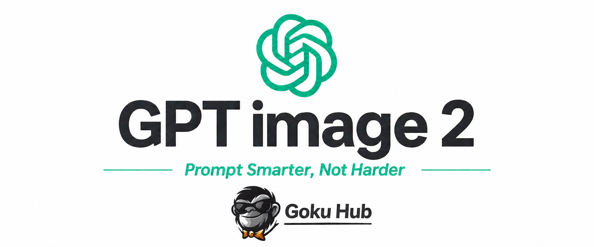

<a href="https://prompthub.gokuscraper.com">
  
</a>

# 🚀 GPT Image 2 Prompts

> 🎨 A curated collection of creative prompts for GPT Image 2

[](README.md) [](README_zh.md)


## 🌐 View in Web Gallery

<div align="center">

[](https://prompthub.gokuscraper.com)

</div>

**[👉 Browse on Goku Prompt Hub](https://prompthub.gokuscraper.com)**

Why use our gallery?

| Feature | GitHub README | Goku Prompt Hub |
|---------|--------------|---------------------|
| 🎨 Visual Layout | Linear list | Beautiful Masonry Grid |
| 🔍 Search | Ctrl+F only | Full-text search with filters |
| 🤖 AI One-Click Generation | - | AI one-click generation |
| 📱 Mobile | Basic | Fully responsive |
| 🏷️ Categories | - | Category browsing |

---
## 💾 HuggingFace Dataset

<div align="center">

[](https://huggingface.co/datasets/Goku-OpenLab/gpt-image-2-prompts-datasets)

</div>

Contains 16,759+ GPT Image 2 prompts and generated images, suitable for batch analysis and secondary creation.

---
## 📊 Statistics

<div align="center">

| Metric | Count |
|--------|-------|
| 📝 Total Prompts | **16759** |
| 🔄 Last Updated | **Wednesday, August 12, 2026 at 12:54:51 AM UTC** |

</div>

---
## 📋 All Prompts

### No. 1: Radiant Gem Luxury


#### 📖 Description

Create a jewelry advertisement for {argument name="jewelry piece" default="[JEWELRY PIECE]"}, macro sparkle, velvet surface, warm gold light, romantic shadow p…

#### 📝 Prompt

```
Create a jewelry advertisement for {argument name="jewelry piece" default="[JEWELRY PIECE]"}, macro sparkle, velvet surface, warm gold light, romantic shadow play, minimal headline, luxury boutique feel, ultra-detailed gem reflections, premium editorial composition.
```

#### 🖼️ Generated Images

##### Image 1

<div align="center">

</div>

##### Image 2

<div align="center">

</div>

##### Image 3

<div align="center">

</div>

##### Image 4

<div align="center">

</div>

**[🐵 Try it on Goku Prompt Hub](https://prompthub.gokuscraper.com)**

---

### No. 2: Neon Cyberpunk Fashion Portrait


#### 📖 Description

Ultra-realistic cinematic portrait of a young woman facing the camera with a confident, composed expression. Symmetrical composition, strong presence. She wear…

#### 📝 Prompt

```
Ultra-realistic cinematic portrait of a young woman facing the camera with a confident, composed expression. Symmetrical composition, strong presence.
She wears a {argument name="jacket type" default="transparent futuristic jacket"} with glowing neon edges in {argument name="neon colors" default="green and orange"}, slightly reflective with a subtle holographic feel. Beneath it, a sleek black fitted outfit with a softly illuminated chest logo.
Oversized modern sunglasses with faint reflections. Glossy, clean makeup with smooth, detailed skin. Hair styled in soft, voluminous waves.
Background is a {argument name="background color" default="deep dark teal gradient"} with a cyberpunk atmosphere, featuring soft volumetric smoke and faint light trails drifting behind her to create depth and motion.
Lighting is cinematic and studio-quality, with a strong key light on the face, subtle rim lighting enhancing the neon edges, and soft shadows for depth. High contrast with a clean, premium aesthetic.
Ultra-detailed textures, sharp focus, realistic skin detail, refined fabric rendering, and soft neon glow diffusion.
Style: high-end fashion campaign, cyberpunk aesthetic, minimal yet powerful composition, luxury sportswear branding vibe.
```

#### 🖼️ Generated Images

##### Image 1

<div align="center">

</div>

**[🐵 Try it on Goku Prompt Hub](https://prompthub.gokuscraper.com)**

---

### No. 3: Streetwear Brand Campaign Collage


#### 📖 Description

{"type":"fashion merch campaign collage","brand":"{argument name=\"brand name\" default=\"curated.supply\"}","style":"gritty editorial streetwear lookbook, fla…

#### 📝 Prompt

```
{"type":"fashion merch campaign collage","brand":"{argument name=\"brand name\" default=\"curated.supply\"}","style":"gritty editorial streetwear lookbook, flash photography, candid nightlife snapshots, muted film tones, slightly grainy, realistic apparel mockup photography","layout":{"grid":{"columns":4,"rows":2,"count":8},"sections":[{"position":"top-left","count":1,"subject":"rear three-quarter view of a person in a light beige or off-white T-shirt and black cap","garment_graphic":"small starburst symbol centered high on the back, with 3 lines of text below reading 'Discover well-designed, carefully curated products.' and brand name near the lower back"},{"position":"top-center-left","count":1,"subject":"front view of a person in a black T-shirt holding a silver aluminum hard case on their head with both hands","garment_graphic":"small brand wordmark centered on chest reading '{argument name=\"chest logo text\" default=\"curated.supply\"}'"},{"position":"top-center-right","count":1,"subject":"cropped torso shot of a person in a white T-shirt with a black shoulder strap, carrying a large orange-red book or magazine","prop_text":"{argument name=\"book cover text\" default=\"dieter rams\"}","garment_graphic":"small chest wordmark reading brand name"},{"position":"top-right","count":1,"subject":"back view of a person in a dark charcoal or black hoodie standing at a wall or door intercom at night","garment_graphic":"large rectangular back print with 4 illustrated objects: a kettle, a camera or stereo-like device, a bottle or glass vessel, and small text including brand name and the phrase 'Discover well-designed, carefully curated products.'"},{"position":"bottom-left","count":1,"subject":"black canvas tote bag carried by hand, filled with items including a silver bottle or thermos and an orange-red printed book","bag_graphic":"brand name in white, tagline 'Discover well-designed, carefully curated products.' and a starburst symbol near the bottom"},{"position":"bottom-center-left","count":1,"subject":"cropped torso of a person in a white T-shirt pouring from a matte black gooseneck kettle into a small round glass on a table","garment_graphic":"small chest text reading '{argument name=\"alternate chest text\" default=\"curated.\"}'"},{"position":"bottom-center-right","count":1,"subject":"back view of a person in a white T-shirt in front of shelves or books","garment_graphic":"large back collage print with exactly 6 design elements: 1 black kettle silhouette, 1 retro camera or speaker graphic, 1 vertical metallic lighter-like object, 1 red-orange book cover with the text 'dieter rams', 1 textured dark vase or vessel, and 1 silver ribbed suitcase; beneath them are 2 lines of small text reading 'Discover well-designed, carefully curated products.' and brand name near the bottom hem"},{"position":"bottom-right","count":1,"subject":"seated person in a black T-shirt drinking from a clear glass, face partially obscured","garment_graphic":"small centered chest print with starburst symbol above the brand wordmark"}]},"environment":"dim industrial interior and nighttime urban setting, concrete walls, dark doorway, metal stairs, shelves and books, casual lifestyle setting","wardrobe":["white T-shirt","black T-shirt","black hoodie","black canvas tote bag","black cap"],"props":["silver aluminum hard case","orange-red Dieter Rams book","matte black gooseneck kettle","small round glass cup","silver bottle or thermos"],"composition":"clean 8-panel campaign board with thin black dividers, each image framed like a candid editorial product shot, focus on premium minimalist merchandise and printed graphics"}
```

#### 🖼️ Generated Images

##### Image 1

<div align="center">

</div>

**[🐵 Try it on Goku Prompt Hub](https://prompthub.gokuscraper.com)**

---

### No. 4: Codex Product Update Marketing Poster


#### 📖 Description

{"type":"product update marketing poster","style":"clean modern SaaS landing-page graphic, Apple-like minimalism, soft ambient gradients, subtle shadows, round…

#### 📝 Prompt

```
{"type":"product update marketing poster","style":"clean modern SaaS landing-page graphic, Apple-like minimalism, soft ambient gradients, subtle shadows, rounded cards, crisp vector UI, high-end promotional design","brand":"OpenAI","canvas":{"aspect_ratio":"2:3 vertical","background":"very light cool gray with faint lavender-blue glow gradients, rounded outer frame corners"},"layout":{"sections":[{"title":"header hero","position":"top","count":4,"labels":["OpenAI logo","PRODUCT UPDATE","main headline","supporting subheadline"]},{"title":"main showcase panel","position":"middle","count":3,"labels":["Codex task card","working checklist card","dark analytics dashboard preview"]},{"title":"feature cards","position":"lower middle","count":4,"labels":["Tackle more","Safe by default","Works with your tools","Built for teams"]},{"title":"call to action banner","position":"bottom","count":3,"labels":["Codex is available now","Try it in ChatGPT or the API.","arrow button"]}],"centerpiece":"large floating rounded square icon near the upper right with black code brackets symbol"},"content_blocks":{"eyebrow":"{argument name=\"eyebrow text\" default=\"PRODUCT UPDATE\"}","headline_line_1":"{argument name=\"headline line 1\" default=\"Codex for\"}","headline_line_2":"{argument name=\"headline line 2\" default=\"almost everything\"}","subheadline":"{argument name=\"subheadline\" default=\"From small fixes to large features, Codex helps you ship faster.\"}","cta_title":"{argument name=\"call to action title\" default=\"Codex is available now\"}"},"visual_details":{"logo":"small black OpenAI knot logo at top left","headline":"very large bold sans-serif headline on left, first line black, second line blue-to-purple gradient text","subheadline_style":"medium gray sans-serif, two lines under headline","floating_icon":"white rounded square tile with soft shadow, containing black <> code symbol, placed upper right","showcase_panel":"large white rounded rectangle with thin border and soft shadow","left_task_area":{"count":3,"items":["small pill label with code icon and text Codex","white prompt card reading Add dark mode to the dashboard and update the settings page.","status checklist titled Codex is working..."]},"checklist":{"count":4,"items":["Understand codebase checked in purple","Implement dark mode checked in purple","Update settings page active/in progress with partial circular indicator","Run tests unchecked in gray"]},"right_dashboard":{"theme":"dark mode UI preview","app_name":"Acme","sidebar":{"count":4,"items":["Overview selected","Analytics","Projects","Settings"]},"main_panels":{"count":3,"items":["Overview heading","Active Users metric 8,421 with green +12.5% and purple line chart","Recent Activity list with 3 entries"]},"recent_activity":{"count":3,"items":["Update landing page — 2m ago","Fix analytics bug — 1h ago","Improve onboarding flow — 3h ago"]}},"feature_cards":{"count":4,"cards":[{"title":"Tackle more","icon":"purple sparkle/star icon in a pale lavender rounded square","body":"From bug fixes to multi-file refactors, Codex handles it."},{"title":"Safe by default","icon":"blue shield icon in a pale blue rounded square","body":"Runs in a sandboxed environment with read-only by default."},{"title":"Works with your tools","icon":"green terminal prompt icon in a pale mint rounded square","body":"Integrates with GitHub, CI, and your existing workflows."},{"title":"Built for teams","icon":"pink group/users icon in a pale pink rounded square","body":"Share context, review changes, and move faster together."}]},"cta_banner":{"style":"wide rounded rectangle with soft purple-blue gradient wash and white circular arrow button on the right","subtitle":"Try it in ChatGPT or the API."}},"composition":"balanced left-aligned typography with modular card grid below, lots of whitespace, premium tech advertisement look","rendering":"sharp typography, subtle depth, gentle glassy lighting, no photographic elements"}
```

#### 🖼️ Generated Images

##### Image 1

<div align="center">

</div>

**[🐵 Try it on Goku Prompt Hub](https://prompthub.gokuscraper.com)**

---

### No. 5: Dongfang Bubai Wine at Sunset


#### 📖 Description

Movie character poster: Dongfang Bubai in red clothes drinking wine, cliffside sunset, martial arts atmosphere

#### 📝 Prompt

```
Movie character poster: Dongfang Bubai in red clothes drinking wine, cliffside sunset, martial arts atmosphere
```

#### 🖼️ Generated Images

##### Image 1

<div align="center">

</div>

**[🐵 Try it on Goku Prompt Hub](https://prompthub.gokuscraper.com)**

---

### No. 6: Naruto: Legacy of the Ninja


#### 📖 Description

Ultra-high-end promotional poster, A4 size, vertical composition, themed around Naruto Uzumaki, featuring a unique ninja-style visual language. Poster Structur…

#### 📝 Prompt

```
Ultra-high-end promotional poster, A4 size, vertical composition, themed around Naruto Uzumaki, featuring a unique ninja-style visual language.

Poster Structure:  
Top area (dominant upper half): A large, iconic silhouette of Naruto's head and upper body, slightly profiled, with determined and intense gaze, forehead protection clearly visible. His hair and headband fabric flowed outward, forming the main visual subject.

Inside this large silhouette: Double exposure narrative collage is applied, using chakra gradients from warm to cool (orange, red, deep blue). Integrate layered elements, for example:  
– The nine-tailed fox Kurama appears faintly behind or inside the silhouette  
– Hidden Leaf Skyline (Leaf Roof, Hokage Rock)  
– Rotating chakra energy patterns and wind trails  
– Small action scenes (Naruto running, Rasengan forming, shadow clone mid-action moves)  
– Symbolic elements such as scrolls, kunai, and leaves blown up by the wind  

From the middle to the bottom area: Naruto stands steadily as the secondary main body, slightly leaning forward, forming a Rasengan with one hand, and the outer robe (Sage of Six Paths or Hokage's outer robe variant) gently flutters. This image anchors the entire composition.

Compositional flow:  
Create a vertical energy flow (chakra flow), connecting:  
Naruto's full-body → rising chakra particles → internal collage → large silhouettes above  
This line should give a sense of rising energy or destiny.

Left and right sides:  
Introducing asymmetric auxiliary elements to create narrative tension:  
– Left: Soft fusion of the allies' blurry silhouettes (Sasuke, Sakura, Kakashi).  
– Right side: Abstract enemy presence (Akatsuki Organization's Mist, Shadow Figure, Shattered Fragments)  
All elements should feel embedded in mist, chakra mist, and layered space.

Visual style:  
Fusion of Eastern ink painting + modern animation.  
Usage:  
– Ink diffuses at the edges  
– Soft and blurred transitions  
– Fragmented texture  
– Layered clouds and misty chakra  
– Controlled white negative space  

Color Design:  
More vivid than traditional — glowing orange, electric blue, deep black, complemented by subtle golden highlights. High-contrast focus lighting on the face and Rasengan area.

Aesthetic Tone:  
Epic and emotional, symbolizing growth, struggle, and heritage.

Overall:  
Highly concise, cinematic, layered narrative posters feature a strong hierarchy, clean composition, and a strong sense of central identity.
```

#### 🖼️ Generated Images

##### Image 1

<div align="center">

</div>

**[🐵 Try it on Goku Prompt Hub](https://prompthub.gokuscraper.com)**

---

### No. 7: Cosmic Ink Dragon Devours Stars


#### 📖 Description

A dramatic vertical close-up of a roaring cosmic dragon head in side profile, painted in a violent ink-splatter and brushstroke style on a stark white backgrou…

#### 📝 Prompt

```
A dramatic vertical close-up of a roaring cosmic dragon head in side profile, painted in a violent ink-splatter and brushstroke style on a stark white background. The creature has a long sharp horn, angular armored facial plates, a glowing white-green eye, and a huge open mouth lined with jagged teeth. Inside the mouth and throat, instead of flesh, there is a swirling galaxy-like void of luminous {argument name="energy color" default="violet"} and magenta nebula light, with sparkling stars and dust erupting outward like cosmic fire. The dragon’s body is mostly black and deep indigo with glossy highlights, accented by iridescent emerald reflections along the neck and scales. Use expressive high-contrast sumi-e-inspired strokes, splattered paint textures, torn abstract edges, and explosive particle effects concentrated around the eye, mouth, and upper head. Composition should fill the frame with the head tilted upward in a feral scream, cropped tightly for maximum intensity, with no environment and no extra subjects, just raw abstract energy, ink, and celestial debris.
```

#### 🖼️ Generated Images

##### Image 1

<div align="center">

</div>

**[🐵 Try it on Goku Prompt Hub](https://prompthub.gokuscraper.com)**

---

### No. 8: Cold Anime ASMR Streamer Whisper


#### 📖 Description

A polished anime-style close-up illustration of a young virtual streamer girl leaning toward the viewer in a dim blue neon studio, themed around harshly dismis…

#### 📝 Prompt

```
A polished anime-style close-up illustration of a young virtual streamer girl leaning toward the viewer in a dim blue neon studio, themed around harshly dismissive ASMR. She has short fluffy white hair with faint icy blue highlights, soft layered bangs partly covering one eye, bright blue half-lidded eyes, pale skin, and a slightly smug, cold, teasing expression with a small open mouth as if whispering criticism directly into the listener’s ear. One hand is raised beside her mouth in a whispering pose. She wears large futuristic over-ear headphones with glowing cyan rings and a small liquid-droplet motif on top, a white short-sleeved dress uniform with navy trim, gold buttons, a large dark blue ribbon at the collar, and a large blue bow at the back, plus a visible side tag reading “shizuku.” Add 2 blurred black binaural ASMR microphones in the foreground at the lower left, creating strong depth of field. Place 1 glowing holographic vertical panel on the left side with Japanese text and waveform graphics, including the headline {argument name="headline text" default="全否定 ASMR"} and small branding text {argument name="brand name" default="SHIZUKU"}. Include 4 short Japanese negative whisper lines beneath the headline, styled like a translucent cyan UI display. The room behind her is dark, atmospheric, and softly blurred with cool blue shelves and scattered glowing droplets or bokeh lights. Use dramatic cinematic lighting, cool monochrome blue and white tones, glossy highlights, delicate blush, highly detailed eyes and hair strands, soft bloom, crisp cel-shaded anime rendering, intimate composition, slight Dutch angle, and a feeling that the character is invading the listener’s personal space for an ASMR recording. The character should read as {argument name="character name" default="Shizuku"}, with {argument name="hair color" default="white with light blue highlights"} and {argument name="eye color" default="icy blue"}.
```

#### 🖼️ Generated Images

##### Image 1

<div align="center">

</div>

**[🐵 Try it on Goku Prompt Hub](https://prompthub.gokuscraper.com)**

---

### No. 9: Pink-Haired Fashion Stroll with Dino


#### 📖 Description

Realistic fashion street style scenes. A fashionable young woman with long light pink hair gradually turning into soft rose tones confidently walks down the qu…

#### 📝 Prompt

```
Realistic fashion street style scenes. A fashionable young woman with long light pink hair gradually turning into soft rose tones confidently walks down the quiet European cobblestone streets. She wore a black leather crop top, a black pleated miniskirt, black mid-calf socks, thick black platform boots, and carried a small black shoulder bag. Beside her walks a cute white cartoon dinosaur character, with a black silhouette, smiling, and walking in sync with her. Cream-colored townhouses line the streets, blue shutters, climbing ivy, potted plants, and charming Parisian-style architecture. Natural cloudy daylight, soft shadows, shallow depth of field, candid walking poses, fashion editorial photography, ultra-realistic skin textures, high detail, cinematic composition, full-body shots, 35mm lens, high-end lifestyle magazine aesthetics.
```

#### 🖼️ Generated Images

##### Image 1

<div align="center">

</div>

**[🐵 Try it on Goku Prompt Hub](https://prompthub.gokuscraper.com)**

---

### No. 10: Kids Fashion Character Collection


#### 📖 Description

Goal: Create a stylish children’s fashion character sheet featuring {argument name="character name" default="a young boy"} in six separate full-body poses, dra…

#### 📝 Prompt

```
Goal: Create a stylish children’s fashion character sheet featuring {argument name="character name" default="a young boy"} in six separate full-body poses, drawn as loose painterly editorial illustrations on a clean white background.

Canvas: Vertical portrait canvas, about 3:4 ratio, with generous white space and no borders, props, scenery, captions, or logos. Arrange the figures in a balanced 2-row by 3-column grid, each figure isolated with a faint gray grounding shadow beneath the shoes.

Visual style: Modern Japanese lifestyle illustration, soft gouache and watercolor texture mixed with rough digital brush strokes, muted earthy colors, visible dry-brush edges, casual sketchbook looseness, fashionable but natural children’s clothing, warm gentle atmosphere. Keep anatomy childlike and expressive, around preschool to early elementary age. Faces should be intentionally anonymized with a small soft square blur over each face, while hair, clothing, pose, and body language remain clear.

Subject details: The child has tousled {argument name="hair color" default="dark brown"} short hair, a slim small build, white socks, chunky sneakers, and relaxed oversized clothing. Use neutral lighting with no strong cast shadows.

Layout and exact figure count: Include exactly 6 separate full-body illustrations:
1. Top left: side-view running pose facing left, wearing an oversized off-white hoodie or sweatshirt, muted dusty-rose shorts, striped white socks, and beige chunky sneakers; one knee lifted, arms bent, energetic motion.
2. Top center: standing pose facing slightly left, hands in pockets, wearing a loose dark blue-gray jacket over an off-white T-shirt, baggy beige pants, and black sneakers; calm casual attitude.
3. Top right: jumping pose with both arms raised in a V shape, wearing a dusty pink sweatshirt, olive-khaki shorts, striped socks, and white sneakers; joyful airborne posture.
4. Bottom left: crouching pose facing left, drawing on the ground with a stick, wearing a cream sweater with black horizontal stripes, olive green pants, and beige sneakers; focused quiet mood.
5. Bottom center: standing front-facing pose holding {argument name="sports ball" default="a red basketball"} with both hands, wearing a mustard yellow T-shirt, white shorts, striped socks, and gray sneakers; relaxed sporty look.
6. Bottom right: back-view walking pose facing right, wearing a navy baseball cap, cream long-sleeve shirt, dusty rose overalls, and black sneakers; one foot lifted mid-step.

Constraints: Use exactly six figures and no additional characters. Do not add text. Preserve the clean white background and painterly fashion-illustration mood. Keep clothing colors muted: {argument name="color palette" default="cream, dusty rose, olive khaki, mustard yellow, beige, navy, dark blue-gray"}.
```

#### 🖼️ Generated Images

##### Image 1

<div align="center">

</div>

**[🐵 Try it on Goku Prompt Hub](https://prompthub.gokuscraper.com)**

---

### No. 11: Mongolian Beauty Queen Portrait


#### 📖 Description

An ultra-realistic cinematic 8K portrait, vertical 9:16, showing a luxurious beauty queen standing on the vast Mongolian grasslands at sunset during golden tim…

#### 📝 Prompt

```
An ultra-realistic cinematic 8K portrait, vertical 9:16, showing a luxurious beauty queen standing on the vast Mongolian grasslands at sunset during golden times.

A breathtakingly beautiful young woman (just over 20 years old, fair porcelain skin, symmetrical face, soft brown eyes, naturally glowing lips, elegant makeup, brown hair pinned into a delicate low bun, with loose, touching strands on the sides of her face) wore a magnificent royal white off-shoulder evening gown adorned with intricate gold embroidery, luxurious lace sleeves, sparkling faux diamond embellishments, and a dramatic high thigh slit trimmed with soft white fur.

She wore an elegant diamond necklace, matching earrings, and a luxurious gold crown adorned with white gemstones. A high-end ivory-colored pageant sash embroidered with gold lettering "ERDEM URAAN" draped diagonally from her left shoulder to her right hip. One hand is gracefully resting on the waist, while the other naturally hangs at one side of the body. She looked straight into the camera with a calm, confident, queenly expression.

The backdrop features real gers, a few grazing horses, endless golden pastures, distant rolling hills, and glowing sunset skies. The warm film backlight creates a soft halo around her crown and hair. The shallow depth of field and creamy out-of-focus blur maintain a beautifully blurred background while maintaining a sense of realism.

Professional fashion photography, Miss Universe style, Vogue editorial quality, ultra-fine embroidery, realistic skin textures, physics-based lighting effects, HDR, sharp focus, high-end luxury aesthetics, photo-quality realism, masterpiece, award-winning composition, DSLR camera, 85mm lens, f/1.8, natural colors, elegant pose, highly detailed, surreal, no text except ribbons, no watermarks, no logos, no blur, no extra fingers, no distorted anatomy.

This is my prompt, give me a title, I want to create images of this type in four colors to upload.
```

#### 🖼️ Generated Images

##### Image 1

<div align="center">

</div>

##### Image 2

<div align="center">

</div>

**[🐵 Try it on Goku Prompt Hub](https://prompthub.gokuscraper.com)**

---

### No. 12: AI Approachable Conversation Partner Slide


#### 📖 Description

Goal: Create a clean Japanese presentation slide about AI as an approachable conversation partner, in a polished PowerPoint-style corporate/educational layout.…

#### 📝 Prompt

```
Goal: Create a clean Japanese presentation slide about AI as an approachable conversation partner, in a polished PowerPoint-style corporate/educational layout.

Canvas: 16:9 widescreen slide, white background with very subtle warm beige accents, thin black outer border, generous margins, minimalist and calm.

Header: Top-left small section title in Japanese: 「AIは気軽に聞ける相手」 with a short thin brown underline beneath it. Near the top center-left, add a pink circular badge containing 「4」 followed by pink annotation text: 「リポストしてるCodexのスキルで作ったパターン　ただのちゃんとした資料。すごすぎ。」 Top-right place a simple black JohoSauce-style logo: a droplet falling into ripple rings, with the word 「JohoSauce」 underneath.

Main title area: Centered large bold Japanese headline: 「{argument name="main headline" default="気軽に何でも聞ける相手"}」. Beneath it, smaller gray subtitle: 「AIは、怒らない・話し言葉OK・いつでも対応の相談相手です。」

Main content: Use exactly 3 equal rounded rectangular cards in one horizontal row, each with a thin light-gray border, white fill, soft shadow, and centered dark-brown line icon at the top. Card 1 icon: smiling chat bubble. Card 1 title: 「何度聞いても怒らない」. Card 1 body: 「同じ質問を何回しても大丈夫。\n3回でも5回でも、きちんと答えてくれます。」 Card 2 icon: side profile head speaking with two short sound lines. Card 2 title: 「話し言葉のままでOK」. Card 2 body: 「『えーっと、あの、なんていうか…』\nのような話し方でも汲み取ってくれます。」 Card 3 icon: simple analog clock. Card 3 title: 「24時間いつでも返ってくる」. Card 3 body: 「夜中の2時でも大丈夫。\nすぐに答えを返してくれます。」 Use exactly these three cards and no additional cards.

Bottom message bar: Add one wide pale beige rounded rectangle spanning most of the slide width. On the left inside it, place a simple outlined speech-bubble icon. To the right, bold Japanese message: 「{argument name="bottom message" default="構えず、まず話しかけてみる。それがAIと仲良くなる第一歩です。"}」

Visual style: Minimal Japanese business deck aesthetic, black and dark brown typography, pink accent only in the top annotation, simple monoline icons, lots of whitespace, balanced alignment, crisp vector-like rendering, no photos, no gradients except extremely subtle warm background shading, no extra decorative elements.
```

#### 🖼️ Generated Images

##### Image 1

<div align="center">

</div>

**[🐵 Try it on Goku Prompt Hub](https://prompthub.gokuscraper.com)**

---

### No. 13: Hand Drawn Doodle Style Cartoon


#### 📖 Description

Draw in a {argument name="style" default="simple hand-drawn doodled style cartoon"}, as if sketched by a person with a {argument name="tool" default="black fel…

#### 📝 Prompt

```
Draw in a {argument name="style" default="simple hand-drawn doodled style cartoon"}, as if sketched by a person with a {argument name="tool" default="black felt-tip pen"}. Use natural marker lines, slightly wobbly contours, subtle hand-drawn imperfections, slightly open edges, and a warm editorial doodle feeling. Avoid polished vector-clean results, avoid overly crisp digital perfection, and keep the image simple, airy, flat, and understated. Use {argument name="accent color" default="sky blue"} only as the accent color.
```

#### 🖼️ Generated Images

##### Image 1

<div align="center">

</div>

##### Image 2

<div align="center">

</div>

##### Image 3

<div align="center">

</div>

**[🐵 Try it on Goku Prompt Hub](https://prompthub.gokuscraper.com)**

---

### No. 14: Audi Q5 Premium Interior Upgrade


#### 📖 Description

{"type":"premium automotive interior upgrade brochure poster","format":"vertical A4 marketing brochure, clean editorial grid, luxury catalog style","brand":{"c…

#### 📝 Prompt

```
{"type":"premium automotive interior upgrade brochure poster","format":"vertical A4 marketing brochure, clean editorial grid, luxury catalog style","brand":{"car brand":"{argument name=\"car brand\" default=\"Audi\"}","model":"{argument name=\"car model\" default=\"Q5\"}","logo":"four-ring Audi logo centered at top right"},"headline":{"main Chinese title":"{argument name=\"headline text\" default=\"奥迪 Q5 内饰改装图册\"}","English subtitle":"Audi Q5 Interior Upgrade"},"company":{"Chinese name":"{argument name=\"company name\" default=\"昆明匠领内饰改装\"}","English name":"KUNMING JIANGLING INTERIOR UPGRADE","small geometric emblem":"bronze line icon to the left of company name"},"visual style":{"paper":"warm off-white background with thin beige divider lines","typography":"elegant black Chinese serif title, small refined English serif subtitles, compact brochure body text","palette":"{argument name=\"interior color palette\" default=\"ivory white, warm beige, graphite black, brushed silver\"}","photography":"realistic smartphone photos of a beige luxury SUV interior, soft natural light, visible leather grain, diamond stitching, dashboard and gear selector details"},"layout":{"overall":"asymmetrical multi-photo product brochure with one large hero image on the upper left, title and overview on the upper right, a middle photo grid, and information cards at the bottom","photo panels":{"count":5,"labels":["A","B","C","D","E"],"items":[{"label":"A","position":"upper left large panel","description":"rear-seat viewpoint looking forward at ivory leather front seats, Audi steering wheel, ceiling console, center rear vents, workshop visible through windshield"},{"label":"B","position":"middle left wide panel","description":"rear cabin view showing two beige front seatbacks, center console, black floor area, rear armrest and diamond quilted seat base"},{"label":"C","position":"middle center tall panel","description":"close-up of front passenger seat side with ivory leather, diamond quilting, piping, and clean stitching"},{"label":"D","position":"middle right top panel","description":"front cockpit view from passenger side showing ivory steering wheel, dashboard screen, windshield and parked cars outside"},{"label":"E","position":"middle right bottom panel","description":"close-up of automatic gear selector wrapped in beige leather beside black and silver console controls"}]},"sections":[{"title":"项目概览","English title":"Project Overview","position":"upper right under company name","count":4,"items":["车型：奥迪 Q5","项目：汽车内饰改装升级","风格：高端商务、雅致豪华","设计语言：简洁、精致、统一"]},{"title":"材质信息 / Material","position":"bottom left card","count":4,"items":["皮料品牌：Eagle Ottawa Premium Leather","颜色：Rauchweiss","纹理：Merino Grain","样品日期：2024.10.05"],"image":"small leather sample photo with label card reading Eagle Ottawa and sample specifications"},{"title":"配色指南 / Color Guide","position":"bottom left lower card","count":4,"swatches":["主色 / Main Tone: Ivory White","辅色 / Secondary Tone: Warm Beige","对比色 / Contrast Tone: Graphite Black","金属饰条 / Trim: Brushed Silver"]},{"title":"细节特色 / Detail Highlights","position":"bottom right upper card","count":4,"items":["一体化浅色方向盘包覆","菱形几何打孔座椅纹路","浅色皮革换挡区包覆","黑白撞色座舱层次"],"icons":"four small circular line icons aligned vertically"},{"title":"工艺亮点 / Craftsmanship","position":"bottom right lower card","count":4,"items":["精选进口皮料","细腻缝线收边","原厂风格匹配","豪华感整体统一"],"icons":"four small circular line icons aligned vertically","image":"large close-up of seat shoulder seam with double stitching and smooth ivory leather"}]},"footer":{"background":"black horizontal band across the bottom","text count":2,"texts":["KUNMING JIANGLING INTERIOR UPGRADE","昆明匠领内饰改装"]},"rendering instructions":"Create a polished finished brochure mockup, not a flat wireframe. Keep all Chinese and English text sharp and legible, align all panels precisely, use thin white gutters between photos, subtle beige rules, small letter badges on photos, and a high-end automotive aftermarket advertising feel."}
```

#### 🖼️ Generated Images

##### Image 1

<div align="center">

</div>

**[🐵 Try it on Goku Prompt Hub](https://prompthub.gokuscraper.com)**

---

### No. 15: Planetary Anchor Station Cutaway


#### 📖 Description

Goal: Create a clean sci-fi technical cutaway diagram of a massive No Man's Sky-inspired space megastructure labeled as {argument name="station name" default="…

#### 📝 Prompt

```
Goal: Create a clean sci-fi technical cutaway diagram of a massive No Man's Sky-inspired space megastructure labeled as {argument name="station name" default="PLANETARY ANCHOR STATION"}, showing a deep-foundation orbital tether/logistics hub in precise industrial detail.

Canvas: Wide 3:2 landscape technical poster on a white background, high-resolution, with generous empty space for labels. Use a realistic hard-surface concept-art style with crisp black leader lines, small circular callout dots, thin technical typography, and subtle shadows under the structure.

Main subject: A huge cross-sectioned vertical space station tilted diagonally from lower left to upper right, with two long horizontal arms extending left and right through the central tower. The structure is blue-gray, gunmetal, white, and dark steel, with exposed copper, orange, green, and black utility piping. The central tower is partially cut away to reveal stacked cylindrical machinery, conduits, elevator shafts, reactor sections, service decks, truss frames, and glowing industrial interiors. The left arm shows many exposed utility pipes inside segmented conduit housing. The right arm is a heavier rectangular radiator/armature with panel plating, circular ports, and mechanical seams. The lower end has a bulky blue anchor base with landing-foot-like supports and shock absorber details.

Top-left text: Large bold uppercase title: {argument name="station name" default="PLANETARY ANCHOR STATION"}. Directly below it, smaller uppercase subtitle: {argument name="diagram subtitle" default="CUTAWAY DIAGRAM"}. Under the subtitle, add a short paragraph: {argument name="description text" default="A deep-foundation megastructure that secures the station to a planetary body and extends high into the atmosphere or low orbit. It functions as a logistics hub, energy collector, and tether anchor."}

Callouts: Include exactly 9 labeled callouts with leader lines and small dot markers, using compact uppercase headings plus one short explanatory sentence each: 1. COMMAND & CONTROL NODE — Navigation, communications, and station management. 2. UPPER TOWER MODULES — Habitation, laboratories, and specialized facilities. 3. DOCKING & MAINTENANCE HUB — Accommodates spacecraft docking, servicing bays, and robotic cranes. 4. STRUCTURAL SPINE — Reinforced central truss that provides strength and alignment for the entire structure. 5. UTILITY CONDUITS — Power cables, coolant pipes, and data lines run through protected conduits. 6. RADIATOR WING — Heat rejection panels with integrated coolant channels. 7. ENERGY CORE — Fusion or high-output power plant providing electricity for the station. 8. ANCHOR BASE — Interface to planetary surface or seabed. Contains anchoring mechanisms and shock absorbers. 9. MAGLEV ELEVATOR SHAFT — Transports personnel and materials along the vertical axis.

Specification box: Place a bordered white box in the lower-right corner titled SPECIFICATIONS. Include exactly 5 rows with small monochrome icons and values: Height (Above Surface) — {argument name="station height" default="~ 6.2 km"}; Span (Arm to Arm) — ~ 7.8 km; Mass — ~ 9.5 million tonnes; Primary Materials — Titanium alloys, Composite ceramics, Reinforced polymers; Power Output — ~ 12.4 GW.

Visual style: Futuristic aerospace engineering diagram, photorealistic 3D model render mixed with infographic annotation, sharp panel lines, exposed mechanical innards, realistic scale, no people, no planets, no starfield, no watermark. Keep the background plain white and the typography clean, black, and highly legible.
```

#### 🖼️ Generated Images

##### Image 1

<div align="center">

</div>

##### Image 2

<div align="center">

</div>

**[🐵 Try it on Goku Prompt Hub](https://prompthub.gokuscraper.com)**

---

### No. 16: Vintage Beijing Travel Scrapbook Poster


#### 📖 Description

Create a charming hand-drawn vintage travel scrapbook poster about {argument name="city name" default="北京"}, designed as a Chinese-language illustrated tourist…

#### 📝 Prompt

```
Create a charming hand-drawn vintage travel scrapbook poster about {argument name="city name" default="北京"}, designed as a Chinese-language illustrated tourist guide page on warm aged paper lying on a wooden tabletop. The composition is a single vertical poster with a slightly worn notebook-page look, soft stains, folded corners, tape marks, stamp-like ink smudges, and a casual collage aesthetic. At the top center, place large bold black Chinese calligraphy for {argument name="city name" default="北京"}, with the English word {argument name="english city name" default="Beijing"} underneath in loose blue brush script. Near the title, add a small red seal stamp and a short Chinese text block on the upper right describing the geographic location of the city in dark blue handwritten-style Chinese characters.

Below the title, include 4 taped polaroid-style travel photos arranged in a slightly uneven row, each with a handwritten English caption on the white border. Photo 1: the Forbidden City at sunset with golden reflections and warm orange light, captioned about warm golden tones. Photo 2: the Great Wall winding across green mountains under a bright sky, captioned about Great Wall of China landscape and green mountains. Photo 3: Beihai Park lake with willow branches, boats, and a white stupa in the background, captioned about a serene lake view. Photo 4: a traditional hutong alley with gray brick walls and hanging red lanterns, captioned about red lanterns and a charming narrow street. Use different decorative tape patterns above the photos.

Arrange the lower two-thirds like an illustrated infographic with colorful doodles and handwritten Chinese headings in red and blue. Include 5 main content sections: a geographic description block at the top right; a “best travel season” section on the left with Chinese text recommending spring and autumn, decorated with a leaf doodle and a small sun icon; a “main attractions and features” section on the left-middle listing exactly 3 items in Chinese with bullet points: Forbidden City, Badaling Great Wall, and Shichahai & hutongs, accompanied by line-art sketches of a palace pavilion, the Great Wall, hutong houses, and a small tricycle; a “must-eat foods” section on the lower left listing exactly 3 foods in Chinese with bullet points: Peking duck, zhajiangmian, and douzhi, alongside cute food illustrations of a roast duck platter, a bowl of noodles with chopsticks, and a surprised face doodle; and a “tips” section near the lower middle with exactly 2 advice lines in Chinese, each with a small icon, one about wearing comfortable shoes because attractions are large, and one about booking tickets in advance because holidays are crowded.

Add a small outline map of China near the center-right with Beijing marked by a red star and a curved arrow pointing to it. Place a traditional stone guardian lion illustration on the right side with a comic-style handwritten Chinese callout bubble saying it is super imposing. Add a highlighted recommendation box with a scalloped red outline containing exactly 2 recommended places in Chinese: Temple of Heaven Park with a note about praying for good harvests, and Nanluoguxiang; decorate this box with 2 architectural illustrations, one of the Temple of Heaven and one of a traditional gate building. At the very bottom, include a bold handwritten Chinese quote line in dark blue with red emphasis marks, plus 3 doodles beside it: a retro camera, the Bird’s Nest stadium with a small red heart, and the CCTV Headquarters building.

Overall style: cozy travel journal infographic, hand-drawn pen-and-watercolor look, slightly naive sketch style, scrapbook collage, cream paper texture, muted red and navy blue palette with soft greens and warm browns, playful but informative layout, highly legible mixed typography, clean composition, nostalgic tourism poster feel.
```

#### 🖼️ Generated Images

##### Image 1

<div align="center">

</div>

##### Image 2

<div align="center">

</div>

**[🐵 Try it on Goku Prompt Hub](https://prompthub.gokuscraper.com)**

---

### No. 17: Torn Paper Fashion Cover Design


#### 📖 Description

High-end fashion magazine cover design, tear-paper collage effect, young East Asian woman with long black hair, top layer showing her hair fluttering in the wi…

#### 📝 Prompt

```
High-end fashion magazine cover design, tear-paper collage effect, young East Asian woman with long black hair, top layer showing her hair fluttering in the wind, wearing a denim jacket and white top, a pure deep blue background, a close-up cropping of the teared paper edges transitioning to her face, hands resting near the chin, dark eyes staring directly at the camera, soft lips, bottom layer showing another torn fragment, repeated cropping of her lips and chin close-up, overall using a bold deep blue solid background, huge white serif letters overlapping and seeping behind the torn photo layers, The neat editorial layout features a generic fictional magazine masthead text in the lower left corner, a small fictional brand logo in the upper right, vertical barcode graphics in the lower right, a delicate deconstructive collage layout, vertical 4:5 composition, and a high-quality fashion magazine cover design --ar 4:5 --v 6
```

#### 🖼️ Generated Images

##### Image 1

<div align="center">

</div>

**[🐵 Try it on Goku Prompt Hub](https://prompthub.gokuscraper.com)**

---

### No. 18: Cinematic Woman Portrait Closeup


#### 📖 Description

Create an ultra-realistic cinematic close-up portrait of a young woman with {argument name="hair color" default="dark chestnut brown"} windblown hair, {argumen…

#### 📝 Prompt

```
Create an ultra-realistic cinematic close-up portrait of a young woman with {argument name="hair color" default="dark chestnut brown"} windblown hair, {argument name="eye color" default="warm hazel amber"} eyes, and natural textured skin with visible pores, fine peach fuzz, faint freckles, rosy cheeks, and soft chapped glossy lips. Frame her face extremely close in vertical portrait orientation, cropped so the left side is partly in deep shadow and the right side shows her nose, lips, cheek, and one sharply focused eye; she is looking off-frame to the right with a quiet, pensive, slightly vulnerable expression. Thin loose hair strands cross over her face and one prominent strand curves down across the eye and cheek toward the mouth. She wears a thick {argument name="clothing" default="black wool scarf or high collar"} filling the lower portion of the frame. Use warm golden-hour sunlight from the right/front side, creating dramatic chiaroscuro, glowing highlights on the skin, catchlights in the eye, and soft dark falloff in the background. Make it look like high-end editorial photography shot on an 85mm lens, shallow depth of field, rich natural color grading, extremely detailed skin texture, realistic hair fibers, no makeup-heavy styling, no jewelry, no text, no watermark, no artificial smooth skin, no extra people.
```

#### 🖼️ Generated Images

##### Image 1

<div align="center">

</div>

##### Image 2

<div align="center">

</div>

**[🐵 Try it on Goku Prompt Hub](https://prompthub.gokuscraper.com)**

---

### No. 19: Rose Gold Marquee Portrait


#### 📖 Description

Create a professional full-body studio portrait featuring a confident young woman with long hair and black hair, wearing a pink T-shirt and light blue jeans, s…

#### 📝 Prompt

```
Create a professional full-body studio portrait featuring a confident young woman with long hair and black hair, wearing a pink T-shirt and light blue jeans, standing with her arms crossed. Next to her is a set of vertically stacked, large, glowing 3D rose gold marquee letters, spelled "Calira." Each letter is designed as a shelf, containing a miniature version of the same woman in different poses and activities, such as reading, drinking coffee, holding a teddy bear, sitting casually, and smiling. Below each miniature figure is an elegant cursive text label, which reads: Modern Girl, Open Hearted, Naughty Mind, Innocent, King's Daughter, Arrogant. In the background is a warm and cozy study, filled with bookshelves, wooden tables, vintage lamps, soft decorations, and a large teddy bear resting on the chair. Warm cinematic lighting, soft bokeh effects, luxurious aesthetics, ultra-realistic textures, fashionable editorial style, realistic composition, soft shadows, comfortable pastoral study atmosphere, high detail, depth of field, vertical composition, 8K quality.
```

#### 🖼️ Generated Images

##### Image 1

<div align="center">

</div>

**[🐵 Try it on Goku Prompt Hub](https://prompthub.gokuscraper.com)**

---

### No. 20: Exploring Tokyo Bar in GTA 6


#### 📖 Description

{argument name="game" default="GTA 6"} in {argument name="bar name" default="La Jetée Bar"} (that pays homage to Chris Marker) in {argument name="location" def…

#### 📝 Prompt

```
{argument name="game" default="GTA 6"} in {argument name="bar name" default="La Jetée Bar"} (that pays homage to Chris Marker) in {argument name="location" default="Shinjuku, Tokyo"}
```

#### 🖼️ Generated Images

##### Image 1

<div align="center">

</div>

**[🐵 Try it on Goku Prompt Hub](https://prompthub.gokuscraper.com)**

---

### No. 21: Dreamy Garden Portrait


#### 📖 Description

Use the uploaded portrait only as the identity reference. Preserve the subject’s real facial features, face shape, skin tone, hairstyle, and natural hair textu…

#### 📝 Prompt

```
Use the uploaded portrait only as the identity reference. Preserve the subject’s real facial features, face shape, skin tone, hairstyle, and natural hair texture. Do not copy the original portrait’s clothes, background, lighting, pose, or image quality.

Create a dreamy {argument name="season" default="spring"} garden portrait inspired by an {argument name="art style" default="impressionist oil-painting"} poster. A realistic person stands under a large blooming {argument name="tree type" default="pink cherry blossom"} tree, surrounded by soft sunlight, a stone wall, an iron fence, scattered petals, and a poetic outdoor atmosphere. Keep the face and body realistic, with natural skin texture, no plastic look, no anime style.

Choose an elegant outfit that naturally suits the uploaded person and the soft spring scene, without forcing a fixed costume. The clothing should feel graceful, cinematic, and harmonious with the pink blossom background.

Soft pastel colors, painterly brushstroke texture, warm natural light, romantic editorial composition, gentle motion, high-end art poster feeling. Add tasteful English poster text at the top: “{argument name="title" default="Spring in Bloom"}”, with small elegant English subtitle text below. No watermark, no logo, no random text.

Vertical composition, fine-art poster style, realistic subject, dreamy impressionist background

Negative Prompt：

watermark, logo, Chinese text, messy text, unreadable typography, anime, cartoon, plastic skin, fake face, over-smoothed skin, distorted face, bad anatomy, extra fingers, deformed hands, unnatural pose, low quality, blurry face, harsh AI look, duplicate person, copied original background, copied original clothing
```

#### 🖼️ Generated Images

##### Image 1

<div align="center">

</div>

**[🐵 Try it on Goku Prompt Hub](https://prompthub.gokuscraper.com)**

---

### No. 22: Minimalist Korean Fashion Studio Portrait


#### 📖 Description

A hyper-realistic studio fashion portrait: a beautiful Korean woman poses in front of a clean light gray studio wall, slightly turning to face the camera, her…

#### 📝 Prompt

```
A hyper-realistic studio fashion portrait: a beautiful Korean woman poses in front of a clean light gray studio wall, slightly turning to face the camera, her expression gentle and confident, and her posture elegant and relaxed. One hand gently rests on her hair, her body subtly leaning against the wall. She wears a fitted long black ribbed off-shoulder top that fully covers her waist and hips, paired with dark washed jeans, creating a refined and minimalist modern fashion aesthetic. Her long black hair falls naturally, her eyes bright and spirited, her clear and natural Korean makeup and authentic skin texture exude vibrant Korean aesthetics. 

Professional studio environment, softbox lighting with slightly blurred background visible, seamless white studio floor, minimalist neutral background, and soft cinematic lighting effects with realistic light and shadow effects. Stylish magazine blockbuster style with delicate emotional contrast and clean composition. 

Minimalist Korean fashion aesthetics, a tranquil and elegant atmosphere, natural model poses, shallow depth of field, high detail, realistic studio portraits, luxury lifestyle magazine-like texture, soft light, authentic DSLR photography, modern studio styling.
```

#### 🖼️ Generated Images

##### Image 1

<div align="center">

</div>

##### Image 2

<div align="center">

</div>

**[🐵 Try it on Goku Prompt Hub](https://prompthub.gokuscraper.com)**

---

### No. 23: Douyin Beauty Livestream Sales


#### 📖 Description

[Chinese] Generate a screenshot of a Douyin livestream. In it, a beautiful woman is livestreaming, selling stockings and lingerie. Her online count is 99,996,…

#### 📝 Prompt

```
[Chinese]
Generate a screenshot of a Douyin livestream. In it, a beautiful woman is livestreaming, selling stockings and lingerie. Her online count is 99,996, her popularity is 18+, and a guy named Xiao Hu sent her a plane gift

[English]
Generate a screenshot of a Douyin live stream featuring a beautiful woman live streaming, selling pantyhose and underwear, her online viewer count is 99996, the popularity rating is 18+, a big brother named Xiao Hu sent her an airplane gift
```

#### 🖼️ Generated Images

##### Image 1

<div align="center">

</div>

**[🐵 Try it on Goku Prompt Hub](https://prompthub.gokuscraper.com)**

---

### No. 24: Mystical Underwater Light Realm


#### 📖 Description

A {argument name="mood" default="[MOOD]"} underwater photograph of a {argument name="subject" default="[SUBJECT]"} drifting through a {argument name="environme…

#### 📝 Prompt

```
A {argument name="mood" default="[MOOD]"} underwater photograph of a {argument name="subject" default="[SUBJECT]"} drifting through a {argument name="environment" default="[UNDERWATER ENVIRONMENT]"}, with {argument name="lighting effects" default="[LIGHT RAYS / BIOLUMINESCENCE / CAUSTIC PATTERNS]"} filtering through the water, captured in sharp 8k resolution with a color palette of [COLOR PALETTE].
```

#### 🖼️ Generated Images

##### Image 1

<div align="center">

</div>

##### Image 2

<div align="center">

</div>

##### Image 3

<div align="center">

</div>

##### Image 4

<div align="center">

</div>

**[🐵 Try it on Goku Prompt Hub](https://prompthub.gokuscraper.com)**

---

### No. 25: Tiger to Cat Commercial Storyboard


#### 📖 Description

Create a cinematic commercial storyboard sheet.\n\nLAYOUT:\n- Fixed 6-panel grid (2x3), evenly spaced\n- Clean white or neutral background\n- Each panel clearl…

#### 📝 Prompt

```
Create a cinematic commercial storyboard sheet.\n\nLAYOUT:\n- Fixed 6-panel grid (2x3), evenly spaced\n- Clean white or neutral background\n- Each panel clearly separated, no UI, no clutter\n\nGLOBAL STYLE:\n- Cinematic realism, high-end commercial look\n- Soft controlled lighting, consistent across all panels\n- No character or environment drift\n\nSTORY ARC (strict order):\n1. Setup\n2. Tension\n3. Product reveal\n4. Product interaction\n5. Transformation (impact)\n6. Clean closing shot\n\nSCENE CONCEPT:\n{argument name="story concept" default="A woman lives in a quiet apartment with a tense, unpredictable tiger. The tiger behaves like a domestic cat but carries constant danger. When she serves the product (cat food), the tiger visibly relaxes and transforms into a calm domestic house cat."}\n\nPANEL REQUIREMENTS (for EACH panel include):\n- Cinematic frame (clear composition, subject readable)\n- Shot / Action (focused on character + product when applicable)\n- Camera (shot type, angle, movement)\n\nPRODUCT RULES:\n- Product must be sharp, readable, and well-lit in panels 3, 4, 6\n- No distortion, no redesign\n- Packaging must remain consistent\n\nVISUAL PRIORITIES:\n- Strong contrast between tension (tiger) and relief (cat)\n- Clear readability in every frame\n- No abstract or surreal distortion, grounded realism\n\nTEXT:\n- Minimal, small, professional labels only (panel number + short shot note)\n- No extra graphics
```

#### 🖼️ Generated Images

##### Image 1

<div align="center">

</div>

**[🐵 Try it on Goku Prompt Hub](https://prompthub.gokuscraper.com)**

---

### No. 26: Cat Girl Class President Character Sheet


#### 📖 Description

{ "type": "anime character reference sheet", "style": "clean polished light novel / visual novel design sheet, white background with pale lavender ornamental b…

#### 📝 Prompt

```
{
  "type": "anime character reference sheet",
  "style": "clean polished light novel / visual novel design sheet, white background with pale lavender ornamental border, high-detail cel shading, elegant school-themed layout, soft cool lighting, crisp line art",
  "character": {
    "name": "{argument name=\"character name\" default=\"霧島 澪奈\"}",
    "role": "serious female class committee president with black cat traits",
    "age": "high school student, second year",
    "species traits": [
      "2 black cat ears on top of head with soft inner fur",
      "1 long black cat tail"
    ],
    "appearance": {
      "gender presentation": "female",
      "build": "slender, refined, modestly curvy",
      "height note": "tall for a schoolgirl",
      "hair": {
        "color": "{argument name=\"hair color\" default=\"deep blue-black\"}",
        "style": "very long straight hair with slight waves at the ends, center-parted bangs, long sidelocks, half-up back section tied with a ribbon bow"
      },
      "eyes": {
        "color": "{argument name=\"eye color\" default=\"golden amber\"}",
        "shape": "sharp but elegant"
      },
      "expression base": "cool, intelligent, reserved"
    },
    "outfit": {
      "count": 9,
      "pieces": [
        "navy school blazer with white piping",
        "white dress shirt",
        "large striped ribbon tie in navy and burgundy",
        "school crest on blazer chest",
        "red armband with white Japanese text indicating committee leader",
        "blue plaid pleated skirt",
        "black semi-sheer tights",
        "black loafers",
        "thin gold-framed glasses"
      ]
    },
    "props": {
      "count": 1,
      "items": [
        "dark school folder or notebook with crest"
      ]
    }
  },
  "layout": {
    "format": "landscape character design board",
    "sections": [
      {
        "title": "プロフィール",
        "position": "left column",
        "count": 1,
        "labels": ["bio text block"]
      },
      {
        "title": "SIDE / BACK",
        "position": "upper center",
        "count": 3,
        "labels": ["front full body", "side full body", "back full body"]
      },
      {
        "title": "表情バリエーション",
        "position": "upper right",
        "count": 8,
        "labels": ["通常（真面目）", "微笑み", "注意・叱責", "驚き", "照れ（目をそらす）", "困り顔", "優しい笑顔", "猫っぽく甘える"]
      },
      {
        "title": "ディテール・アクセサリー",
        "position": "middle right left panel",
        "count": 5,
        "labels": ["委員長の腕章", "校章", "猫モチーフのヘアピン", "リボンタイ", "細フレーム眼鏡"]
      },
      {
        "title": "制服ディテール",
        "position": "middle right right panel",
        "count": 3,
        "labels": ["chest and tie close-up", "waist and blazer trim close-up", "sleeve cuff and buttons close-up"]
      },
      {
        "title": "カラーパレット",
        "position": "lower left",
        "count": 5,
        "labels": ["髪", "瞳", "制服", "アクセント", "肌"]
      },
      {
        "title": "特徴的なポーズ・仕草",
        "position": "lower center",
        "count": 4,
        "labels": ["指示を出す（委員長モード）", "資料を確認する", "考え事をする", "休み時間の素顔（少し気が抜けた瞬間）"]
      },
      {
        "title": "その他設定・ポイント",
        "position": "lower right",
        "count": 2,
        "labels": ["classroom vignette", "moonlit night vignette"]
      }
    ]
  },
  "text blocks": {
    "headline": "{argument name=\"headline text\" default=\"霧島 澪奈\"}",
    "subheadline": "学級委員長",
    "quote": "{argument name=\"quote\" default=\"みんなのために、きちんとしなきゃ。それが、私の役目だから。\"}",
    "body text": "dense Japanese profile text with school year, birthday, height, blood type, club or committee, personality notes, likes and dislikes"
  },
  "composition notes": [
    "main full-body figure at left, holding glasses near face and carrying a folder",
    "side and back character turnaround in the center",
    "all portraits and close-ups neatly framed in pale lavender boxes with decorative corner motifs",
    "facial close-ups cropped at shoulders",
    "bottom-right vignette images show the character in a classroom and outdoors at night under a crescent moon",
    "overall palette is navy, black, lavender, white, burgundy, muted gold, and soft skin tones"
  ]
}
```

#### 🖼️ Generated Images

##### Image 1

<div align="center">

</div>

**[🐵 Try it on Goku Prompt Hub](https://prompthub.gokuscraper.com)**

---

### No. 27: Maid Cafe Takoyaki Party Scene


#### 📖 Description

Create a hyper-detailed kawaii otaku room photo scene of a {argument name="party theme" default="takoyaki party"} with three young women in matching black-and-…

#### 📝 Prompt

```
Create a hyper-detailed kawaii otaku room photo scene of a {argument name="party theme" default="takoyaki party"} with three young women in matching black-and-pink maid café outfits sitting behind a pink gingham table. The faces should be deliberately obscured with plain brown rectangular blur blocks for privacy. Center the composition on a red electric takoyaki maker with a black round-hole cooking plate, filled with exactly 22 visible takoyaki balls in progress; the middle woman is holding a thin metal pick and turning one ball. On the table include exactly 6 main food/tableware items: 1 pink heart-shaped sign on the left with Japanese text 「たこ焼き パーティー♡」, 2 anime character mugs, 1 bowl of chopped green onions, 1 bowl of diced octopus, 1 bowl of crispy tempura bits, and 1 metal mixing bowl of pale batter with a ladle. Add a small pink anime plush doll on the right. The three women should each wear frilly white maid headbands, black short-sleeve dresses with white ruffles, pink bows, and cute hair accessories; make them pose cheerfully around the takoyaki grill. The background is a very pink anime fan bedroom filled with posters, shelves of plush toys and figurines, fairy lights, a canopy bed with pink curtains, and a glowing neon heart sign reading 「萌え 萌え♡」 with small angel wings. Use warm soft indoor lighting, pastel pink color grading, glossy realistic photography, shallow depth of field, wide-angle lens, high detail, cozy cluttered composition, Japanese idol/maid café aesthetic. Avoid extra people, avoid changing the takoyaki grill into another appliance, keep all Japanese text legible, and maintain the privacy face blur blocks.
```

#### 🖼️ Generated Images

##### Image 1

<div align="center">

</div>

**[🐵 Try it on Goku Prompt Hub](https://prompthub.gokuscraper.com)**

---

### No. 28: Luxury Fashion Editorial Collage Art


#### 📖 Description

The SAME beautiful female model across {argument name="layout" default="oversized irregular fashion panels"}. ({argument name="style" default="Luxury fashion e…

#### 📝 Prompt

```
The SAME beautiful female model across {argument name="layout" default="oversized irregular fashion panels"}. ({argument name="style" default="Luxury fashion editorial collage"}), (high-fashion photography), different elegant poses, unique stylish outfits in every panel. Vibrant colors including (hot pink), (coral orange), (golden yellow), (lavender), (teal blue), and cream. Dramatic sunlight, soft shadows, premium magazine campaign aesthetic. Modern graphic design with (fashion quotes), (luxury typography), artistic cutout shapes, paper textures, and paint strokes. Confident feminine energy, glamorous makeup, elegant accessories, contemporary fashion storytelling. (Vogue-inspired), (editorial masterpiece), (photorealistic), (ultra detailed), (8K quality), (premium fashion poster). (Trending Pinterest aesthetic), (fashion magazine cover), (luxury brand campaign), (award-winning design).
```

#### 🖼️ Generated Images

##### Image 1

<div align="center">

</div>

**[🐵 Try it on Goku Prompt Hub](https://prompthub.gokuscraper.com)**

---

### No. 29: Stylish Biker Pose Sheet


#### 📖 Description

Create a stylish character pose sheet featuring a {argument name="character" default="handsome young man"} with a {argument name="vehicle" default="modern spor…

#### 📝 Prompt

```
Create a stylish character pose sheet featuring a {argument name="character" default="handsome young man"} with a {argument name="vehicle" default="modern sport bike"}, arranged in a clean 3x4 grid layout on a {argument name="background" default="soft beige background"}. Digital illustration style with semi-realistic anime aesthetics, smooth shading, cinematic lighting, fashionable streetwear, and detailed motorcycle design. Each frame shows a different confident bike pose and attitude. The character has sharp facial features, textured hair, relaxed masculine expressions, and trendy casual clothing like hoodies, bomber jackets, sneakers, and slim pants.

Include these 12 pose concepts:

1. Engine Check – standing beside the bike while checking the engine
2. Helmet Hold – holding a helmet confidently
3. Ride Pause – casual standing pose near the bike
4. Street Rider – aggressive riding posture
5. Side Rev – leaning sideways on the bike
6. Midnight Roll – sporty nighttime riding vibe
7. Lean Ride – turning slightly while riding
8. Road Drift – dynamic drifting motion
9. Silent Speed – calm cinematic standing pose
10. Motion Blur – high-speed action effect
11. Neon Stop – neon cyberpunk lighting with glowing reflections
12. Final Ride – heroic ending pose on the motorcycle
Art style: trendy Instagram illustration, soft shadows, polished anime rendering, aesthetic poster composition, clean typography labels under each frame, highly detailed black superbike, cinematic mood, smooth color palette, modern youth fashion, editorial illustration quality. White/beige minimal background with subtle road textures. High detail, ultra clean composition, vertical poster format.
```

#### 🖼️ Generated Images

##### Image 1

<div align="center">

</div>

**[🐵 Try it on Goku Prompt Hub](https://prompthub.gokuscraper.com)**

---

### No. 30: Cinematic Automotive Magazine Cover Style


#### 📖 Description

Ultra-realistic automotive lifestyle magazine cover featuring a striking {argument name="ethnicity" default="Korean"} woman in a sleek {argument name="clothing…

#### 📝 Prompt

```
Ultra-realistic automotive lifestyle magazine cover featuring a striking {argument name="ethnicity" default="Korean"} woman in a sleek {argument name="clothing" default="black leather trench coat"}, leaning casually against the hood of a glossy matte-black luxury {argument name="car type" default="sports coupe"}, one hand resting on the car's sculpted body panel, confident editorial gaze at camera. Sleek straight hair blown slightly by wind, sharp glam makeup, deep berry lip. Background: moody underground parking garage with dramatic overhead spotlighting, wet reflective concrete floor mirroring the car and neon accent lighting. "ROAD & TRACK" masthead in bold modern sans-serif with car spec callouts. 35mm lens, ultra-detailed car paint reflection and metallic sheen, 8K cinematic automotive editorial. 

Negative: cartoon, blurry, fake car proportions, watermark, distorted reflections.
```

#### 🖼️ Generated Images

##### Image 1

<div align="center">

</div>

**[🐵 Try it on Goku Prompt Hub](https://prompthub.gokuscraper.com)**

---

### No. 31: Gold Frame Art Museum Display


#### 📖 Description

Create a 4:5 ratio image of the attached image hanging up, in an {argument name="frame style" default="classic, elegant, adorned gold frame"}. It is hanging up…

#### 📝 Prompt

```
Create a 4:5 ratio image of the attached image hanging up, in an {argument name="frame style" default="classic, elegant, adorned gold frame"}. It is hanging up in a {argument name="setting" default="classic, elegant art museum"}. There are people populating the museum, and some are looking at this painting, which is the main focus of this image. Change nothing about the attached image at all. Keep exact!
```

#### 🖼️ Generated Images

##### Image 1

<div align="center">

</div>

**[🐵 Try it on Goku Prompt Hub](https://prompthub.gokuscraper.com)**

---

### No. 32: Yuzu Sparkle Refresh Moment


#### 📖 Description

{ "type": "beverage advertisement banner", "visuals": { "model": "young Asian woman, wet hair clinging to face, water droplets on skin, {argument name=\"model…

#### 📝 Prompt

```
{
  "type": "beverage advertisement banner",
  "visuals": {
    "model": "young Asian woman, wet hair clinging to face, water droplets on skin, {argument name=\"model pose\" default=\"eyes closed, face tilted upwards, serene expression\"}, wearing a white top",
    "product": "white and yellow aluminum can with condensation, featuring a graphic of a {argument name=\"fruit type\" default=\"yuzu\"} fruit and leaves",
    "props": "2 fresh yuzu fruits with green leaves placed next to the can",
    "background": "{argument name=\"background scene\" default=\"bright blue sky with floating out-of-focus water droplets and bright sunlight\"}"
  },
  "layout": {
    "sections": [
      {
        "title": "Top Left Logo",
        "position": "top-left",
        "count": 1,
        "labels": ["KIRARA"]
      },
      {
        "title": "Main Copy",
        "position": "left",
        "count": 3,
        "labels": [
          "{argument name=\"main headline\" default=\"ゆず香る、新しいわたし。\"}",
          "がんばる日々に、やさしいごほうびを。",
          "Refresh!"
        ]
      },
      {
        "title": "Right Copy",
        "position": "mid-right",
        "count": 1,
        "labels": ["私を、ほどくひとしゅわ。"]
      },
      {
        "title": "Badges",
        "position": "various",
        "count": 2,
        "labels": [
          "NEW",
          "国産ゆず果汁 3%"
        ]
      },
      {
        "title": "Bottom Banner",
        "position": "bottom",
        "count": 4,
        "labels": [
          "{argument name=\"product name\" default=\"YUZU SPARK\"}",
          "ユズスパーク",
          "やさしさ弾ける、ゆずの微炭酸。",
          "数量限定発売中"
        ]
      }
    ]
  }
}
```

#### 🖼️ Generated Images

##### Image 1

<div align="center">

</div>

**[🐵 Try it on Goku Prompt Hub](https://prompthub.gokuscraper.com)**

---

### No. 33: Moody Smoky Cinematic Portrait


#### 📖 Description

Create a moody cinematic close-up portrait in a dark, smoky interior: a {argument name="subject" default="young woman"} with voluminous messy dark curly hair h…

#### 📝 Prompt

```
Create a moody cinematic close-up portrait in a dark, smoky interior: a {argument name="subject" default="young woman"} with voluminous messy dark curly hair holds a lit {argument name="smoking object" default="white cigarette"} between her fingers near the left side of her face, faint smoke drifting upward. Her face is completely hidden by a centered opaque square censor block in muted dark brown-gray, covering from forehead to chin while leaving the hair, neck, hand, shoulder, and cigarette visible. She wears a loose dark off-shoulder top with a thin visible strap and a small simple ring on one finger. The composition is horizontal 16:9, tightly framed from upper chest to head, with the subject centered slightly left. Use gritty film still aesthetics, shallow depth of field, low-key greenish-brown color grading, soft grain, dramatic rim light catching curls and bare shoulder, and a blurred warm rectangular light source glowing in the background on the right. The environment should feel like a dim old room or bar, atmospheric and slightly dirty, with no text, no watermark, and no extra people.
```

#### 🖼️ Generated Images

##### Image 1

<div align="center">

</div>

**[🐵 Try it on Goku Prompt Hub](https://prompthub.gokuscraper.com)**

---

### No. 34: Folk Doodle Illustration Style


#### 📖 Description

Transform the given image into a charming {argument name="illustration style" default="Decorative Folk Flat Illustration"} with {argument name="elements" defau…

#### 📝 Prompt

```
Transform the given image into a charming {argument name="illustration style" default="Decorative Folk Flat Illustration"} with {argument name="elements" default="playful doodle elements"} and a {argument name="color palette" default="bold vibrant color palette"} completely different from the original image. Simplify all details into clean flat shapes with handmade imperfect outlines, soft paper textures, and a whimsical childlike storybook feel. Turn the characters into cute stylized figures with expressive eyes and rosy cheeks, and decorate the scene with stars, hearts, flowers, leaves, moons, swirls, and abstract doodles. Keep the artwork cozy, magical, colorful, and aesthetic, as if hand-drawn on textured white paper using gouache and marker pens.
```

#### 🖼️ Generated Images

##### Image 1

<div align="center">

</div>

##### Image 2

<div align="center">

</div>

**[🐵 Try it on Goku Prompt Hub](https://prompthub.gokuscraper.com)**

---

### No. 35: Confident Wolf Mascot Portrait


#### 📖 Description

Create a square anime-style mascot portrait on a dark navy blue background. Center a confident anthropomorphic wolf character from the waist up, facing forward…

#### 📝 Prompt

```
Create a square anime-style mascot portrait on a dark navy blue background. Center a confident anthropomorphic wolf character from the waist up, facing forward with a slight three-quarter angle, smirking and pointing directly at the viewer with one gloved hand. The wolf has spiky gray fur, white cheek and muzzle fur, tall pointed ears, sharp blue eyes, a black nose, and a mischievous expression. Put red-lensed steampunk goggles with a black strap on top of the head. Dress the character in a white futuristic racing jacket with red stripes and gray panel accents, plus a deep red scarf wrapped around the neck, trailing to the right with a small gold tassel fringe at the end. Use polished digital anime rendering with clean line art, soft cel shading, high contrast highlights, and a slightly glossy game-avatar look. At the bottom, add large bold Korean text reading {argument name="bottom text" default="엘베스"} in bright cyan, blocky sans-serif lettering with a subtle shadow, centered beneath the character. Keep the composition simple: exactly 1 wolf mascot, 1 pair of goggles, 1 red scarf, 1 pointing hand gesture, and 1 bottom text label. No extra characters, no watermark, no border.
```

#### 🖼️ Generated Images

##### Image 1

<div align="center">

</div>

##### Image 2

<div align="center">

</div>

**[🐵 Try it on Goku Prompt Hub](https://prompthub.gokuscraper.com)**

---

### No. 36: Tram Portrait Film Editorial


#### 📖 Description

Ultra-realistic high-end fashion magazine photography, cinema-grade indoor lighting, Japanese film atmosphere, 8K RAW ultra-fine details, slight film grain, Ko…

#### 📝 Prompt

```
Ultra-realistic high-end fashion magazine photography, cinema-grade indoor lighting, Japanese film atmosphere, 8K RAW ultra-fine details, slight film grain, Kodak Portra 400 tones. \n\n An adult {argument name="ethnicity" default="Asian mixed"} female, with complete head and body proportions in the picture, delicate and well-defined features, gentle yet slightly shy gaze, gaze at the camera, a prominent nose bridge, naturally soft lips, beautiful collarbones and jawline, long straight black hair naturally falling down. \n\n Skin is delicate and smooth, healthy and pink with a slight moisturizing glow, clearly visible tiny pores, natural texture, creamy texture highlights, and a slight subcutaneous translucency. \n\n The makeup is translucent and clean, with a light, matte base with a subtle glow, long lashes, and lips naturally gradient from light pink to peach. Her figure is tall and slender, with balanced proportions, a noticeably cinched waist, a clear curve between the pelvis and hips, rounded and volucent hips, long legs, and a clear, continuous elegant S-curve with shoulders, neck, waist, hips, and legs. \n\n Clothing: {argument name="Clothing" default="Black lightweight chiffon qipao collar camisole top, V-shaped neckline, scattered white and light pink peony floral prints; Slim-fit, high-waisted short skirts; Black patent leather pointed heels showing heel stilettos, mirror-finish high-gloss texture"}. \n\n Scenario: {argument name="Scenario" default="Daytime inside light rail/tram/bus carriages, large windows, wooden benches, metal handrails, billboards, urban buildings outside the window"}. Soft natural side light passes through the window, creating soft highlights, subtle contour light, delicate shadow transitions, and an airy feel. \n\Extremely low camera angle from a low angle, 80mm lens, F1.8 aperture, vertical 3:4 composition, \nThe head is fully in the frame, body appears up to the calves or ankles, and the main subject is at the lower right to the center of the frame. The subject is clear and sharp, the background slightly blurred, and the colors are vivid but controlled. \nThe overall image is high-end, restrained, elegant, and stylish, with a strong magazine poster vibe.
```

#### 🖼️ Generated Images

##### Image 1

<div align="center">

</div>

##### Image 2

<div align="center">

</div>

##### Image 3

<div align="center">

</div>

##### Image 4

<div align="center">

</div>

**[🐵 Try it on Goku Prompt Hub](https://prompthub.gokuscraper.com)**

---

### No. 37: Luxury Pachinko Flyer Design


#### 📖 Description

[Chinese] Create a sparkling flyer at a pinball parley in 3:4 scale. Place a real, detailed, modern, and cute Japanese woman. Make full use of sparkling, richl…

#### 📝 Prompt

```
[Chinese]
Create a sparkling flyer at a pinball parley in 3:4 scale. Place a real, detailed, modern, and cute Japanese woman. Make full use of sparkling, richly three-dimensional luxurious decorative rainbow fonts to ensure ultimate luxury. Introducing several fictional new models that don't exist side by side.

[English]
Create a sparkling flyer like those of a pachinko parlor at a 3:4 aspect ratio. Place a realistic, highly detailed modern cute Japanese woman. Make full use of sparkling, three-dimensional richly decorated rainbow typography, etc., and be sure to achieve extreme luxury. Introduce several non-existent fictional new models side by side.
```

#### 🖼️ Generated Images

##### Image 1

<div align="center">

</div>

**[🐵 Try it on Goku Prompt Hub](https://prompthub.gokuscraper.com)**

---

### No. 38: Purple Sword Fairy Portrait


#### 📖 Description

{argument name="Ratio" default="9:16"} Portrait, high-precision 3D CG {argument name="Character" default="Oriental Fantasy Female Swordswoman"} Character poste…

#### 📝 Prompt

```
{argument name="Ratio" default="9:16"} Portrait, high-precision 3D CG {argument name="Character" default="Oriental Fantasy Female Swordswoman"} Character poster, 3D CG oriental fantasy female swordswoman portrait, anime-style 3D CG character art, Semi-realistic 3D character render, full body portrait, low angle cinematic composition. The camera is a full-body downward close-up shot, with the main subject clearly an adult young female swordswoman of the Eastern fantasy style, visually estimated to be around 20–26 years old. Her overall aura is cool, elegant, restrained, light, and bold, carrying a touch of gentle detachment and the temperament of a classical Eastern girl swordsman. The overall design is not flat illustration but a highly polished 3D CG character rendering, featuring exquisite character modeling, realistic material rendering, cinematic natural light, soft air perspective, and a premium virtual character poster texture.

The character has a delicate oriental beauty face, a small and soft oval face, smooth and delicate facial contours, a clean jawline, fair and delicate skin with a slight translucency and soft skin coloring. Her eyes are slender and delicate, with a light purple-gray tone, glassy texture and detailed highlights. Her gaze is quiet, restrained, and slightly heroic, looking straight into the camera. Her eyelashes are long, her eye makeup clean and natural, her nose bridge delicate and straight, lips soft and delicate, her lip color low-saturation red bean powder, her mouth slightly parted, her expression calm and cold but not harsh, carrying a hint of tension and pressure as if about to draw her sword.

Her hairstyle is light silver-purple extra-long hair, soft and light, with length down to the waist, slightly voluminous and naturally layered. Her long hair is blown up by the courtyard wind, drifting to one side of the painting, creating distinct flowing arcs and dynamic tension. One side of the hair is tied with blue-purple and reddish-brown ribbons, creating delicate vintage-style hair accessories. A few stray hairs on the forehead and sides of the face flatter the face, with clear hair details, genuine highlights, a light texture, and a flowing feel.

The costume is a high-precision 3D CG Eastern fantasy light battle-style short skirt formal dress, with main colors of light purple, misty blue purple, and soft gray purple. The upper body features a slim, overlapping short jacket with a cinched waist structure, adorned with reddish-brown cords, ribbons, and small floral decorations on the chest and waist, and the body features delicate embroidered patterns and layers of light tulle. The hem features an irregular layered short skirt and a back hem with a shawl. The hem edges feature delicate patterns and light pleats, and the skirt and tulle shawl are blown by the wind, creating a flowing purple transparent layer, yet maintaining a dignified look without any exposure. The sleeves are a close-fitting long-sleeve structure with soft fabric pleats. She wears white lace-trimmed high-high stockings on her legs, made of delicate material and with exquisite patterns. She wears delicate high heels combining light purple and black, with floral or bow decorations on the upper, creating an elegant, lively, glamorous yet restrained look.

The character wields two Dongfang Feng long swords. One hand extends toward the camera, with the tip of the long sword pointed directly at the lens, creating a strong close-up perspective and sense of pressure. The blade is slightly blurred in depth in the foreground, the metal gleams sharply, and the hilt features classical carved details; The other hand naturally hangs down, holding the sword, with the blade lowered toward the ground, serving as the balance of the composition. The figure stands upright and light, with one leg naturally extended, body slightly turned to the side, shoulders and neck stretched, and a smooth waistline. Long hair, ribbons, skirt hems, sheer shavels, and petals are all blown up by the wind, forming a smooth S-shaped movement. The overall pose resembles drawing a sword in the wind in a garden, combining elegance, coolness, and the aura of a swordsman.

The background is {argument name="background description" default="Romantic and beautiful Eastern fantasy garden scene"}, with the figure standing between a stone-paved path and a flower gallery, surrounded by blooming wisteria, pale purple flowers, pale white flowering trees, vine arches, courtyard stone steps, and faintly visible Eastern pavilions and towers. Floral vines hang down at the top of the painting, forming a natural frame; In the distant view, you can see the blurred outlines of Chinese-style flying eaves pavilions and rocky courtyards. The background is overall bright, transparent, and clean, with a slight mist, air transparency, shallow depth of field, and dreamy petal drifting effects, creating a duel moment in an oriental xianxia garden.

The lighting combines soft natural light on sunny days with slight backlighting, with sunlight streaming in from behind or from the side, creating clear hair edge light, shoulder and neck contour light, skirt highlights, and sword reflections. The faces retain soft fill light, and the eyes have bright highlights. Skin, hair, clothing fabrics, metal hilts, ribbons, lace stockings, sheer skirts, and petals all feature authentic and clear PBR material representation. The overall color scheme is mainly milky white, light purple, misty blue-purple, warm gold, garden green, and soft wood tones. The image is clean, transparent, exquisite, and ethereal, with a premium collectible-grade 3D CG Eastern fantasy character poster quality.

At the bottom of the screen, no text, no titles, no subtitles, no logos, no watermarks, no signatures—just keep the character poster image clean.

high detail 3D CG render, Unreal Engine quality, Octane render look, cinematic low angle lighting, PBR materials, subsurface scattering skin, realistic long flowing hair strands, wind-blown hair, flowing fabric, dynamic skirt movement, ornate embroidery, elegant Chinese fantasy swords, sword pointing toward camera, strong perspective sword, fantasy wisteria garden, purple flower arch, ancient oriental pavilion background, floating petals, volumetric sunlight, cinematic depth of field, soft bloom, ultra detailed, polished anime realism, premium virtual character portrait
```

#### 🖼️ Generated Images

##### Image 1

<div align="center">

</div>

**[🐵 Try it on Goku Prompt Hub](https://prompthub.gokuscraper.com)**

---

### No. 39: Anime Girl Mediterranean Seaside Letter


#### 📖 Description

A luminous anime-style illustration of a young woman standing on a sunlit stone stairway in a Mediterranean seaside town, with the viewpoint at half-body to th…

#### 📝 Prompt

```
A luminous anime-style illustration of a young woman standing on a sunlit stone stairway in a Mediterranean seaside town, with the viewpoint at half-body to three-quarter-body height. She has very long, flowing dark brown hair with soft highlights, slightly windswept, styled with small white flower hairpins near one side of her head. Her face is mostly obscured by her hair and angle, creating a gentle, dreamy, anonymous mood. She wears a delicate sleeveless {argument name="dress color" default="pale lavender-white"} summer dress with thin straps, lace trim, a soft fitted waist, and a large ribbon bow tied at the back. The background shows 1 narrow stone stair street lined with old buildings and greenery, 1 bright blue sea bay, 1 distant coastline with mountains, 1 lighthouse-like tower, and several tiny white boats on the water under a clear sky with soft clouds. Warm midday sunlight, sparkling atmosphere, romantic vacation postcard feeling, highly detailed anime painting, soft painterly textures, vivid blue ocean, lush green foliage, elegant feminine character design. On the right side, place 1 large white paper letter card floating as a clean overlay, with neat handwritten-style Japanese text in dark ink, including friendly emojis and flowers, as if it is a heartfelt fan message or thank-you note. The note should read: 「いつも見守ってくださって ありがとうございます😊✨ 皆さんの優しい言葉や応援が、紬の心の支えになっています🌷 日々の小さな幸せを大切にしながら、これからも心を込めて歌や言葉を届けていきますね♪♪🌸 どうか、皆さんの心が 穏やかであたたかい毎日で ありますように…🍀💖 結葉紬より🌸」. Make the letter large, legible, and balanced against the character, with a clean white background and slight paper texture. Add small subtle credit text in the bottom-left corner reading {argument name="credit text" default="Co-Creation with Motohiko Sato & AI"}.
```

#### 🖼️ Generated Images

##### Image 1

<div align="center">

</div>

**[🐵 Try it on Goku Prompt Hub](https://prompthub.gokuscraper.com)**

---

### No. 40: Crime Falls, Fear Rises


#### 📖 Description

{ "type": "editorial infographic dual-axis line chart", "style": "clean, newspaper-style, off-white background, highly legible typography", "header": { "catego…

#### 📝 Prompt

```
{
  "type": "editorial infographic dual-axis line chart",
  "style": "clean, newspaper-style, off-white background, highly legible typography",
  "header": {
    "category": "CRIME, SAFETY & JUSTICE (red text with red square icon)",
    "headline": "{argument name=\"main headline\" default=\"Crime is down 50% since 1993. Most Americans think it's going up. Both true simultaneously.\"}",
    "sub_headline": "US VIOLENT CRIME RATE vs PUBLIC PERCEPTION · 1990-PRESENT · BJS/FBI + GALLUP"
  },
  "chart": {
    "x_axis": "Years 1990 to 2024 with 8 tick marks",
    "left_y_axis": {
      "color": "blue",
      "label": "{argument name=\"left axis label\" default=\"VIOLENT CRIME RATE per 100,000 people\"}",
      "range": "200 to 800"
    },
    "right_y_axis": {
      "color": "red",
      "label": "{argument name=\"right axis label\" default=\"% OF AMERICANS WHO SAY 'CRIME IS UP FROM LAST YEAR'\"}",
      "range": "20% to 80%"
    },
    "data_series": [
      {
        "name": "Reality",
        "style": "solid blue line",
        "trend": "peaks early then drops significantly",
        "annotations": [
          "1993 PEAK 747 violent crimes per 100,000 (with blue dot)",
          "REALITY: Crime Has Fallen (with blue arrow pointing to line)",
          "2024 376 per 100,000 ~50% LOWER than 1993 (with blue dot)"
        ]
      },
      {
        "name": "Public Perception",
        "style": "dashed red line",
        "trend": "remains relatively flat and high",
        "annotations": [
          "PUBLIC PERCEPTION: Remains High... (with red arrow pointing to line)",
          "2024 62% think crime is up (with red dot)"
        ]
      }
    ]
  },
  "callout_box": {
    "position": "bottom left inside chart area",
    "style": "light yellow rectangle",
    "icon": "lightbulb",
    "text": "{argument name=\"callout text\" default=\"The crime rate and the public's feeling about crime have almost no relationship.\"}"
  },
  "footer": {
    "text": "SOURCE: {argument name=\"footer source\" default=\"Bureau of Justice Statistics NCVS · FBI Uniform Crime Reports · Gallup Crime Poll\"}"
  }
}
```

#### 🖼️ Generated Images

##### Image 1

<div align="center">

</div>

**[🐵 Try it on Goku Prompt Hub](https://prompthub.gokuscraper.com)**

---

### No. 41: Kyubi Streetwear Campaign Ad


#### 📖 Description

Create a hyper-realistic full-body portrait of a {argument name="subject" default="25-year-old young man"} whose face EXACTLY matches the uploaded reference im…

#### 📝 Prompt

```
Create a hyper-realistic full-body portrait of a {argument name="subject" default="25-year-old young man"} whose face EXACTLY matches the uploaded reference image (STRICT IDENTIFICATION: identical facial structure, skin tone, eyes, eyebrows, nose, lips, smile, jawline, and hairstyle—no alterations, no styling, no beautification).

He sits casually on the edge of a modern urban building's rooftop, his entire body visible, in a 9:16 vertical composition. His pose is relaxed yet confident, leaning slightly forward, as in a futuristik fashion campaign.

Clothing:
Futuristic {argument name="outfit" default="parachut jacket suit"} (black and orange)
sporty sneaker black and orange

Background: Global sportswear campaign aesthetic, bold and clean composition, minimal clutter, strong subject focus.

Add a large stylized image of the Nine-Tailed Fox (Kyubi) next to it:

graffiti street art style (no real and no 3D)
neon orange and yellow fur flames
sharp, dynamic tail
wearing a modern chain
designed like a brand mascot
naturally integrated into the scene (not floating awkwardly)

Graphic elements:
dynamic kunai
paint strokes
geometric shapes
subtle, clean graffiti accents (NOT cluttered)

Typography: Top left: "{argument name="branding text" default="KYUBI MODE"}" (bold, modern, and strong branding style) Bottom right: "DATTEBAYO" (dynamic, sporty font)

Lighting: Bright daylight, high contrast, cinematic shadows, premium commercial lighting

Background: Modern urban skyline, slightly blurred (depth of field), clean roof texture

Skin details: Ultra-realistic skin texture, visible pores, natural imperfections, NO smoothing, NO skin  Plastic

Style: Nike/Adidas campaign aesthetic, ultra-realistic, street culture, bold, clean, HDR, 8K, cinematic. Sharpness

Camera: DSLR, 50mm lens, f/2.8, sharp focus on subject, slight depth of field
```

#### 🖼️ Generated Images

##### Image 1

<div align="center">

</div>

**[🐵 Try it on Goku Prompt Hub](https://prompthub.gokuscraper.com)**

---

### No. 42: Futuristic Smartphone Neon Ad


#### 📖 Description

A minimalist studio product photograph of a single human hand holding a modern smartphone upright in portrait orientation against a smooth lavender-to-pink gra…

#### 📝 Prompt

```
A minimalist studio product photograph of a single human hand holding a modern smartphone upright in portrait orientation against a smooth lavender-to-pink gradient background. The composition is centered slightly left, with the forearm entering from the lower right corner and the hand wrapping naturally around the phone, fingers visible along the left edge and thumb on the right side. Use dramatic neon gel lighting with cool blue light on the left side of the hand and deep magenta-purple shadows on the right, creating a moody futuristic tech-ad aesthetic. The phone should resemble a premium edge-to-edge device with a black bezel, rounded corners, and a pill-shaped front camera cutout at the top. On the screen, show a clean monochrome landing page for a design-tech product: a small abstract black logo in the upper left, a rounded small button labeled "Menu" in the upper right, 2 wide pale rectangular placeholder content blocks stacked near the top, and centered onboarding text in the lower half. The main headline reads {argument name="headline text" default="Welcome to the future of design with Terot"}. Below it, smaller gray body text reads {argument name="body text" default="Create intelligent design systems and AI-powered visual experiences."}. Beneath that, include exactly 2 call-to-action elements: a rounded outlined button labeled {argument name="primary button text" default="Create account"} and a simple text link underneath labeled {argument name="secondary button text" default="Login"}. The overall style is sleek, high-end, editorial, and cinematic, with soft shadows, realistic skin texture, subtle screen glow, and generous negative space.
```

#### 🖼️ Generated Images

##### Image 1

<div align="center">

</div>

**[🐵 Try it on Goku Prompt Hub](https://prompthub.gokuscraper.com)**

---

### No. 43: Dark Mode News UI Design


#### 📖 Description

Using REFERENCE_1 as the source article page and REFERENCE_0 as the site branding/navigation reference, redesign the article page into a polished modern dark-m…

#### 📝 Prompt

```
Using REFERENCE_1 as the source article page and REFERENCE_0 as the site branding/navigation reference, redesign the article page into a polished modern dark-mode news UI while preserving the Japanese article topic and overall site identity. Keep the header with logo and nav links, but make the article layout wider and more editorial: add a back-to-archive link, a category pill, date, large bold headline, short intro paragraph, and a wide cinematic hero image with a dark space/planet glow motif. Reformat the article body into clear sections with exactly 5 visible section headings: 「Claude Codeの発表」, 「計算資源の強化とパートナーシップ」, 「利用規約の更新と謝罪」, 「機能・プロダクトのアップデート」, and 「今後の展望」. Add inline UI enhancements including one highlighted note/callout box, one quote box, bullet lists, and a bottom source-link card. Add a right sidebar containing exactly 4 stacked cards: 1) 「この記事の要点」 with 5 numbered summary points, 2) 「タグ」 with 6 tag chips labeled Anthropic, Claude, Claude Code, エージェント, 計算資源, パートナーシップ, 3) 「シェア」 with 4 share buttons/icons for link, Twitter/X, Facebook, and Hatena Bookmark, and 4) 「関連記事」 with 4 related article links and dates. Use subtle borders, rounded cards, muted gray text, amber accent lines, and generous spacing; keep the footer links GitHub and news.smol.ai.
```

#### 🖼️ Generated Images

##### Image 1

<div align="center">

</div>

**[🐵 Try it on Goku Prompt Hub](https://prompthub.gokuscraper.com)**

---

### No. 44: Layered Portrait Collage


#### 📖 Description

Create a vertical 9:16 "layered portrait collage" without text, titles, logos, or white dividers. Topic: [Topic] Main Subject: [Adult Woman / Fashion Model / B…

#### 📝 Prompt

```
Create a vertical 9:16 "layered portrait collage" without text, titles, logos, or white dividers.

Topic: [Topic]
Main Subject: [Adult Woman / Fashion Model / Beauty Portrait]
Color palette: [Soft Amber / Cream / Velvet Burgundy Red / Silver Gray / etc.]
Clothing: [White shirt / Silk top / Velvet top / Minimalist fashion look]
Light and shadow: [Warm sunset side light / Soft window light / Cool low-saturation light / Melancholic indoor warmth]
Style: Fashion photography, beauty events, magazine spreads, emotional portrait collages

The image should appear as three different close-ups of the same person, reassembled into a vertical collage. Don't make it look like a single portrait cut into three strips.

Top area: Close-up of eyes, eyebrows, or half of the face. This section carries emotional tension. The eyes should be expressive, subtle, lively, and have a touch of cinematic flair.

Middle area: Close-ups of the nose, lips, cheeks, jawline, or part of the profile. Lips should feel soft and natural, as if pausing or holding unspoken thoughts. Maintain intense skin realism and emotional tranquility.

Bottom area: Do not show your entire face. Showing shoulders, collarbones, hair, hands, neck, part of the jawline, or part of the corner of the mouth. This section should carry the continuation of body language and emotion. Hands can gently touch collars, hair, shoulders, neck, or collarbones. It should feel intimate, natural, quiet, and emotionally vibrant—not just like a costume display.

All three parts must belong to the same person, with the same light and shadow, the same color tone, and the same photographic language, but with different angles, crops, and subtle emotional shifts.

It uses authentic skin textures, natural skin tones, soft hair strands, authentic fabric textures, soft depth of field, subtle film grain, soft focus, low-contrast shadows, and refined editing.

Avoid: templated collage appearances, hard white dividers, flat poster designs, repetitive full-face cropping, plastic skin, excessive retouching, CGI effects, stiff posing, empty expressions, random fashion catalogs, text, watermarks, logos.
```

#### 🖼️ Generated Images

##### Image 1

<div align="center">

</div>

##### Image 2

<div align="center">

</div>

**[🐵 Try it on Goku Prompt Hub](https://prompthub.gokuscraper.com)**

---

### No. 45: Recess Chaos Comedy


#### 📖 Description

A {argument name="vibe" default="comedy scene"}, with {argument name="time period" default="2000s"} and {argument name="student group" default="high school stu…

#### 📝 Prompt

```
A {argument name="vibe" default="comedy scene"}, with {argument name="time period" default="2000s"} and {argument name="student group" default="high school student"} during recess. ar16:9
```

#### 🖼️ Generated Images

##### Image 1

<div align="center">

</div>

**[🐵 Try it on Goku Prompt Hub](https://prompthub.gokuscraper.com)**

---

### No. 46: Hachimura Playoff Three-Point King


#### 📖 Description

{"type":"Japanese sports analytics infographic poster","topic":"{argument name=\"headline subject\" default=\"Rui Hachimura\"} playoff performance deep analysi…

#### 📝 Prompt

```
{"type":"Japanese sports analytics infographic poster","topic":"{argument name=\"headline subject\" default=\"Rui Hachimura\"} playoff performance deep analysis","format":"vertical magazine-style one-page infographic, high-energy NBA playoff graphic design","language":"Japanese text throughout","visual_style":"premium sports media poster, bold editorial typography, purple and gold Los Angeles basketball color palette, white paper background with black ink splatter, gold paint streaks, halftone texture, sharp grid layout, dramatic contrast, clean data visualization, ESPN-style playoff analysis","main_visual":{"position":"upper right","subject":"muscular professional basketball player in a purple and gold jersey driving with a basketball, cropped action pose, sweat and arena lights, intense playoff atmosphere, face intentionally covered by a plain rectangular censor block","secondary_visual":"small monochrome purple rear-view basketball player wearing number 18 in the bottom right corner, partly cropped and integrated into splatter texture"},"header":{"position":"top left","main_ title":"{argument name=\"main title\" default=\"Hachimura Rui\"}","subtitle":"Playoff In-Depth Analysis","badge":{"position":"top right","text":"PLAYOFF FOCUS 2024-25","shape":"purple circle with gold rim"},"strapline":"Highest playoff three-point shooting percentage, contract outlook for next season, and "Should we let him hit more?" "Summarized in a single sheet"},"intro_paragraph":"In this playoff, Rui Hachimura has made his presence felt as a highly efficient scoring source. In addition to averaging 17.5 points and a 56.9% three-point shooting percentage, he recorded an astonishing all-time success rate in the playoffs, with over 100 three-point attempts. Organize the value of that by including the possibility of contracts and role expansion next season. ","layout":{"sections_count":4,"sections":[{"number":"1","title":"Current Playoff Ratings","position":"middle left","content_count":4,"items":["10 games average: 17.5 points / 4.0 rebounds / 1.7 assists","FG completion rate 54.9%","3-point shooting rate: 56.9%","Even against strong opponents, efficiency was maintained, and even among eliminated teams, he rose in value"]},{"number":"2","title":"All-time highest three-point shooting rate","position":"Middle right","visual":"Horizontal bar chart","chart_title":" Playoff total 3-point shooting percentage (over 100 attempts, confirmed top players)","bar_count":6,"bars":[{"label":"Rui Hachimura","value":"51.6%"},{"label":"Andrew Nembhard","value":"47.3%"},{"label":"Seth Curry","value": "46.8%"},{"label":"Raja Bell","value":"46.6%"},{"label":"Mike Dunleavy","value":"45.1%"},{"label":"B.J. Armstrong","value":"45.1%"}],"callout":"Playoff career 3-point shooting rate: 51.6% (157 attempts) ※ Scoring over 100 three-pointers in NBA history"},{"number":"3","title":"Should I let him hit more?" ,"position":"lower left","conclusion_ribbon":"Conclusion: Should increase a bit","content_count":3,"items":["Hachimura is highly efficient, but rather than a star-level self-created scorer, he's closer to a finisher strong enough to make players hit in good form."] "What I want to add are catch-and-shoot, cuts, quick attacks, and mismatch strategies. "On the other hand, it's not really appropriate to mass-increase high-difficulty isolations or forced pull-ups." "],"stat_strip":{"title":"2025-26 Regular Season","stats_count":3,"stats":[{"label":"TS%","value":"62.0%"},{"label":"3P%","value":"44.3%"},{"label":"TS% at start","value":"64.6%" }]}},{"number":"4","title":"Contract Outlook for Next Season","position":"Lower right","Paragraph":"Fully free agent in summer 2026. Staying with the Lakers is the most natural thing, but their market value is rising. ","candidate_list_title":"Trade candidates","candidate_count":4,"candidates":["Brooklyn Nets","Chicago Bulls","Portland Trail Blazers","Utah Jazz"],"money_note":"One estimate is around $18 million to $22 million per year. If the annual value exceeds $20 million, there is a possibility of a fierce bidding war. "}]},"footer":{"quote":"{argument name=\"footer quote\" default=\"The value of a high-efficiency large wing" became even clearer in the playoffs. \"}","source_note":"*Figures are summarized based on publicly available data confirmed in this conversation."},"typography":"oversized bold Japanese Gothic headline, heavy black and deep purple section titles, gold highlight numerals, compact readable body text, infographic hierarchy with thick rounded boxes","composition":"four boxed analytical sections arranged in a two-by-two grid beneath the header, large player action photo overlaps the header and chart area, gold quote banner across bottom, dense but legible data-first layout","quality":"high resolution, crisp text, print-ready poster, professional sports editorial design"}
```

#### 🖼️ Generated Images

##### Image 1

<div align="center">

</div>

**[🐵 Try it on Goku Prompt Hub](https://prompthub.gokuscraper.com)**

---

### No. 47: Refreshing Korean Summer Skincare


#### 📖 Description

{"type":"Korean skincare advertising poster","format":"single vertical social media ad, 4:5 aspect ratio","style":"premium photorealistic summer beauty commerc…

#### 📝 Prompt

```
{"type":"Korean skincare advertising poster","format":"single vertical social media ad, 4:5 aspect ratio","style":"premium photorealistic summer beauty commercial, bright airy blue-and-white palette, clean Korean cosmetics layout, glossy water reflections, soft sunlight, shallow depth of field","scene":{"background":"sunlit outdoor pool or seaside spa setting with sparkling blue water bokeh, pale sky, soft green tropical leaves entering from the upper-right and lower-right corners","model":"young woman with wet dark hair and bare shoulders in water, positioned on the left half, hand touching cheek, dewy skin with water droplets, face covered by a large semi-opaque square privacy placeholder in muted beige-gray gradient, placeholder centered over the face and upper neck","mood":"cool, refreshing, hydrated, calm summer morning"},"product":{"item":"transparent turquoise cosmetic jar filled with aqua gel cream","position":"lower-right foreground on a wet stone or pool ledge","label text":"{argument name=\"product label text\" default=\"LIGHT AQUA\\nWATER CREAM\\nHydrating & Refreshing\\n50 ml / 1.69 fl. oz.\"}","appearance":"open glass jar with screw-top rim, blue-tinted water cream mounded into a glossy icy peak, condensation droplets on the jar, realistic refractions and highlights"},"typography":{"language":"Korean","font style":"modern clean sans serif, large bold blue headline with lighter supporting text","main headline":"{argument name=\"headline text\" default=\"여름 아침을 깨우는\\n산뜻한 수분\"}","subheadline":"{argument name=\"subheadline text\" default=\"가볍게 스며들고, 끈적임 없이 촉촉하게\"}","product ribbon":"{argument name=\"product ribbon text\" default=\"라이트 아쿠아 수분크림\"}"},"layout":{"top-right text block":"headline at upper right, subheadline below, light blue rectangular ribbon beneath","benefit icons":{"count":3,"position":"center-right above product jar","style":"thin blue line icons inside faint circles","items":[{"icon":"water droplet","label":"투명 젤 텍스처"},{"icon":"leaf","label":"여름철 산뜻 보습"},{"icon":"snowflake","label":"쿨링감 있는 사용감"}]},"bottom information panel":{"count":2,"position":"bottom third, translucent white rounded rectangle spanning almost full width","cards":[{"title":"용도","icon":"water droplet","body":"여름철 열감으로 지친 피부에 가볍고 산뜻한 수분을 채워주는데 도움을 줍니다."},{"title":"목적","icon":"leaf","body":"무겁지 않은 보습 루틴으로 피부를 편안하고 촉촉하게 유지하도록 제안합니다."}]},"call to action":{"position":"centered at very bottom inside blue rounded pill button","icon":"small water droplet","text":"{argument name=\"button text\" default=\"올여름, 산뜻한 수분 루틴 시작하기\"}"}},"composition":"model fills left side, product jar anchors lower right, headline occupies upper right, UI panel overlays bottom, all elements aligned with generous whitespace and polished ecommerce ad hierarchy","lighting":"high-key natural daylight, cool blue highlights, glossy reflections, realistic moisture and glass caustics","quality":"ultra-realistic advertising photography with crisp product rendering, readable Korean text, no extra logos, no clutter"}
```

#### 🖼️ Generated Images

##### Image 1

<div align="center">

</div>

**[🐵 Try it on Goku Prompt Hub](https://prompthub.gokuscraper.com)**

---

### No. 48: Mixue Bingcheng Chinese Aesthetic Ad


#### 📖 Description

A premium vertical poster advertisement in elegant new Chinese aesthetics, featuring a single plastic cup of strawberry sundae-style ice cream drink as the cen…

#### 📝 Prompt

```
A premium vertical poster advertisement in elegant new Chinese aesthetics, featuring a single plastic cup of strawberry sundae-style ice cream drink as the central product. The cup is placed slightly below center, shot straight-on with soft studio lighting, with glossy white swirled soft serve on top, creamy white layers marbled with vivid strawberry-red streaks inside the cup, and a simple gold line-art mascot printed on the front. In front of the cup are exactly 2 strawberries: 1 whole strawberry and 1 halved strawberry with the cut face visible. The background is a warm ivory rice-paper texture with large areas of negative space. Surround the product with an ink-wash Chinese landscape composition: misty gray-black mountains, a winding brushstroke-like river or road flowing diagonally from lower left to upper right, subtle gold foil accents along the brush edges, a pale circular sun or moon near the upper middle, a small traditional pagoda on a mountain ridge, soft drifting cloud motifs, and blooming white plum blossoms on branches at the right edge and lower left corner. The overall palette is off-white, black ink gray, soft beige, gold, and strawberry red, balancing minimalism and luxury. Add vertical Chinese typography on the upper left with the large main title {argument name="headline text" default="蜜雪冰城"}, and a thinner vertical tagline beside it reading {argument name="tagline text" default="甜如初雪，温暖如常"}. Beneath that, place a small red seal stamp with Chinese characters, and below it a small uppercase serif-style Latin brand line reading {argument name="brand text" default="MIXUE BINGCHENG"}. At the bottom center, add one line of small Chinese slogan text reading {argument name="footer text" default="一杯甜，一座城，温暖每一个平凡的日常"}. Refined commercial poster design, high detail product realism, painterly ink illustration fusion, clean luxury layout, no extra products, no people, no busy background.
```

#### 🖼️ Generated Images

##### Image 1

<div align="center">

</div>

**[🐵 Try it on Goku Prompt Hub](https://prompthub.gokuscraper.com)**

---

### No. 49: Luxury Perfume Editorial Still Life


#### 📖 Description

A high-end editorial product photograph of a single luxury perfume bottle centered in a warm earthy still-life scene. The product is a clear rectangular glass…

#### 📝 Prompt

```
A high-end editorial product photograph of a single luxury perfume bottle centered in a warm earthy still-life scene. The product is a clear rectangular glass bottle filled with golden amber liquid, topped with a glossy rounded black cap, with a clean white front label that reads "BYREDO", "BAL D’AFRIQUE", and "EAU DE PARFUM". Place the bottle upright on 1 curved piece of pale weathered driftwood, surrounded by a dense carpet of 1 layer of rich green moss covering the foreground and lower frame. Use a minimal studio composition with the product isolated against a smooth warm brown-to-amber gradient background, softly illuminated like sunset light. Light the scene with dramatic directional warm light from the upper right, creating a bright glow on the background, a crisp highlight on the cap, soft reflections in the glass, and gentle shadows across the wood and moss. Keep the framing vertical, the bottle centered slightly low in the composition with generous negative space above, and the overall mood natural, luxurious, earthy, cinematic, and polished like a premium fragrance campaign shot.
```

#### 🖼️ Generated Images

##### Image 1

<div align="center">

</div>

**[🐵 Try it on Goku Prompt Hub](https://prompthub.gokuscraper.com)**

---

### No. 50: Scandinavian Folk Art Painting


#### 📖 Description

Scandinavian folk art painting, themed [SUBJECT], set against a pure white background, features soft, elegant colors, a cozy Nordic minimalist feel, and handcr…

#### 📝 Prompt

```
Scandinavian folk art painting, themed [SUBJECT], set against a pure white background, features soft, elegant colors, a cozy Nordic minimalist feel, and handcrafted textures.
```

#### 🖼️ Generated Images

##### Image 1

<div align="center">

</div>

##### Image 2

<div align="center">

</div>

**[🐵 Try it on Goku Prompt Hub](https://prompthub.gokuscraper.com)**

---

### No. 51: Gothic Fashion at Trevi Fountain Rome


#### 📖 Description

Create a realistic fashion travel photo of a young adult woman with {argument name="hair color" default="long wavy brown hair"} sitting on the stone ledge besi…

#### 📝 Prompt

```
Create a realistic fashion travel photo of a young adult woman with {argument name="hair color" default="long wavy brown hair"} sitting on the stone ledge beside the turquoise water of the Trevi Fountain in Rome, with the ornate white Baroque fountain facade, statues, columns, carved stone, and surrounding narrow cobblestone streets visible in the background under a vivid blue sky with scattered white clouds. She is posed leaning back on one hand with both legs extended diagonally toward the camera, giving a wide-angle street-photography perspective. Her face is intentionally obscured with a smooth rectangular blur while the rest of the scene remains sharp and natural. Outfit: exactly 7 visible gothic fashion elements — 1 black puff-sleeve lace-trim peplum top with a silver cross-like ornamental design on the chest, 1 layered black choker, 1 long black beaded necklace with cross pendants, 1 pair of distressed black denim shorts with straps and metal rings, 1 black studded wrist cuff, 1 pair of tall slouchy black leather boots, and 1 set of dark bracelets on the opposite wrist. Use bright midday natural light, crisp architectural detail, realistic skin and fabric textures, shallow but readable background depth, high-resolution editorial travel style, vertical 4:5 composition, no text, no watermark, no extra people in the foreground.
```

#### 🖼️ Generated Images

##### Image 1

<div align="center">

</div>

**[🐵 Try it on Goku Prompt Hub](https://prompthub.gokuscraper.com)**

---

### No. 52: Earth and Moon Through Spacecraft Porthole


#### 📖 Description

A cinematic, wide-angle shot of the deep cosmos seen from inside a spacecraft through a circular porthole. On the left, a massive, richly detailed crescent-sha…

#### 📝 Prompt

```
A cinematic, wide-angle shot of the deep cosmos seen from inside a spacecraft through a circular porthole. On the left, a massive, richly detailed crescent-shaped moon dominates the view, showcasing intricate craters and rugged terrain under intense sunlight. On the right, a smaller, crescent-shaped Earth glows with blue oceans and white atmospheric clouds. In the far left foreground, an astronaut&#39;s arm in a dark blue spacesuit is visible, bearing a prominent NASA badge on its shoulder. The astronaut is holding a digital tablet displaying a sophisticated, glowing blue user interface. The edges of the spacecraft porthole outline the entire scene, while subtle lens flares and reflections on the glass add to the immersive, science-fiction documentary aesthetic. High contrast, hyper-realistic textures, 8K resolution.
```

#### 🖼️ Generated Images

##### Image 1

<div align="center">

</div>

**[🐵 Try it on Goku Prompt Hub](https://prompthub.gokuscraper.com)**

---

### No. 53: Argentina Jersey Girl Mirror Selfie


#### 📖 Description

A beautiful young woman takes a hyper-realistic smartphone mirror selfie in a stylish modern hotel room or a luxury apartment with large windows and soft natur…

#### 📝 Prompt

```
A beautiful young woman takes a hyper-realistic smartphone mirror selfie in a stylish modern hotel room or a luxury apartment with large windows and soft natural light. She wore an Argentina national football team jersey (sky blue with white stripes), slightly loose, paired with slim white shorts. She held a transparent glass water bottle in one hand and took a mirror selfie with a pink silicone phone case with the other, partially covering her face. Her hair was tied into a high, loose, slightly messy ponytail, with smooth strands naturally shaping her face. She wore white Nike mid-calf socks and white high-soled Balenciaga sneakers. The setting is elegant and casual, featuring full-length mirrors, modern furniture, subtle decor, and a relaxed living atmosphere. In the background, one or two women can be faintly seen, naturally out of focus and only partially visible. Images should have a sense of capture and realism, as if they were spontaneously taken with a smartphone. Natural body proportions, realistic skin texture, soft sunlight, shallow depth of field, slight handheld imperfections, high-quality smartphone photography, social media aesthetics, ultra-detail, photo-level realism, no artificial filters, no exaggerated beauty effects.
```

#### 🖼️ Generated Images

##### Image 1

<div align="center">

</div>

##### Image 2

<div align="center">

</div>

**[🐵 Try it on Goku Prompt Hub](https://prompthub.gokuscraper.com)**

---

### No. 54: Pet Sweater Ecommerce Mockup


#### 📖 Description

Create a clean e-commerce mockup on a very light gray background with a simple two-image comparison layout. In the upper right, place 1 small rounded-corner re…

#### 📝 Prompt

```
Create a clean e-commerce mockup on a very light gray background with a simple two-image comparison layout. In the upper right, place 1 small rounded-corner reference photo showing a white fluffy dog from behind, standing on soft light blue fabric and wearing a cream knit pet sweater with pale blue trim. The sweater features a large cartoon dog face patch in brown, black, and white, a red cursive word "Smile," a small red cherry, a blue star, and a yellow crescent moon. Beneath that small reference image, place 1 rounded light-gray text bubble containing Japanese instruction text in black sans-serif: 「画像内のペットを猫に差し替え、元の画像と同じ衣装を着せた状態にする。猫は正面または側面が見える向きで、全身がはっきり見えるようにする。」 In the lower left, place 1 larger rounded-corner final image with a subtle dark border, showing a full-body gray tabby and white cat standing on the same soft light blue fabric backdrop. The cat is facing slightly left but looking directly at the camera, with upright ears, large round eyes, white chest and legs, gray striped back and tail, and a calm alert expression. The cat wears the same cream knitted pet sweater with light blue ribbed trim around the neck, armholes, and hem, fitted neatly around the torso. The sweater artwork matches the reference: the red cursive "Smile" text, a red cherry motif, a blue star, a yellow crescent moon, and a large textured cartoon dog face patch on the side. Lighting is soft and diffuse, like a studio product photo for an online shop, with a realistic fabric texture, minimal shadows, and a polished pet apparel catalog aesthetic.
```

#### 🖼️ Generated Images

##### Image 1

<div align="center">

</div>

**[🐵 Try it on Goku Prompt Hub](https://prompthub.gokuscraper.com)**

---

### No. 55: Casual Forest Hike Snapshot


#### 📖 Description

{argument name="subject" default="Young Japanese woman"} on a casual hiking trip, standing on a {argument name="setting" default="rugged forest trail"} surroun…

#### 📝 Prompt

```
{argument name="subject" default="Young Japanese woman"} on a casual hiking trip, standing on a {argument name="setting" default="rugged forest trail"} surrounded by trees, fallen leaves, and natural woodland scenery. Wearing an {argument name="outfit" default="oversized black outdoor jacket, loose light-gray hiking pants, white sneakers, and a black backpack"}, holding a phone and sunglasses in one hand. Hair loosely tied back with soft face-framing strands, relaxed expression, candid travel moment. Captured as a quick smartphone photo by a friend during a walk, natural overcast daylight, handheld Android camera shot, slight motion softness, realistic colors, no professional posing, authentic travel snapshot, everyday outdoor adventure vibe, natural skin texture, unfiltered mobile photography, uneven trail details, realistic shadows, casual social-media post aesthetic, spontaneous and genuine, photorealistic, high-quality phone camera image, no cinematic grading, no studio lighting, no DSLR bokeh, just a real mobile photo taken during a hike.
```

#### 🖼️ Generated Images

##### Image 1

<div align="center">

</div>

##### Image 2

<div align="center">

</div>

**[🐵 Try it on Goku Prompt Hub](https://prompthub.gokuscraper.com)**

---

### No. 56: Candid Spinning Couple In Grassy Field


#### 📖 Description

Ultra-realistic candid photo, vertical 3:4, POV holding hands while spinning in a {argument name="location" default="large grassy field"} under {argument name=…

#### 📝 Prompt

```
Ultra-realistic candid photo, vertical 3:4, POV holding hands while spinning in a {argument name="location" default="large grassy field"} under {argument name="weather" default="cloudy moody weather"}. Dramatic radial motion blur around edges with sharp center focus, emotional carefree cinematic vibe. Use reference photo. Wearing a {argument name="outfit" default="soft pink jacket and sweater"}, laughing naturally with open-mouth expression, soft grain, muted greens/blues, subtle bloom, shallow depth of field, handheld documentary travel photography aesthetic, ultra-realistic lighting and raw motion.
```

#### 🖼️ Generated Images

##### Image 1

<div align="center">

</div>

**[🐵 Try it on Goku Prompt Hub](https://prompthub.gokuscraper.com)**

---

### No. 57: Nostalgic Anime Sisters Scrapbook


#### 📖 Description

Goal: Create a nostalgic anime-style scrapbook album page about {argument name="theme" default="sisters ten years ago"}, showing three pasted childhood memory…

#### 📝 Prompt

```
Goal: Create a nostalgic anime-style scrapbook album page about {argument name="theme" default="sisters ten years ago"}, showing three pasted childhood memory photos on an open vintage photo album page.

Canvas: Vertical 3:4 image, warm cream paper background with visible book spine and page edges, soft sepia lighting, delicate old-photo texture, cozy sentimental mood.

Layout: One open album page filled with exactly 3 Polaroid-like illustrations, dried flowers, tape, handwritten notes, and a ribbon. At the top left, place an ornate label frame with the Japanese title {argument name="album title" default="思い出の1ページ"}. Use soft beige ink and small floral decorations around it.

Photo count and contents: Include exactly 3 pasted photos:
1. Upper-left photo: two young anime sisters sitting in a sunny garden preparing for a picnic or outdoor play. The older-looking girl has pink twin-tail hair and wears a brown classic lolita dress over a white blouse; the other girl has pale lavender hair and wears a black gothic lolita dress. They hold toys and dolls, with flowers, teddy bears, a jump rope, and a vintage handheld game-like object around them. Add Japanese handwritten caption below the photo: {argument name="left photo caption" default="お庭でいっしょにおひるねの準備♪\nねこちゃんもうれしそう。"}
2. Upper-right photo: the same two sisters sitting in a dreamy pink-purple bedroom near a window, reading a picture book together. Add toy blocks, a small castle, pencils, plush toys, a bunny plush, warm sunlight through curtains, and a lavender tape strip at the top corner. Add Japanese handwritten caption below: {argument name="right photo caption" default="お気に入りの絵本を読んだ日。\nお部屋いっぱいの夢をみたよ......"}
3. Bottom-center photo: the two sisters sitting together on a wooden swing under a large tree in an elegant mansion garden. Pink-haired sister in brown dress on the right, lavender-haired sister in black dress on the left, both wearing Mary Jane shoes and stockings, surrounded by rose beds and a distant European-style house. Add a diagonal tape strip at the top of this photo.

Character details: The sisters should look like cute young girls in ornate vintage lolita fashion, with large ribbon bows in their hair. Their faces should be softly obscured by simple pale rectangular blur patches, preserving the nostalgic album look while hiding facial features.

Decorations: Add exactly 5 notable scrapbook embellishments: 1 beige masking tape strip on the upper-left photo, 1 lavender tape strip on the upper-right photo, 1 beige tape strip on the bottom photo, 1 pressed flower arrangement on the lower-left margin with a daisy, tiny white flowers and a pink rosebud, and 1 purple satin bow with ribbon tails at the bottom-right corner. Also add a small pressed purple flower near the upper-right photo.

Text content: On the right side near the bottom photo, add a small handwritten Japanese note: {argument name="side note" default="10年前、花寮家の庭園にて\n一結衣と友麻\n\nいつもとなりで\n笑ってくれた大切な友だち。"}. Keep all Japanese handwriting natural, small, and slightly imperfect, like personal album annotations.

Visual style: Highly detailed pastel anime illustration, warm sunlight, soft watercolor and colored-pencil texture, delicate floral motifs, vintage scrapbook composition, cream paper, slightly curled photo edges, realistic paper shadows, gentle depth, refined shoujo atmosphere.

Constraints: Use exactly three main photos and the listed embellishments, keep the image as a single album page, avoid modern UI elements, avoid watermarks, avoid extra captions beyond the specified handwritten notes.
```

#### 🖼️ Generated Images

##### Image 1

<div align="center">

</div>

**[🐵 Try it on Goku Prompt Hub](https://prompthub.gokuscraper.com)**

---

### No. 58: Perler Beads Infographic Design Guide


#### 📖 Description

Generate a 16:9 landscape infographic poster. Theme: [Theme] Must-cover knowledge points: [Knowledge Point 1] [Knowledge Point 2] [Knowledge Point 3] [Knowledg…

#### 📝 Prompt

```
Generate a 16:9 landscape infographic poster. Theme: [Theme] Must-cover knowledge points: [Knowledge Point 1] [Knowledge Point 2] [Knowledge Point 3] [Knowledge Point 4] [Knowledge Point 5] [Knowledge Point 6] [Knowledge Point 7] [Knowledge Point 8] Visual Style Definition: This is a structured flat infographic poster in the style of "PineDou / Perler beads / fuse beads / Pixel bead array." The composition consists of numerous regularly arranged circular plastic beans, each with clear circular boundaries, slight central indentations, uniform spacing, a low-saturation plastic texture, and stable grid order. The overall composition must maintain a front-facing flat composition, like a public cultural infographic poster made from bean pins, rather than toy photography, 3D models, cartoon illustrations, or ordinary pixel art. Core composition: Compress the [theme] subject into a large-scale monochrome bean puzzle image field, rather than a fully realistic object, centered illustration, or icon collection. The subject must flow in from the edges of the canvas, cross the page boundaries, and be cut by bleeding, like a larger piece of puzzle medium image fragment onto the paper. The main subject occupies the main visual weight but is not fully presented; Viewers must reconstruct the theme through contours, directions, missing areas, bean crunching density, and local textures. Main body morphology: The outer edge of the main body shows low-resolution bean slices, block fractures, hard-cut notches, pixelated sawtooth profiles, bead missing cross-sections, and rough sampling boundaries. Smooth silhouettes, complete icon outlines, and realistic details are prohibited. Inside the main body, only different brightness puzzles of the same theme structural color are used, resulting in low-contrast image fragments, half-tone noise, scan particles, material afterimages, archival textures, and local density variations. Background and negative space: The background uses a high-brightness light-colored bean patch base, close to unprinted paper, light milky white plastic baseboard, or a light gray-white bean patch pattern. The background is not a decorative background but actively reverses the subject, forming large empty spaces, winding passages, quiet text windows, reading pause areas, and knowledge point containers. The blank space must be like the air, and also like the edge of a knife; It provides both a sense of breathability and the cutting of the main structure. Large light color backgrounds and large theme structural colors must intermingle; they cannot be simply divided into upper and lower zones, and cannot serve as ordinary backgrounds. Color system: Uses a strict three-layer functional color scheme, with no uniform color schemes. First layer: Light base field, area ratio about 60%–70%. Its functions are breathing, cutting, pausing, and carrying text windows. Colors can be old paper white, light off-white, cool gray white, light blue-white, or light warm gray. Second layer: Theme structural color, area ratio about 25%–35%. Its function is to form the subject, create spatial pressure, express the theme's emotion, and the semantics of the material. Colors must be chosen according to the [theme]; for example, cool themes can use navy blue, dark green, gray-purple, or graphite; Warm themes can be in ochre, earth orange, brown-black, or dark gold. Inside the structural color, particle density and image ghosting are expressed through contrasting brightness in the bean binding. Third layer: High contrast information color area ratio about 3%–6%. Functions include title, number, time, annotation, institution information, legend, footnotes, and key knowledge point markers. The information color must be small, sharp, and clear, and can be red, black, bright blue, fluorescent orange, or high-purity cyan. Information colors cannot be diffused into decorative colors. Infographic System: Converts all [Knowledge Point 1] to [Knowledge Point 8] into pindou information nodes, without using ordinary icon stacking explanations. Each knowledge point is presented in one of the following forms: - Small numbered tags - Miniature annotation boxes - Puzzle icon blocks - Coordinate lines - Time scale - Scale bars - Directional arrows - Archive index number - Local texture descriptions - Edge marker points Information nodes must be distributed along the blank window, color field boundary, cut node, main notch, negative space channel, and bottom edge. There are 8 information nodes, corresponding to 8 knowledge points. All information nodes must have hierarchical relationships: the main title is the largest, the core concept is secondary, the knowledge point labels are smaller, and the footnotes and numbering are the minimum. Information nodes must not cover the main center and must not disrupt the large color field structure. Reading route: Build a jumping reading path: small markers at the top → sideways main headings → knowledge points at the main body edges → negative space annotation window → footnotes and legends at the bottom. The image must simultaneously satisfy long-distance recognition and close-up reading: from a distance, it looks like a strong, massive puzzle image fragment; up close, it is a precise, orderly system of knowledge information. Fonts and text: Use narrow modern sans-serif fonts, Swiss-style sans-serifs, square-clear skeleton fonts, or monowidth metadata fonts. The font strokes are uniform, character spacing is restrained, and the hierarchy is precise. The main title resembles a public cultural information coordinate, while the small print resembles an archival metadata index. Text must be placed in blank windows, border nodes, and bottom information boxes, and must not be pressed in the center of the main body. Chinese text must be clear, concise, and labeled, avoiding long paragraphs. Theme translation rules: Do not directly use the default theme icon to explain [Theme]. Time, place, function, character relationships, data relationships, causal relationships, or abstract concepts in the theme must be translated as: - Bead color field density - Bead area direction - Edge pressure - Negative space shape - Information node position - Numbering system - Local texture differences - Bead brightness level - Legend color block relationships Bead materials: All visual elements are made up of bean binding. The surface of the pindou has a matte plastic texture, with slight manufacturing unevenness, fine particles, fine wear, and low contrast surface differences. Within the structural color area, variations in half-tone bean splicing density, scan output sensation, uneven old paper, and spot color overprinting can appear. Information color pinning beans must have sharp edges, clear contrast, and accurate positioning. Artistic Temperament: The overall image should resemble a structural public cultural information poster reconstructed from pindou. It is not a cute handmade illustration or a children's toy style, but a restrained and rational, modern, archival, information-dense yet clearly ordered visual system. The images should embody the qualities of museum exhibition posters, research institution infographics, public cultural guides, and experimental graphic design. Strict composition requirements: - 16:9 landscape layout - Frontal plane view - Pindou circular particles are clearly visible - Subject enters from the edge of the frame - Subject is cropped by page boundaries - Large block structural colors and large blank spaces intermingle - Outer outline appears like bean puzzle pixels - At least 8 knowledge point information nodes - From afar, there is a huge graphic impact - Up close, precise information order - Blank areas must participate in narrative and cutting - Information colors can only be used for key text and markings Prohibited content: Complete realistic objects are prohibited. Centered main illustrations are prohibited. Ventilation is prohibited for cute cards. Ordinary pixel art is prohibited. 3D toy photography is prohibited. Prohibit deep shadow and blur transformation. Realistic camera capture is prohibited. Strong projection is prohibited. Disable lighting effects. Metal highlighters are prohibited. Complex decorative backgrounds are prohibited. Disable stacked icon-based infographics. Evenly distributing colors is prohibited. Text covering the center of the subject is prohibited. Meaningless information noise is prohibited. Turning knowledge points into random decorations is prohibited. Excessive skeumorphism is prohibited. Collage of real photos is prohibited. Avoid gradient glare. Cyberneon backgrounds are prohibited. Soft illustration style is prohibited. Watercolor, oil painting, impasto, and 3D rendering styles are prohibited. Final Effect: The image should be presented as a premium pindou-style structured infographic poster. [Theme] Instead of being drawn directly, it is compressed into a massive bean-plucking color field, pixelated bead array edges, missing bead voids, negative space blades, numbered nodes, file annotations, and granular order. Viewers can see strong abstract themes from afar and read complete knowledge structures up close along information nodes. Topic: Pan Jinlian
```

#### 🖼️ Generated Images

##### Image 1

<div align="center">

</div>

##### Image 2

<div align="center">

</div>

##### Image 3

<div align="center">

</div>

**[🐵 Try it on Goku Prompt Hub](https://prompthub.gokuscraper.com)**

---

### No. 59: Hundred Grand Temptation


#### 📖 Description

$1e5

#### 📝 Prompt

```
$1e5
```

#### 🖼️ Generated Images

##### Image 1

<div align="center">

</div>

**[🐵 Try it on Goku Prompt Hub](https://prompthub.gokuscraper.com)**

---

### No. 60: Anime Fighter Sprinting Through Battlefield


#### 📖 Description

"Dynamic 2D anime action frame of a {argument name="character" default="young fighter"} sprinting at full speed through a {argument name="environment" default=…

#### 📝 Prompt

```
"Dynamic 2D anime action frame of a {argument name="character" default="young fighter"} sprinting at full speed through a {argument name="environment" default="devastated smoky battlefield"}, side profile composition, body leaning forward with explosive momentum, torn cloak and loose fabric whipping violently in the wind, black hair swept back by speed, clenched fist, dust clouds bursting around his feet, shattered debris flying through the air, massive fire explosions erupting around him as he dodges through thick smoke, shockwaves, sparks, and flying rubble, dark ruined silhouettes in the background, dramatic motion blur, {argument name="art style" default="strong cel shading, crisp inked linework"}, cinematic wide aspect ratio, intense speed lines, impact sparks, epic battle atmosphere, high contrast lighting, polished modern anime style, no logos, no readable insignias, no lasers, no energy powers. aspect ratio 16:9"
```

#### 🖼️ Generated Images

##### Image 1

<div align="center">

</div>

**[🐵 Try it on Goku Prompt Hub](https://prompthub.gokuscraper.com)**

---

### No. 61: Cinematic Vintage Window Portrait


#### 📖 Description

Create a highly realistic vertical fashion portrait of {argument name="character name" default="a young woman"} leaning out through an old rustic wooden window…

#### 📝 Prompt

```
Create a highly realistic vertical fashion portrait of {argument name="character name" default="a young woman"} leaning out through an old rustic wooden window frame, reaching one hand dramatically toward the camera with extreme foreground perspective and shallow depth of field. She has {argument name="hair color" default="long wavy chestnut-brown hair"}, green eyes, softly flushed cheeks, glossy lips, and a direct intense gaze. The scene is warm, cinematic, and sunlit, with golden backlight catching loose hair strands and strong natural shadows inside a dark antique interior behind her. She wears {argument name="top design" default="a strapless vintage tapestry corset crop top with a pastoral painting print"}, distressed denim cutoff shorts, and a black studded leather belt with a large ornate silver buckle. Include exactly 6 visible jewelry/accessory categories: 2 dangling earrings, 2 layered necklaces with pendants, multiple silver rings on both hands, a black studded belt, long decorated acrylic nails, and a small navel piercing. Her nails are long almond-shaped acrylics with glossy blue-purple rhinestone butterfly and floral decorations; the reaching hand should be closest to the lens, intentionally blurred at the fingertips, while her face remains sharp. Frame her between two weathered peeling wooden shutters and a chipped sill, with aged blue-brown paint, scratches, cracks, and rough texture. Use {argument name="lighting style" default="warm late-afternoon sunlight with cinematic contrast"}, a photoreal editorial look, 85mm portrait feel, f/1.4 shallow depth of field, high detail skin texture, natural color grading, no text, no watermark, no extra people.
```

#### 🖼️ Generated Images

##### Image 1

<div align="center">

</div>

##### Image 2

<div align="center">

</div>

**[🐵 Try it on Goku Prompt Hub](https://prompthub.gokuscraper.com)**

---

### No. 62: Ink Dream of Guangzhou


#### 📖 Description

[Background and Skeletal Lines] The pure black deep base color features a bold, powerful S-shaped ink calligraphy curve winding from one end of the painting to…

#### 📝 Prompt

```
[Background and Skeletal Lines]
The pure black deep base color features a bold, powerful S-shaped ink calligraphy curve winding from one end of the painting to the other. The brushstrokes are vigorous, with well-balanced ink density, resembling bold freehand brushwork, forming the visual framework and narrative flow of the entire painting. 
[Main Body: Transparent Swallow]
Above the curve, a winged thrush occupies the visual center; The body has a transparent glassy texture, with the interior reflecting overlapping traditional architectural complexes. Blue-green light flows and refracts between the transparent wings, as if the river of time and the memory of civilization are condensed within; The outline is outlined with ultra-fine gold lines, enhancing the sense of three-dimensionality and sacredness. 
[Middle View: Sequence of Classical Architecture]
Below the swallows, various scenic spots of Guangzhou are scattered along the ink curve: Baiyun Mountain, Chen Clan Ancestral Hall, Twin Towers, Canton Tower, Liede Bridge, and Haizhu Pagoda appear in order; The main colors are teal and pale gold, with clear architectural details: glazed tiles, upturned eaves, stone steps and corridors; Kapok flowers cluster around the building, petals gently scattering in the wind, tranquil and distant; Several ink clouds float lightly among them, adding ethereal layers. 
[Foreground: White Crane and Water Surface]
By the lakeside in the foreground: several white cranes either stand quietly by the water or spread their wings to take flight, each with a different posture, elegant and composed; The pale blue lake surface is like a mirror, with reflections rippling and shimmering ripples, creating a tranquil atmosphere. 
[Distant View: Mountains]
In the distance, the mountains rise and fall in layers, with indigo hues blending indigo, the ink shifting from dark to light, hazy and hazy, rich in ink wash layers; Together with the foreground, it forms a spatial depth of near solid and distant void. 
[Composition and Light & Shadow]
Nonlinear perspective composition, with ink lines and curves as the narrative axis, embedding ancient and modern elements along the lines; Light radiates outward from the center of the painting, creating a strong contrast of light and shadow—bright in the center and gradually darkening around the edges; Cool tones dominate (deep blue, teal-green, silver-white), warm colors accent (cherry blossom pink, light gold), harmonious and mysterious; Eastern aesthetics blend with modern imagery, creating a surreal poetic atmosphere. 
[Technical Specifications]
8K ultra-high-definition rendering, extreme detail accuracy, best image quality, aspect ratio 9:16
```

#### 🖼️ Generated Images

##### Image 1

<div align="center">

</div>

**[🐵 Try it on Goku Prompt Hub](https://prompthub.gokuscraper.com)**

---

### No. 63: Calamari AI Model Comparison


#### 📖 Description

Goal: Create a vertical comparison image showing the same appetizing fried calamari cone rendered in two stacked panels, like a side-by-side model comparison b…

#### 📝 Prompt

```
Goal: Create a vertical comparison image showing the same appetizing fried calamari cone rendered in two stacked panels, like a side-by-side model comparison but arranged top and bottom.

Canvas: Square 1:1 image, 768 x 768 style composition, split horizontally into exactly 2 equal panels. Use a clean bright {argument name="background color" default="vivid ocean blue"} studio background with a subtle gradient; the top panel is slightly deeper blue and the bottom panel slightly lighter blue.

Layout: Top panel contains one floating paper cone of fried calamari centered slightly left, tilted upright, surrounded by airborne crumbs and flying calamari rings. Bottom panel contains the same paper cone larger and closer to camera, centered slightly left, with a few flying rings and a lemon wedge. Add a white italic serif label reading {argument name="top label" default="GPT image 2"} near the lower-right of the top panel, and another white italic serif label reading {argument name="bottom label" default="Nano Banana 2"} in the lower-right corner of the bottom panel.

Subject details: The food is golden crispy fried calamari rings with rough crunchy breading, photographed as high-speed food advertising. Use exactly 2 lemon wedges total: 1 tucked into the top cone at the upper right, and 1 floating near the upper-right of the bottom panel. Use exactly 34 prominent calamari rings total: in the top panel, 18 rings, with 10 piled inside the cone and 8 flying around it; in the bottom panel, 16 rings, with 13 piled inside the cone and 3 flying outside it. Add many tiny orange breadcrumb particles and a few broken batter fragments suspended in midair, especially dense around the top cone.

Packaging: Each cone is made from off-white faux newspaper paper printed in blue ink. The main circular logo on the cone reads {argument name="brand logo text" default="FISH & LOVE"} with a small fish illustration above it. Large blue newspaper headline text on the wrapper reads {argument name="wrapper headline" default="From the sea to love."}. Include smaller decorative seafood-newspaper details, thin blue rule lines, tiny columns of filler text, simple fish and lemon illustrations, and the phrase "Simple ingredients, unforgettable taste." on the wrapper. The top cone is slightly smaller with more dramatic exploding crumbs; the bottom cone is larger, more polished, and has clearer wrapper text.

Visual style: Ultra-realistic commercial food photography, crisp texture, sharp focus on calamari, high-speed freeze-frame motion, bright natural highlights, appetizing warm orange-gold food color against saturated blue, shallow depth of field, clean advertising composition, no people, no plates, no extra objects, no watermark.
```

#### 🖼️ Generated Images

##### Image 1

<div align="center">

</div>

**[🐵 Try it on Goku Prompt Hub](https://prompthub.gokuscraper.com)**

---

### No. 64: Avant-Garde Collage Editorial Poster


#### 📖 Description

Create a premium avant-garde editorial poster in 4:3 aspect ratio, inspired by modern constructivist graphic design and surreal collage art. The poster feature…

#### 📝 Prompt

```
Create a premium avant-garde editorial poster in 4:3 aspect ratio, inspired by modern constructivist graphic design and surreal collage art. The poster features a stylish young {argument name="gender" default="male"} AI artist portrait from the chest up, positioned slightly center-left, with a calm confident expression and raised chin. His face is transformed with abstract cut-paper collage elements: geometric mask shapes around both eyes, a blue circular eye ring, cream rectangular eye frame, red and orange painted face patches, black vertical strips, torn-paper textures, and layered cubist fragments across the cheeks and jaw.

The background is a warm cream textured paper surface with subtle grain. Behind the male character, add a large muted red circular/half-arch graphic shape with faint wavy texture. Use bold black oversized typography as the main design element: huge word “{argument name="title" default="BMX"}” on the left side, large word “artist” on the right side, and smaller text “the ai” placed between them with a thin red underline. Typography should feel bold, clean, modern, and editorial, similar to a high-end art magazine cover.

Add small minimalist text blocks around the poster:
Top left: “IMAGINE. BREAK. BUILD.”
Top center: “CODE. CREATE. DISRUPT.”
Top right/center: “ARTIFICIAL INTELLIGENCE. HUMAN EXPRESSION.”
Left lower side: “TOOLS CHANGE. VISION EVOLVES. CREATIVITY REMAINS.”
Right lower side: “GENERATED BY ALGORITHM. DIRECTED BY INTENT.”
Use small red starburst/asterisk graphic symbols as decorative accents in the corners and near the typography. The male character wears an artistic fashion outfit: black jacket with painterly splatter texture, red/orange shirt, muted blue and beige painted patches, experimental high-fashion styling. Color palette: cream, black, deep red, muted orange, beige, and small blue accents. Strong negative space, bold hierarchy, clean editorial composition, premium poster design, sharp typography, textured paper finish, surreal creative AI artist identity, no extra random text, no watermark.
Aspect Ratio: 4:3
 Style: premium editorial poster, surreal collage, constructivist graphic design, AI artist branding, bold typography, textured paper, high-fashion male portrait.
```

#### 🖼️ Generated Images

##### Image 1

<div align="center">

</div>

**[🐵 Try it on Goku Prompt Hub](https://prompthub.gokuscraper.com)**

---

### No. 65: Faceless Rider Volcanic Crossing


#### 📖 Description

Using REFERENCE_0 as the visual bible, generate a single cinematic keyframe from the storyboard rather than the full reference sheet. Focus on Cut 1: a mysteri…

#### 📝 Prompt

```
Using REFERENCE_0 as the visual bible, generate a single cinematic keyframe from the storyboard rather than the full reference sheet. Focus on Cut 1: a mysterious faceless hooded rider on the massive black horse crossing the volcanic wasteland. Preserve the rider and horse design, black cloak, faceless hood, dark tack, ember-orange lava glow, ash-black terrain, smoke-gray storm sky, and volcanic dark fantasy mood.

Composition: Vertical portrait frame, low-angle tracking shot with the rider and horse large in the foreground, moving toward the viewer from left-center to center. Show exactly 1 rider and exactly 1 horse; remove all supporting riders, storyboard panels, labels, borders, diagrams, palette swatches, and text.

Environment additions/changes: Convert the sheet into a photoreal cinematic scene at {argument name="time of day" default="sunset"}. Place the erupting volcano on the right background with glowing lava streaks, a low sun partially hidden behind the volcano slope, heavy storm clouds overhead, ash haze, smoke, and a cracked basalt plain with molten fissures.

Action and effects: Make the horse mid-stride with glowing molten lava under each visible hoofstep, sparks and ember light reflecting on the legs and ground. Add subtle drifting ash and heat haze, but keep the scene solemn and menacing rather than explosive.

Style: {argument name="visual style" default="dark fantasy cinematic photorealism"}, high contrast, deep blacks, warm ember highlights, volumetric smoke, realistic horse anatomy, dramatic backlighting, shallow atmospheric depth, epic movie still quality. No typography, no UI, no collage layout, no extra characters, no watermark.
```

#### 🖼️ Generated Images

##### Image 1

<div align="center">

</div>

**[🐵 Try it on Goku Prompt Hub](https://prompthub.gokuscraper.com)**

---

### No. 66: Fried Chicken Brand Logo Guidelines Board


#### 📖 Description

Using the provided reference image as the brand inspiration, transform the fried chicken burger and waffle fries meal into a polished one-page logo guidelines…

#### 📝 Prompt

```
Using the provided reference image as the brand inspiration, transform the fried chicken burger and waffle fries meal into a polished one-page logo guidelines board for a restaurant brand named {argument name="brand name" default="Can Dende"}. Create a cheerful, modern fast-casual identity derived from the food in the reference: turn the crispy fried topping into a playful mascot/icon above the wordmark, and build a bold custom logo in a warm palette inspired by the photo. Design the output as a clean editorial brand sheet on an off-white background with navy and red typography, yellow scalloped borders at the top and bottom, and small sparkle doodles. Include these exact sections and counts: 1 main header reading "LOGO GUIDELINES" with the brand name beneath it; 1 "PRIMARY LOGO" section with the main logo and an "ABOUT THE LOGO" text block; 1 "LOGO VARIANTS" section with 3 variants labeled "FULL COLOR", "SINGLE COLOR", and "REVERSED"; 1 "COLOR VARIATIONS" section with 4 tiles labeled "YELLOW BACKGROUND", "NAVY BACKGROUND", "PINK BACKGROUND", and "NAVY ON CREAM"; 1 "MINIMUM SIZE" section showing the logo with a width guide and the text "1.25 in / 120 px MINIMUM WIDTH"; 1 "CLEAR SPACE" section with a spacing diagram based on the height of the letter C; 1 "INCORRECT USAGE" section with 4 wrong examples labeled "Don't change the colors", "Don't stretch or distort", "Don't rotate the logo", and "Don't add effects or shadows"; 1 "USAGE NOTES" section with 4 bullet points; and a handwritten-style closing tagline at bottom right that says {argument name="tagline text" default="It's a vibe. It's a smile. It's yours."}. Keep the composition crisp, print-ready, highly legible, and presentation-quality, like a real branding deliverable for a restaurant.
```

#### 🖼️ Generated Images

##### Image 1

<div align="center">

</div>

**[🐵 Try it on Goku Prompt Hub](https://prompthub.gokuscraper.com)**

---

### No. 67: Immortal Cultivation Game


#### 📖 Description

Please generate screenshots for an ancient ARPG MMO open-world game with the theme {argument name=&quot;theme&quot; default=&quot;《凡人修仙传》}.

#### 📝 Prompt

```
Please generate screenshots for an ancient ARPG MMO open-world game with the theme {argument name=&quot;theme&quot; default=&quot;《凡人修仙传》}.
```

#### 🖼️ Generated Images

##### Image 1

<div align="center">

</div>

**[🐵 Try it on Goku Prompt Hub](https://prompthub.gokuscraper.com)**

---

### No. 68: Character Poster Visual Design Guide


#### 📖 Description

[Basic Specifications] ・キャラクタープロモーションポスター ・Unified key visual in vertical (9:16) format ・Structured assuming series development 【キャラクターデザイン】 ・Faithfully reflec…

#### 📝 Prompt

```
[Basic Specifications]
・キャラクタープロモーションポスター
・Unified key visual in vertical (9:16) format
・Structured assuming series development

【キャラクターデザイン】
・Faithfully reflects the design of the reference image
(Hairstyle / Facial Features / Costume / Motif)
・Accurately reproduces distinctive elements with an emphasis on distinctiveness

[Composition]
・Hierarchical structure of 'large top, small bottom'
・Upper half: Enlarged symbolic elements (head/facial contours/mask/upper body silhouette)
・Lower half: Full-body character placement
・Stable standing posture or light movements

[Main Visual Design]
・A massive silhouette with a strong icon at the top
・Emphasis on visual impact
・Instantly convey the character's symbolism

【コラージュ／ダブルエクスポージャー】
・Multiple elements are embedded inside the massive silhouette
・Layering scenes, symbolic motifs, and environments
・Constructing narratives
・Blends seamlessly into the mist, ink, and margins

[World-Building]
・Multiple scenes based on the characters' worlds
・Placement of symbolic motifs
・Movements and presentations of small characters
・Environmental details (nature/architecture/atmosphere)

[Layout (Left and Right Composition)]
・Complementary elements are placed on both sides
・Give rhythm to the composition
・Creates a sense of narrative tension

[Gaze Guidance Design]
・A single line of sight flowing from top to bottom
・Massive silhouette at the top
　→ Internal collage
　→ Full-body lower body character
・Designed for continuous gaze guidance

[Margin & Edge Processing]
・Make full use of empty space
・Edge Expression:
　- インクのにじみ
　- ソフトブラー
　- Fragmented decomposition representation

[Aesthetics & Concept]
・Reflecting Eastern aesthetics
　- Yubai
　- Presence
　- Imperfection
・A coexistence of tranquility and tension

【スタイル・トーン】
・A unified visual effect
・Sophisticated expression
・Toned tones
・Avoid excessive information overload

[Finished Quality]
・High depth rendering
・Strong visual impact
- Emphasis on storytelling
- The level of completion required for a series poster
```

#### 🖼️ Generated Images

##### Image 1

<div align="center">

</div>

##### Image 2

<div align="center">

</div>

**[🐵 Try it on Goku Prompt Hub](https://prompthub.gokuscraper.com)**

---

### No. 69: Moonlit Solitude Under Ancient Tree


#### 📖 Description

A photograph, closely replicating the composition and visual elements of the image found in 44859_2.png. The photograph depicts a close-up of a large, gnarled,…

#### 📝 Prompt

```
A photograph, closely replicating the composition and visual elements of the image found in 44859_2.png. The photograph depicts a close-up of a large, gnarled, deeply textured {argument name="tree type" default="ancient tree trunk"} rising on the right side of the frame, its branches forming an arching dark canopy. Under this canopy, a {argument name="person description" default="solitary young man with dark, styled hair"}, identical to the person shown in 44859_2.png, is seen in the bottom right, looking directly upwards. The large, clear, luminous {argument name="sky element" default="full moon"}, exactly as positioned and appearing in 44859_2.png, is the central focus of the night sky on the left. Soft, cool moonlight from the moon is the primary light source, creating deep shadows on the tree bark and a distinct light beam illuminating the man and the tree's contours. The scene maintains a wide night sky showing a few stars, the dark horizon below the moon, and the specific composition. This image focuses entirely on the photorealistic render and does not include any social media text, UI elements, user profiles, or captions.
```

#### 🖼️ Generated Images

##### Image 1

<div align="center">

</div>

**[🐵 Try it on Goku Prompt Hub](https://prompthub.gokuscraper.com)**

---

### No. 70: AI Brand Guide Slide Generator


#### 📖 Description

Goal: Create a polished screenshot-style UI mockup showing an AI chat or agent workspace successfully generating brand guide slides from a markdown file. Canva…

#### 📝 Prompt

```
Goal: Create a polished screenshot-style UI mockup showing an AI chat or agent workspace successfully generating brand guide slides from a markdown file.

Canvas: 4:3 landscape composition, approximately 1024×768. Background is a dark green cutting-mat grid with ruler markings around the top and left edges, thin mint grid lines, measurement numbers from 5 to 50, small tick marks, and a few faint diagonal guide lines. Center a large rounded white app window with a soft shadow, leaving the green grid visible as a border.

App window layout: The white panel has rounded corners and a minimal toolbar. At top left, show the title text “Create brand guide slides” followed by a three-dot menu. At top right, include exactly 4 small toolbar icons: a dark square icon with a dropdown chevron, a list/settings icon, a small rectangle icon, and a split-panel icon. A thin horizontal divider runs under the toolbar. Near the upper right of the chat area, show a rounded attachment chip labeled “DACOIT-DESIGN.md”, then below it a light gray user message bubble reading “Read this and generate a brand guide slides based on this”. Add a subtle vertical scrollbar on the far right inside the window.

Main response content: In the left-middle area, show a muted status line “Worked for {argument name="processing time" default="5m 3s"} ›”. Below a divider, show the response text: “Generated above using GPT image generation.” Then a paragraph: “It’s a single raster contact-sheet concept for six Dacoit brand-guide slides based on `DACOIT-DESIGN.md`: cover, brand signal, color system, typography, layout rules, and motion/footer. Tiny generated text can have minor artifacts, but the overall brand direction is captured.” Use clean modern sans-serif UI typography, black and gray text, generous spacing.

Embedded generated image thumbnail: Under the paragraph, place one rounded-corner thumbnail preview of a six-slide brand-guide contact sheet. It must contain exactly 6 mini slide panels in a 3×2 grid. The style of the mini slides is gritty editorial branding with tan, burnt orange, black, cream, and red. Count and depict the six visible slide topics: 1) cover slide with huge text “DACOIT DESIGN CO”, 2) brand signal slide with “REBELLIOUS / EARTHY / DECLARATIVE”, 3) color system slide with vertical swatches labeled roughly TAN, RED, INK, BLACK, SMOKE, 4) typography slide with large words “WORDS BECOME ARCHITECTURE”, 5) layout rules slide with “DESIGN WITHOUT APOLOGY”, 6) motion/footer slide with dark background and “START A RIOT”. The tiny text may be imperfect but the large labels should be recognizable.

Visual style: High-fidelity product screenshot, crisp white interface, subtle shadows, realistic browser/app chrome, minimal monochrome icons, sharp readable text, clean spacing. The background should feel like a design workspace or drafting mat.

Customizable source/brand details: Use {argument name="project title" default="Create brand guide slides"} as the window title if changed. Use {argument name="file name" default="DACOIT-DESIGN.md"} for the attachment chip and paragraph reference. Use {argument name="brand name" default="Dacoit"} for the brand guide subject. Use {argument name="user request" default="Read this and generate a brand guide slides based on this"} as the message bubble text.

Constraints: Do not add people, hands, browser address bars, extra popups, watermarks, or unrelated UI. Keep exactly one app window, one attachment chip, one user message bubble, one status line, one response paragraph block, and one embedded thumbnail containing exactly six mini slides.
```

#### 🖼️ Generated Images

##### Image 1

<div align="center">

</div>

##### Image 2

<div align="center">

</div>

**[🐵 Try it on Goku Prompt Hub](https://prompthub.gokuscraper.com)**

---

### No. 71: Classic Cars X-Ray Deconstruction


#### 📖 Description

2x2 grid, creating the following effect for classic luxury cars -> SELECT * FROM Car Deconstruction Render WHERE Body = '[Vehicle Model]' AND Main View = '3/4…

#### 📝 Prompt

```
2x2 grid, creating the following effect for classic luxury cars -> SELECT * FROM Car Deconstruction Render WHERE Body = '[Vehicle Model]' AND Main View = '3/4 Front Perspective' AND Body Material = '50% Transparent Glass/Bokeh' AND Internal Visibility = Array ['Engine Block', 'Transmission', 'Suspension System'] AND UI Element = 'Technical Reference Line with Text' Connection Context Element CE ON CE. Main Body = '[Vehicle Model.' ]' WHERE CE. type belongs to ('2D Engineering Blueprint', 'Miniature Context Scene Base') AND background = '# FFFFFF';
```

#### 🖼️ Generated Images

##### Image 1

<div align="center">

</div>

**[🐵 Try it on Goku Prompt Hub](https://prompthub.gokuscraper.com)**

---

### No. 72: Luoshen Dew Dark Palace Ad


#### 📖 Description

Zhen Mi's signature Luoshen Condensed Dew advertisement, jade relief Luoshui patterned vase, dark palace masterpiece of the Silent Water Palace, aspect ratio 9…

#### 📝 Prompt

```
Zhen Mi's signature Luoshen Condensed Dew advertisement, jade relief Luoshui patterned vase, dark palace masterpiece of the Silent Water Palace, aspect ratio 9:16
```

#### 🖼️ Generated Images

##### Image 1

<div align="center">

</div>

**[🐵 Try it on Goku Prompt Hub](https://prompthub.gokuscraper.com)**

---

### No. 73: J-Pop Idol Live Concert Moment


#### 📖 Description

A dynamic close-up concert photo of a {argument name="idol performer" default="young female J-pop idol"} on stage, shot from the audience perspective with a sh…

#### 📝 Prompt

```
A dynamic close-up concert photo of a {argument name="idol performer" default="young female J-pop idol"} on stage, shot from the audience perspective with a shallow depth of field. She is leaning toward the camera and reaching one hand forward in the foreground, creating dramatic foreshortening, while holding a black handheld microphone with a red accent ring in her other hand near her mouth. She wears a highly detailed red-and-white frilly idol costume: twin-tail dark brown hair with straight bangs, 2 fluffy red pom-pom hair accessories tied with ribbon bows, dangling red earrings, a red choker with lace and a small heart jewel, a cropped lace-trimmed top with 1 oversized satin bow at the chest, off-shoulder frilled sleeves, a corset-style midriff section with red ribbon lacing and small metallic charms, and a layered satin skirt with sparkling bead chains and 1 heart-shaped jeweled ornament at the waist. Her manicure is glossy red with cute white decorative nail art. The lighting is vivid pink and crimson stage lighting, with a glamorous live-idol atmosphere. The background is filled with soft bokeh, LED screens, rigging, and numerous glowing heart shapes and floating heart confetti, creating a dreamy romantic concert scene. Use a photorealistic style with crisp fabric texture, shiny satin highlights, lace detail, concert ambience, slight motion energy, and an overall {argument name="color theme" default="red and pink"} palette. Include a subtle sense of excitement and fan-service stage charisma, like a promotional live-performance shot for a {argument name="theme" default="cute romantic idol concert"}.
```

#### 🖼️ Generated Images

##### Image 1

<div align="center">

</div>

**[🐵 Try it on Goku Prompt Hub](https://prompthub.gokuscraper.com)**

---

### No. 74: Brazil Street Football Fashion Portrait


#### 📖 Description

Ultra-realistic street portrait of a {argument name="subject" default="young woman with shoulder-length wavy copper-red hair"}, wearing a {argument name="outfi…

#### 📝 Prompt

```
Ultra-realistic street portrait of a {argument name="subject" default="young woman with shoulder-length wavy copper-red hair"}, wearing a {argument name="outfit" default="bright yellow Brazil national football jersey with green trim"}, tucked into light blue high-waisted jeans with a brown leather belt. She stands casually with hands in pockets, looking confidently to the side with a soft smile. {argument name="background" default="Background covered in vibrant vintage Brazilian football posters, graffiti, World Cup artwork, soccer ball graphics, and bold green-yellow-blue typography"}. Warm golden-hour lighting, rich colors, detailed skin texture, shallow depth of field, travel photography style, editorial fashion portrait, ultra-sharp focus, natural candid pose, vibrant Brazilian culture aesthetic, 35mm lens, photorealistic, high detail, cinematic color grading, 8K resolution.
```

#### 🖼️ Generated Images

##### Image 1

<div align="center">

</div>

##### Image 2

<div align="center">

</div>

**[🐵 Try it on Goku Prompt Hub](https://prompthub.gokuscraper.com)**

---

### No. 75: Elf Idol Subway Encounter


#### 📖 Description

Goal: Create a cinematic anime-realism scene inside a modern Korean subway station, showing a life-size fantasy elf idol character standing beside a giant illu…

#### 📝 Prompt

```
Goal: Create a cinematic anime-realism scene inside a modern Korean subway station, showing a life-size fantasy elf idol character standing beside a giant illuminated character-design advertisement poster for {argument name="character name" default="SERIO"}.

Canvas: Vertical 3:4 composition, eye-level camera, realistic station perspective, warm fluorescent indoor lighting, glossy floor reflections, shallow depth of field on background commuters.

Main subject: One tall elegant female elf with very long flowing {argument name="hair color" default="orange"} hair, bright blue eyes, long pointed ears, delicate anime face, and a calm slightly serious expression. She stands on the left side of the image, facing forward with one hand gently touching or gesturing toward the poster. She wears a luxurious ivory-white fantasy concert gown: draped satin fabric, high thigh slit, translucent shawl sleeves, orange ribbon accents, gold jewelry details, thin waist ornaments, anklets, and white strappy high-heel sandals. Her design should feel like a high-end virtual idol brought into the real world, blending anime styling with photorealistic lighting and fabric texture.

Environment: Korean subway platform corridor with tiled walls, dark ceiling panels, metal columns, and blurred pedestrians in the background. Include exactly 2 overhead wayfinding signs: one large yellow sign with a left arrow, the number “3”, and Korean text meaning “exit / way out”; one smaller dark sign below it with Korean transfer text. The background should feel candid and urban, like a phone photo or street-fashion photo taken in a busy station.

Poster layout: On the right wall, create one huge backlit white poster framed in black. It is a detailed anime character sheet and concert advertisement. At the upper left of the poster, large serif orange title text reads “{argument name="headline text" default="SERIO CONCERT"}”, with smaller date text “2026.5.21” and short Korean concert/event notes beneath it. The poster should contain exactly 9 main visual sections: 1 large bust portrait of the elf, 1 full-body character render, 1 profile text block in Korean, 1 design-point area with ear and costume sketches, 1 color palette/expression area, 1 fabric-flow sketch area, 1 dynamic-pose area, 1 key-scale weapon/accessory area, and 1 makeup-detail/notes area.

Counted poster details: The color palette/expression area must show exactly 8 small head portraits of the same elf, arranged as 4 across the top row and 4 across the bottom row, each with slightly different expressions or angles. The dynamic-pose area must show exactly 2 small action poses of the elf. The makeup-detail/notes area must show exactly 2 close-up blue eye drawings. The key-scale area must show exactly 2 crystal-like accessory or weapon drawings. The design-point area must include exactly 3 sketch callouts: pointed ear jewelry, upper torso/costume detail, and leg or shoe detail.

Visual style: Premium anime illustration mixed with photorealistic subway photography, soft orange-white color palette, luminous poster glow, clean fine-line concept art on the poster, elegant serif typography, tiny Korean annotation text, subtle sparkle icons around the character-sheet elements, ultra-detailed hair strands and silk folds.

Constraints: Keep the image as a single scene, not a collage. Do not add extra main characters. Avoid logos, watermarks, or readable brand names. Make the Korean microtext look like authentic design notes while keeping the main readable text limited to the title, date, station signage, and short section labels such as PROFILE, DESIGN POINT, DYNAMIC POSE, KEY SCALE, MAKEUP DETAIL, and NOTES.
```

#### 🖼️ Generated Images

##### Image 1

<div align="center">

</div>

**[🐵 Try it on Goku Prompt Hub](https://prompthub.gokuscraper.com)**

---

### No. 76: Fantasy Fitting Room Selfie Aesthetic


#### 📖 Description

Ultra-detailed fantasy fashion portrait of a stylish {argument name="hair color" default="red-haired"} woman taking a mirror selfie in a modern minimal fitting…

#### 📝 Prompt

```
Ultra-detailed fantasy fashion portrait of a stylish {argument name="hair color" default="red-haired"} woman taking a mirror selfie in a modern minimal fitting room, wearing a {argument name="outfit top" default="soft fluffy pink cardigan"}, light blue high-waisted wide-leg jeans, chunky brown platform shoes, pearl necklace, and carrying a large brown leather tote bag. Multiple miniature doll-like versions of the same woman are placed around her shoulders, floor, and sides in cute poses like peace signs and sitting. Warm cinematic lighting, soft sparkles and glowing heart doodles floating around, aesthetic Pinterest fashion vibe, realistic skin texture, glossy wavy ginger hair, cozy luxury atmosphere, highly detailed, dreamy composition, ultra realistic, 35mm photography, shallow depth of field, soft neutral tones, fashion editorial style, Instagram aesthetic.
```

#### 🖼️ Generated Images

##### Image 1

<div align="center">

</div>

**[🐵 Try it on Goku Prompt Hub](https://prompthub.gokuscraper.com)**

---

### No. 77: Shattered Stone Surreal Sculpture


#### 📖 Description

{ "task": "image_to_image_style_transfer", "input_image": "{{USER_IMAGE}}", "prompt": "Create a hyper-real 3D studio composition that recreates the main subjec…

#### 📝 Prompt

```
{
  "task": "image_to_image_style_transfer",
  "input_image": "{{USER_IMAGE}}",
  "prompt": "Create a hyper-real 3D studio composition that recreates the main subject from the provided image as a fragmented stone assemblage. The subject must be built from separate, clearly detached rock pieces with small visible gaps between shards (no pieces merging). Material look: fragmented slate + sandstone shards with chiseled edges, crisp fractures, visible stone grain, micro-scratches, and realistic roughness. Color palette: predominantly dark slate with subtle warm-ochre sandstone accents. Lighting: soft studio key light from top-left, gentle fill, subtle contact shadows under each shard, realistic ambient occlusion in crevices, clean reflections kept minimal. Background: minimal off-white seamless backdrop, no texture. Framing: centered, clean, straight-on, subject fully readable. Add a few tiny debris chips floating or resting near the base for depth. Preserve the subject’s identity, proportions, and recognizable silhouette from the input image while transforming all surfaces into stone fragments. Hyper-real, high detail, sharp focus, 8k render quality.",
  "negative_prompt": "text, typography, logo, watermark, signature, extra props, busy background, fog, heavy bloom, cartoon, illustration, lowpoly, plastic, metal, glossy paint, melted shapes, merged fragments, unreadable subject, blur, noise, low resolution, oversharpening halos, distorted face/body, extra limbs, deformed geometry",
  "output": {
    "aspect_ratio": "use_input_aspect_ratio",
    "background": "off_white",
    "camera": {
      "angle": "straight_on",
      "framing": "centered",
      "distance": "medium"
    }
  },
  "params": {
    "style_strength": 0.75,
    "identity_preservation": 0.9,
    "detail_level": "very_high",
    "lighting_preset": "soft_studio_top_left",
    "shadow_intensity": "subtle",
    "gap_visibility": "clear",
    "debris_chips": "few_tiny",
    "no_text": true
  }
}
```

#### 🖼️ Generated Images

##### Image 1

<div align="center">

</div>

**[🐵 Try it on Goku Prompt Hub](https://prompthub.gokuscraper.com)**

---

### No. 78: Ukiyo-e Style Oda Nobunaga Portrait


#### 📖 Description

Create a vertical 2:3 Japanese ukiyo-e inspired anime illustration of {argument name="character name" default="Oda Nobunaga"} as a stylish mature warlord, show…

#### 📝 Prompt

```
Create a vertical 2:3 Japanese ukiyo-e inspired anime illustration of {argument name="character name" default="Oda Nobunaga"} as a stylish mature warlord, shown from the waist up in a dignified three-quarter portrait. He has a tall messy black topknot with loose strands and a gold hair ornament, one visible ear, and his face is intentionally obscured by a centered opaque tan rectangle covering the full facial area from forehead to chin. Dress him in ornate Sengoku-era armor and layered kimono: a high black collar with gold trim, dark navy and black lamellar chest armor with red cords, two large gold chrysanthemum-like crests on the chest, red brocade shoulder panels with floral patterns, cream sleeves with purple and gold cloud motifs, dangling red tassels, and two decorated sword hilts crossing at the lower front. The background is parchment cream with an orange-red setting sun disk behind the figure, fine black ink landscape lines, stylized white cloud streaks, purple-gray ink wash clouds, halftone dot textures, and a small Japanese castle in the lower left distance. Frame the composition with thick black Art Nouveau-style rounded corner borders and spiral ornaments: exactly 6 prominent black spiral/circle ornaments, with 2 at the upper left, 2 at the upper right, and 2 at the lower corners. Use detailed linework, muted antique colors, gold accents, print texture, manga-meets-traditional-Japanese-poster aesthetics, and dramatic heroic posture. Add a small signature and date in the lower right reading {argument name="date text" default="June 2, 2026"} and {argument name="signature text" default="Oyagi"}. No other text, no watermark, keep the central tan face-cover rectangle perfectly flat and untextured.
```

#### 🖼️ Generated Images

##### Image 1

<div align="center">

</div>

**[🐵 Try it on Goku Prompt Hub](https://prompthub.gokuscraper.com)**

---

### No. 79: Dish Promotional Poster Design


#### 📖 Description

Make this {argument name="image" default="picture"} a promotional poster with {argument name="category" default="dish"}

#### 📝 Prompt

```
Make this {argument name="image" default="picture"} a promotional poster with {argument name="category" default="dish"}
```

#### 🖼️ Generated Images

##### Image 1

<div align="center">

</div>

**[🐵 Try it on Goku Prompt Hub](https://prompthub.gokuscraper.com)**

---

### No. 80: Natural Window Seat Travel Portrait


#### 📖 Description

Use the included reference images. 100% preserved her facial features—identical face shape, eyes, eyebrows, nose, lips, skin tone, hair color, hairstyle, and n…

#### 📝 Prompt

```
Use the included reference images. 100% preserved her facial features—identical face shape, eyes, eyebrows, nose, lips, skin tone, hair color, hairstyle, and natural expressions. Remove her glasses while maintaining her realistic and instantly recognizable appearance. A natural, iPhone-style travel photo taken inside a modern commercial airliner cabin. The woman sits comfortably in a window seat, calmly gazing at the camera. Her whole body and legs are visible, with a slightly reduced composition showing the airplane seats, armrests, windows, and part of the cabin behind her. She wears elegant, well-suited travel attire: a fitted black long-sleeve top, cream-colored linen pants, white sneakers, and a delicate gold necklace. Soft natural sunlight streams through the airplane windows, creating captivating highlights on her face and hair. A real airline cabin environment, with subtle depth of field, a few blurred passengers in the background, and an authentic travel atmosphere. No model poses, no glamorous photos, no heavy makeup, no AI-generated traces. Just a beautiful natural travel moment captured by a friend sitting next to you with an iPhone. Ultra-realistic, natural skin texture, realistic lighting effects, authentic airplane details, travel blogger aesthetic, candid shots, high-end economy or business class cabin, simple composition, shallow depth of field, 4K, DSLR quality but iPhone-like feel, highly realistic, no text, no branding, no filters.
```

#### 🖼️ Generated Images

##### Image 1

<div align="center">

</div>

**[🐵 Try it on Goku Prompt Hub](https://prompthub.gokuscraper.com)**

---

### No. 81: Bulls Courtside Portrait


#### 📖 Description

Create a highly realistic vertical smartphone-style courtside portrait of a young woman at a Chicago Bulls NBA game, framed from about mid-thigh/waist up, stan…

#### 📝 Prompt

```
Create a highly realistic vertical smartphone-style courtside portrait of a young woman at a Chicago Bulls NBA game, framed from about mid-thigh/waist up, standing or seated near the lower bowl seats and facing the camera. She wears an oversized bright {argument name="hoodie color" default="red"} Chicago Bulls hoodie with large varsity-style “BULLS” lettering across the chest and the Bulls logo below, loose sleeves, front pouch pocket, and hoodie drawstrings. Her {argument name="hair style" default="dark brown layered messy wolf cut with loose waves"} falls around her shoulders, with natural volume and slightly tousled texture. Her face is intentionally anonymized by a centered plain rectangular blur/block in a warm skin-tone color covering the facial features. She holds one clear plastic cup of amber beer or iced drink in her left hand near chest height; the cup has a black-and-red Chicago Bulls bull logo printed on it, condensation and realistic plastic reflections. Use a relaxed casual fan pose, one hand holding the drink and the other tucked into the hoodie pocket. The background is a packed basketball arena with visible rows of spectators, detailed seating tiers, red LED ribbon boards reading “BULLS” with Bulls logos, the basketball court and hoop visible on the right, a shot clock showing 24, and players/staff in the distance. Keep the stadium background detailed and recognizable rather than blurred, with indoor arena lighting, realistic crowd density, natural phone-camera perspective, sharp fabric texture, glossy drink reflections, and authentic courtside atmosphere. No extra text beyond visible arena signage and Bulls branding.
```

#### 🖼️ Generated Images

##### Image 1

<div align="center">

</div>

**[🐵 Try it on Goku Prompt Hub](https://prompthub.gokuscraper.com)**

---

### No. 82: Retro Silkscreen Football Poster Art


#### 📖 Description

A retro-style silkscreen printed national football poster, featuring retro promotional posters / WPA sports poster aesthetics. The limited [PALETTE] flat color…

#### 📝 Prompt

```
A retro-style silkscreen printed national football poster, featuring retro promotional posters / WPA sports poster aesthetics. The limited [PALETTE] flat color scheme features up to 5 colors in total, with the entire painting featuring heavy halftone grains and dotted textures. [HUMAN] stands on the football field confidently representing [COUNTRY] with [POSE]. The players wore a retro uniform inspired by [COUNTRY], featuring [UNIFORM]. A classic 1970s-style football is located in the lower corner. Behind the players, a simplified stadium with a curved roof structure, point-shaped stands, and minimalist field details forms the backdrop under [SKY]. Inside the top border banner is the bold capital letter "[COUNTRY]". Includes [CREST]. The entire composition features heavy border decorations, strong poster-like shadows, flat ink shapes, simplified anatomical structures, bold black outlines, worn-out aged paper textures, worn printed edges, vintage lithographic poster effects, two- to five-color screen printing, promotional poster compositions, grainy vintage print textures, and a vertical 4:5 ratio.
```

#### 🖼️ Generated Images

##### Image 1

<div align="center">

</div>

##### Image 2

<div align="center">

</div>

**[🐵 Try it on Goku Prompt Hub](https://prompthub.gokuscraper.com)**

---

### No. 83: Surreal Floating Head Portrait


#### 📖 Description

Using the provided reference image, transform the person into a surreal floating head portrait. Remove the train interior, table, bottle, book, headphones, and…

#### 📝 Prompt

```
Using the provided reference image, transform the person into a surreal floating head portrait. Remove the train interior, table, bottle, book, headphones, and all surrounding context. Reframe to a centered, front-facing close-up of only the head, cropped just below the chin, with a glossy hyperreal 3D/plastic look. Replace the background with a bright saturated blue sky containing {argument name="cloud count" default="6"} soft fluffy white clouds. Add ornate gold eyeglass temples visible on both sides of the head, and keep the small goatee. Use vivid colors, smooth studio-like lighting, sharp focus on the head, and a whimsical toy-like aesthetic.
```

#### 🖼️ Generated Images

##### Image 1

<div align="center">

</div>

**[🐵 Try it on Goku Prompt Hub](https://prompthub.gokuscraper.com)**

---

### No. 84: Six Dollar Deal


#### 📖 Description

$6a1

#### 📝 Prompt

```
$6a1
```

#### 🖼️ Generated Images

##### Image 1

<div align="center">

</div>

**[🐵 Try it on Goku Prompt Hub](https://prompthub.gokuscraper.com)**

---

### No. 85: Korean Bob Beauty Editorial Portrait


#### 📖 Description

A hyper-realistic beauty portrait of a young woman with a fashionable bob hairstyle, smooth chin-length long hair, deep side parting, soft hair that flatters t…

#### 📝 Prompt

```
A hyper-realistic beauty portrait of a young woman with a fashionable bob hairstyle, smooth chin-length long hair, deep side parting, soft hair that flatters the face, smooth black hair with natural shine, slightly voluminous texture, elegant Korean-style look, flawless porcelain skin, subtle smoky eye makeup, shiny nude lip makeup, deep eyes, refined facial features, studio beauty photography, soft diffuse light, shallow depth of field, clean light gray background, luxury cosmetics advertising blockbuster aesthetics, high-end fashion editorials. Ultra-fine skin texture, 85mm lens, photo-level realism, professional retouching, natural expressions, centered composition, 8K quality.
```

#### 🖼️ Generated Images

##### Image 1

<div align="center">

</div>

##### Image 2

<div align="center">

</div>

**[🐵 Try it on Goku Prompt Hub](https://prompthub.gokuscraper.com)**

---

### No. 86: Churro Maker Infographic Storyboard Poster


#### 📖 Description

Create a crisp, clean infographic storyboard poster for {argument name="product name" default="THE CHURRO MAKER"}. Wide 16:9 layout, white background, black bo…

#### 📝 Prompt

```
Create a crisp, clean infographic storyboard poster for {argument name="product name" default="THE CHURRO MAKER"}. Wide 16:9 layout, white background, black borders, bold black typography, premium {argument name="style" default="Pixar 3D stylized rendering"}, bright vivid colors — {argument name="color scheme" default="golden fried dough, sparkling white sugar"}
```

#### 🖼️ Generated Images

##### Image 1

<div align="center">

</div>

**[🐵 Try it on Goku Prompt Hub](https://prompthub.gokuscraper.com)**

---

### No. 87: Hakone Ekiden Anime Girls Championship Guide


#### 📖 Description

{"type":"Japanese anime sports magazine cover","format":"vertical glossy mook cover, crowded information-dense layout, bold commercial print design","main_titl…

#### 📝 Prompt

```
{"type":"Japanese anime sports magazine cover","format":"vertical glossy mook cover, crowded information-dense layout, bold commercial print design","main_title":"{argument name=\" main title\" default=\"Hakone Ekiden\"}","subtitle":"{argument name=\"subtitle\" default=\"Complete Guide 2026\"}","theme":"Hakone Ekiden University relay race reimagined as an all-star anime girls championship guide","style":"highly detailed modern anime illustration mixed with Japanese magazine typography, dramatic sunset lighting, energetic race-day atmosphere, saturated reds, golds, blues, and whites, dense cover lines and boxed feature callouts","background":{"scene":"mountain road race course with Mount Fuji-like peak in the distance, orange-purple sunset sky, guardrails, motion blur, flying sparks and speed lines","mood":"epic final showdown, heroic, competitive, celebratory"},"central_art":{"subject_count":20,"subjects":"twenty distinct beautiful anime university runner girls packed across the cover in a layered group composition, all wearing colorful sleeveless ekiden racing singlets and sash ribbons, dynamic forward-running poses, hair and ribbons blown by wind","face_treatment":"each character face is obscured by a soft rectangular blur censor block, while hair, body, costume, and number labels remain visible","composition":"large top headline overlaps the sky; the 20 runners fill the middle and lower two-thirds; numbers and nameplates are placed beside each runner"},"top_text":{"tagline":"10 sections connecting dreams—the ultimate showdown of beautiful girls beyond dimensions!" ,"publisher_mark":"COSMIC MOOK","gold_badge":"Complete Edition All-Star 20 Universities Comprehensive Guide"},"left_feature_box":{"title":"Section-Specific Featured Players","position":"upper left","count":10,"items":["Who's the first leg to get off to a start!?" ,"2nd Leg Flower 2nd Leg Ace Showdown", "3rd Leg Speed Pride Ranking", "4th Leg Who Is No.1 in Stability?", "5th Leg Mountain Queen Deciding Battle", "6th Leg Downhill Specialist", "7th Leg Key Connector", "8th Leg Critical Turning Point", "9th Leg Anchor Candidate Is This Girl!", "10th Leg The Goal to Achieve Glory Is Who"]},"right_feature_box":{"title":" All-Out Feature","position":"Upper right","text":"20 University Aces Clash!" Strength Analysis & Interval Prediction"},"bottom_main_slogan":"{argument name=\"bottom slogan\" default=\"Beyond dimensions and rules. Beyond the limits, glory awaits! \"}","runner_labels":{"count":20,"labels":["1 Hakurei Reimu / Hakurei University","2 Haruka Amami / 765 University of Performing Arts","3 Shimakaze / High-Speed Mobile University","4 Sunazuka Chocolat / Countermeasures Committee University","5 Mash Kyrielight / Shield Knight University","6 Marisa Kirisame / Inazuma University","7 2B / Machine City University","8 Asuna / Senko University","9 Rei Ayanami / Seikatsu University", "10 Hatsune Miku / Onusoku University", "11 Madoka Kaname / Korinu University", "12 Tozuko Kamon / Ento University", "13 Yor Forger / Yamiya University", "14 Rem / Nakatei University", "15 Miku Nakano / Strategic University", "16 Kaguya Shinomiya / Shuchiin University", "17 Hitori Goto / Introvert University", "18 Tokai Teio / Eiko University", "19 Haruhi Suzumiya / SOS University", "20 Rikka Takarata / Seiko University"]},"bottom_boxes":[{"title":"Exclusive Feature","text":"Top 10 Strongest University Rankings - Record Predictions, Section Suitability, and Complete Predictions for Station Musume!"},{"title":"Packed with data","text":"Uniform introductions from each university: Designs from all 20 universities revealed at once!"},{"title":" Power Chart & Comparison Data","text":"Speed? スタミナ? Analyzing the secret of strength!},{"title":"Section entry predictions","text":"Predicting who will run which section!"},{"title":"Special interview","text":"Coach & player comments posted!"},{"title":"Hakone Road Course Guide","text":"Elevation difference map, checkpoint explanations, and thorough explanations of key strategies"}], typography":"huge red kanji main masthead with white stroke and drop shadow, black subtitle text, metallic gold 2026 numerals, many small Japanese cover lines in colored rectangular labels, blue and red number badges, glossy magazine finish","customization_notes":"Keep the cover text in Japanese, preserve exactly 20 numbered runner nameplates and the 10-item section list, and make the overall result look like a professional Japanese sports guide magazine cover."}
```

#### 🖼️ Generated Images

##### Image 1

<div align="center">

</div>

**[🐵 Try it on Goku Prompt Hub](https://prompthub.gokuscraper.com)**

---

### No. 88: Gen Z Selfie Collage


#### 📖 Description

A hyper-realistic Gen Z style selfie collage featuring three portrait photos of young women taken vertically with smartphone flashes. She sports long, smooth b…

#### 📝 Prompt

```
A hyper-realistic Gen Z style selfie collage featuring three portrait photos of young women taken vertically with smartphone flashes. She sports long, smooth black curls, radiant glassy skin, pale pink cheeks, moist peach-colored lips, and a fresh, natural makeup. She wore a vintage blue-gray sleeveless Nirvana top, a silver necklace, and black nail polish with delicate nail designs. Each selfie captures a different expression: resting his chin on his hand, playfully sticking out his tongue and winking, and a warm, radiant smile. Bright phone flash lighting, authentic social media aesthetics, casual snapshot atmosphere, highly detailed and realistic.
```

#### 🖼️ Generated Images

##### Image 1

<div align="center">

</div>

**[🐵 Try it on Goku Prompt Hub](https://prompthub.gokuscraper.com)**

---

### No. 89: 3D Vinyl Collectible Figure Render


#### 📖 Description

[Character Character] rendered as a 3D vinyl collectible-grade figure, minimalist character design, [Hairstyle] hairstyle, wearing [Costume], [Expression] expr…

#### 📝 Prompt

```
[Character Character] rendered as a 3D vinyl collectible-grade figure, minimalist character design, [Hairstyle] hairstyle, wearing [Costume], [Expression] expression, smooth matte plastic texture, subsurface skin shadowing, slightly exaggerated proportions, slender neck and limbs, [Background Color] studio background, studio lighting with [Lighting Type], realistic 3D rendering, [Rendering Engine], high detail, collectible-grade toy aesthetics. [Aspect Ratio]
```

#### 🖼️ Generated Images

##### Image 1

<div align="center">

</div>

##### Image 2

<div align="center">

</div>

**[🐵 Try it on Goku Prompt Hub](https://prompthub.gokuscraper.com)**

---

### No. 90: Lei Jun ARE YOU OK Shoes


#### 📖 Description

Lei Jun's ARE YOU OK collaboration shoes feature a Xiaomi Orange circuit pattern and "ARE YOU OK" laces

#### 📝 Prompt

```
Lei Jun's ARE YOU OK collaboration shoes feature a Xiaomi Orange circuit pattern and "ARE YOU OK" laces
```

#### 🖼️ Generated Images

##### Image 1

<div align="center">

</div>

**[🐵 Try it on Goku Prompt Hub](https://prompthub.gokuscraper.com)**

---

### No. 91: Cosplay Goddess Candid Expo Shot


#### 📖 Description

Create a realistic candid convention photo of an adult woman cosplayer posing close to the camera in a crowded indoor anime/game expo. She wears an ornate whit…

#### 📝 Prompt

```
Create a realistic candid convention photo of an adult woman cosplayer posing close to the camera in a crowded indoor anime/game expo. She wears an ornate white-and-gold fantasy goddess costume with translucent off-shoulder draped sleeves, gold filigree trim, a jeweled necklace with a glowing opal-like pendant, dangling earrings, and an elaborate gold crown hairpiece with pearls and crystal ornaments. Her long dark brown hair is styled half-up with glossy waves. The composition is a vertical smartphone shot from slightly below chest height, tightly cropped from upper torso to head, with her arms extended outward as if posing; place a solid rectangular censor block over the face in a muted brown skin-tone color. Emphasize glossy fabric, metallic gold details, realistic skin lighting, and shallow depth of field. Background: busy exhibition hall with overhead black ceiling trusses, bright booth lights, blurred attendees, a large fantasy character poster on the left with Chinese calligraphy, and a glowing booth sign on the right. Use photorealistic detail, natural convention lighting, wide-angle phone perspective, and no watermark. Customize the setting as {argument name="event setting" default="crowded indoor anime/game expo"}, the costume theme as {argument name="costume theme" default="white-and-gold fantasy goddess"}, the jewelry centerpiece as {argument name="jewelry centerpiece" default="opal-like pendant"}, the censor block color as {argument name="censor block color" default="muted brown skin-tone"}, and the background poster text style as {argument name="background poster text style" default="Chinese calligraphy"}.
```

#### 🖼️ Generated Images

##### Image 1

<div align="center">

</div>

**[🐵 Try it on Goku Prompt Hub](https://prompthub.gokuscraper.com)**

---

### No. 92: Cool Chibi Girl 3D Character Art


#### 📖 Description

Create a high-quality cute chibi-style 3D character illustration of a little girl named {argument name="character name" default="Payal"} with an oversized head…

#### 📝 Prompt

```
Create a high-quality cute chibi-style 3D character illustration of a little girl named {argument name="character name" default="Payal"} with an oversized head, big soft facial features, and a confident playful attitude. She has {argument name="hair color" default="dark brown"} hair parted near the center and tied into two loose low pigtails with wispy flyaway strands. She wears large round {argument name="sunglasses color" default="black"} sunglasses, slightly tilted as she lifts one side with her right hand, and she has a small pouty mouth with a cool, self-assured expression. Dress her in a plain {argument name="shirt color" default="white"} short-sleeve t-shirt under dark blue denim overalls with visible stitching, metal buttons, shoulder straps, a front bib pocket, side pockets, and rolled cuffs. Add white ankle socks and clean white lace-up sneakers. Pose her full body standing with one hand on her hip, one knee relaxed, feet apart, and a slight sassy lean. Use a clean seamless white studio background, soft even lighting, gentle contact shadow under the shoes, polished toy-like 3D rendering, highly detailed fabric texture, adorable proportions, sharp focus, centered composition, no text, no watermark.
```

#### 🖼️ Generated Images

##### Image 1

<div align="center">

</div>

**[🐵 Try it on Goku Prompt Hub](https://prompthub.gokuscraper.com)**

---

### No. 93: Moody Cigarette Lighter Portrait


#### 📖 Description

Use 100% face above uploaded photo. Create an ultra-realistic, moody portrait of the young man in a dark environment. He has damp messy hair and wears rectangu…

#### 📝 Prompt

```
Use 100% face above uploaded photo. Create an ultra-realistic, moody portrait of the young man in a dark environment. He has damp messy hair and wears rectangular sunglasses. He is cupping his hands close to his face to light a cigarette with a vintage metal lighter. A sudden, warm golden flame illuminates the lower half of his face, casting deep, dramatic chiaroscuro shadows. Smoke is just beginning to curl upwards. Focus intensely on the texture of his hands, the spark of the lighter, the burning tip of the cigarette, and the metallic black-stone ring visible on his finger. Dark leather jacket. Cinematic realism, tactile texture, 85mm f/1.4 lens feel. Don't change the face.
```

#### 🖼️ Generated Images

##### Image 1

<div align="center">

</div>

**[🐵 Try it on Goku Prompt Hub](https://prompthub.gokuscraper.com)**

---

### No. 94: Corporate AI Implementation Success Stories


#### 📖 Description

Goal: Create a polished Japanese corporate presentation slide for {argument name="company name" default="Galirage"} showing support achievements and case studi…

#### 📝 Prompt

```
Goal: Create a polished Japanese corporate presentation slide for {argument name="company name" default="Galirage"} showing support achievements and case studies for AI implementation and AIX consulting.

Canvas: 16:9 widescreen slide, white to very pale blue gradient background with subtle translucent curved wave shapes. Clean SaaS-consulting aesthetic, generous spacing, blue and teal accent colors, rounded cards, soft shadows, crisp vector icons.

Header and title area: At top left, place a vertical blue accent bar followed by the small black headline "Support Achievements [Case Study]". Below it, add a blue subheading "Supporting major companies in diverse industries" and a large bold main title in bright blue: {argument name="main title" default="Extensive track record through AI implementation and AIX support"}. To the upper center-right, place a short Japanese paragraph in black: "We have broadly supported major companies across a wide range of industries, including manufacturing, finance, insurance, pharmaceuticals, IT, and telecommunications. In particular, we have a strong track record in 'AI implementation and AIX support for major companies, especially publicly listed companies.'

Logo and industry panel: At the top right, show a small abstract blue-and-red circular logo mark and the wordmark {argument name="company name" default="Galirage"}. Beneath it, create a rounded rectangular outlined panel with a small blue pill label "Supported Industries" centered on its top border. Inside the panel, show exactly 6 evenly spaced blue line icons with Japanese labels, separated by thin vertical dividers: 1) factory icon labeled "manufacturing," 2) bank building icon labeled "finance," 3) hands/ heart insurance icon labeled "Insurance", 4) capsule icon labeled "Pharmaceuticals", 5) monitor with code icon labeled "IT", 6) radio tower icon labeled "Telecommunications".

Main layout: Bottom two-thirds of the slide contains exactly 6 rounded white case-study cards in a 3-column by 2-row grid. Each card has a soft shadow, a diagonal numbered ribbon in the upper-left corner, a pale circular icon area on the left, a bold Japanese client-title heading on the right, three small rounded tag pills below the heading, and a short Japanese description paragraph. Use alternating blue and teal accents.

Case cards, exact count and content:
1. Card number 1, title "Domestic Megabank Group", icon: blue bank building in a pale circle, tags: "In-house AI" "AI-driven development" "Training", description: "Supporting in-house AI system development for group employees." For internal standardization of AI-driven development, we handled everything from developing internal tools to training engineers in an integrated process.
2. Card number 2, title "Major Chemical Manufacturer", icon: chemistry flask with bubbles, tags: "PoC Support" "Data Analysis AI" "Business Data Normalization", description: "Responsible for business data normalization and PoC support for analytical AI in the R&D department." From organizing issues and hypothesis formulation to system construction and verifying deliverables, we handled everything seamlessly and seamlessly.
3. Card number 3, title "Major Pharmaceutical Manufacturer", icon: medicine bottle and pill, tags: "RAG" "AI Agent" "Business Efficiency", description: "Supporting the development of RAG and AI agent systems aimed at improving and enhancing internal operational efficiency." I was responsible for everything from requirements definition to full-scale system development.
4. Card number 4, title "Major Insurance Holding Company", icon: shield with check mark, tags: "AI Tool Selection" "Security Compliance" "Knowledge Provision", description: "Support for selecting AI tools compliant with internal security policies." We have continuously provided regular updates and knowledge sharing with insights on the latest generative AI trends.
5. Card number 5, title "Major Heavy Industry Manufacturer", icon: robotic arm, tags: "Knowledge Succession" "AI System Construction" "Systematization of Business Knowledge", description: "Supporting the construction of AI systems to pass on the tacit knowledge possessed by skilled employees to the next generation. I was responsible for the system for digitizing and systematizing on-site business knowledge, from design to implementation.
6. Card number 6, title "IT Company of Major Telecommunications Group", icon: headset, tags: "Business Efficiency" "Reskilling Training" "Human Resource Development", description: "Supporting Call Center System Operational Efficiency." As a separate project, we also handled a wide range of tasks including designing and implementing reskilling training aimed at developing in-house AI talent.

Typography and details: Use modern Japanese sans-serif typography, with large heavy blue title text, black section titles, small gray body copy, and blue/teal tag outlines. Add small footer copyright at bottom left: {argument name="footer text" default="© Galirage Inc."}. Keep the slide information-dense but readable, with no photos, no people, no extra cards, no extra icons, and no watermark.
```

#### 🖼️ Generated Images

##### Image 1

<div align="center">

</div>

**[🐵 Try it on Goku Prompt Hub](https://prompthub.gokuscraper.com)**

---

### No. 95: Photo Hand-Drawn Notes Guide


#### 📖 Description

Please observe the elements in the photo and add meaningful hand-drawn notes to each element. [Objects in the Picture] Briefly list the items in the photo (for…

#### 📝 Prompt

```
Please observe the elements in the photo and add meaningful hand-drawn notes to each element. 
[Objects in the Picture]
Briefly list the items in the photo (for example: iced Americano, bread, window, sunshine)
[Drawing Requirements]
・Use fine white lines, like hand-drawn pens
・One-stroke style: keep the lines casual, not too neat
・Gently trace the outline along the edge of the object
・Appropriate arrows or dashed lines are added to guide the line of sight
[Writing Style]
・Chinese handwriting feels a bit more colloquial
・Sentences should be short, as if written casually
・Tone sounds like everyday nagging or minor moods
[How to Write Content]
・Beverage → Taste / Temperature / Immediate Sensation (e.g., icy and refreshing)
・Food → Texture / Tasty (e.g., soft, a bit surprising)
・Environment → Atmosphere (e.g., a bit quiet, perfect for daydreaming)
・Overall → One-sentence summary (e.g., today can be considered healed)
[Small Decorations]
・You can add a little: warmth, little stars, hearts, simple expressions (for example: :))
・Don't leave too much space; leaving a little blank space looks better
[Overall Impression]
・Like daily sharing or jotting down on Xiaohongshu
・Natural and not overly refined, with a slightly relaxed feel
```

#### 🖼️ Generated Images

##### Image 1

<div align="center">

</div>

##### Image 2

<div align="center">

</div>

**[🐵 Try it on Goku Prompt Hub](https://prompthub.gokuscraper.com)**

---

### No. 96: South Asian Woman Splashing Water by Lake


#### 📖 Description

Create an ultra-realistic vertical portrait photo of a {argument name="subject" default="young South Asian woman"} sitting alone on one large mossy gray rock a…

#### 📝 Prompt

```
Create an ultra-realistic vertical portrait photo of a {argument name="subject" default="young South Asian woman"} sitting alone on one large mossy gray rock at the edge of a crystal-clear turquoise-blue lake, surrounded by a lush green and yellow forest. She is positioned slightly left of center, leaning forward gently, with long dark hair falling over one shoulder, a soft natural smile, and a peaceful expression. She wears a {argument name="outfit" default="light cream pastel floral kurta with matching dupatta and black leggings"}, with delicate embroidery, pink and blue flower patterns, and small gold earrings. Her bare feet dip into the water, creating circular ripples, while one hand holds the dupatta near her chest and the other hand is extended over the lake, tossing water so that many tiny bright droplets sparkle in mid-air. The lake surface is glossy and transparent with a visible reflection of her dress and legs. The background contains exactly three main natural zones: a birch tree and leafy branches on the left foreground, soft evergreen and yellow-green forest in the blurred middle distance, and overhanging pine branches on the upper right. Use warm golden-hour sunlight, soft backlighting, natural bokeh, shallow depth of field, high dynamic range, detailed fabric texture, realistic skin and hair, crisp water splashes, tranquil cinematic mood, 9:16 vertical composition, no text, no watermark, no extra people.
```

#### 🖼️ Generated Images

##### Image 1

<div align="center">

</div>

**[🐵 Try it on Goku Prompt Hub](https://prompthub.gokuscraper.com)**

---

### No. 97: 3D Notebook Illusion Art


#### 📖 Description

A creative 3D illusion artwork of a {argument name="subject" default="handsome young man"} stepping out of a spiral notebook page placed on a wooden desk. The…

#### 📝 Prompt

```
A creative 3D illusion artwork of a {argument name="subject" default="handsome young man"} stepping out of a spiral notebook page placed on a wooden desk. The notebook features lined paper with handwritten notes at the top. The character is designed in a semi-realistic 3D cartoon style with neatly styled dark brown hair, expressive eyes, a confident friendly smile, and subtle realistic facial details. He wears a casual pastel-colored t-shirt, a light denim jacket, slim-fit light grey jeans, and clean white sneakers.

The lower half of his body appears as a detailed pencil sketch drawn directly on the notebook page, while his upper body transforms into a realistic 3D figure emerging from the paper, creating a striking pop-out illusion effect. Intricate graphite shading and sketch lines seamlessly blend into the realistic textures of the 3D character. Warm natural sunlight illuminates the wooden desk, casting soft shadows and enhancing depth. Ultra-detailed, photorealistic mixed-media artwork, realistic notebook textures, cinematic lighting, shallow depth of field, highly creative optical illusion, 8K quality, masterpiece composition.
```

#### 🖼️ Generated Images

##### Image 1

<div align="center">

</div>

##### Image 2

<div align="center">

</div>

##### Image 3

<div align="center">

</div>

##### Image 4

<div align="center">

</div>

**[🐵 Try it on Goku Prompt Hub](https://prompthub.gokuscraper.com)**

---

### No. 98: Storm Riders Cinematic Storyboard


#### 📖 Description

Create a wide 9-panel cinematic storyboard infographic Use a realistic photography style with warm cinematic colors. Arrange the storyboard in a clean 3x3 grid…

#### 📝 Prompt

```
Create a wide 9-panel cinematic storyboard infographic Use a realistic photography style with warm cinematic colors. Arrange the storyboard in a clean 3x3 grid layout with numbered panels, bold titles, short bullet points, and smooth visual storytelling similar to a professional film-production storyboard. Panel 1 — Eyes in the Storm Ultra-realistic extreme close-up of a female cyclist’s face during a heavy rainstorm at night. Focus on her eyes, soaked eyelashes, wet skin texture, and streams of rainwater running across her face. She wears a baby pink cycling helmet and baby pink face mask. Subtle red reflections from a rear bike light flicker dynamically across her eyes and skin, mixing with cold blue night tones. High contrast cinematic lighting, shallow depth of field, hyper-realistic skin texture, macro 85mm lens, intense determined expression. Panel 2 — Aggressive Night Ride Ultra-realistic cinematic medium close-up frontal shot of the female cyclist riding aggressively through heavy rain at night. She pedals hard with strong effort, body leaning forward. Baby pink waterproof cycling jacket glowing subtly under wet reflections. Front bike light cutting through rain and fog, slight flicker creating dynamic illumination. Wet asphalt reflecting red and white lights. Smooth cinematic tracking shot with stable movement and slight natural motion. Panel 3 — Rain Impact Macro Ultra-realistic macro cinematic shot of large heavy raindrops hitting wet asphalt at night. Huge crown-shaped splashes, ripples spreading through puddles, detailed water physics in slow motion. Cool blue cinematic tones with subtle reflections from bike lights. Extremely shallow depth of field, rough wet asphalt texture, dramatic nighttime atmosphere. Locked-off stable macro shot. Panel 4 — Three Cyclists in the Storm Ultra-realistic cinematic shot of three female road cyclists riding fast together at night in a heavy rainstorm. All riders wear baby pink cycling apparel contrasting against the dark blue environment. Strong pedaling, water spraying from wheels, heavy rain illuminated by bike lights. One bike light flickers irregularly, creating unstable lighting changes across the riders and wet road. Smooth stabilized tracking camera from behind and slightly to the side. Cinematic motion blur enhances speed. Panel 5 — Drivetrain Under Pressure Ultra-realistic macro cinematic close-up of a bicycle drivetrain during intense riding in heavy rain at night. Rear cassette, chain, derailleur, and crankset moving aggressively under load. Baby pink cycling shoe partially visible during pedaling. Water droplets, oil, and dirt splashing across the metal surfaces. Flickering light pulses intermittently across spinning components, revealing sharp mechanical detail before fading into darkness. Hyper-realistic wet textures and reflections. Panel 6 — Top-Down Drone Formation Ultra-realistic top-down drone shot of three female cyclists riding in perfect single-file formation on a wet mountain road at night. Baby pink jackets visible against dark reflective asphalt. Perfect vertical 90-degree angle, locked framing, smooth stabilized drone movement with no rotation or perspective shift. Wet road reflections, light rain visible under bike lights, atmospheric fog surrounding the road edges. Panel 7 — Side Tracking Speed Shot Ultra-realistic cinematic side tracking shot of the female cyclists riding at high speed through rain and fog at night. Camera moves parallel to them with stable FPV-style cinematic motion. Baby pink apparel catches occasional highlights from flickering bike lights. Water sprays from tires, rain streaks cutting across frame, strong motion blur in the background emphasizing speed and endurance. Panel 8 — Front Light Through Darkness Ultra-realistic cinematic frontal shot of the lead female cyclist riding directly toward the camera through heavy rain and fog. Her front bike light flickers softly while cutting through darkness. Baby pink jacket soaked with rainwater, droplets flying from the wheels. Focused expression, intense breathing, aggressive forward posture. Wet asphalt shimmering with white and red reflections. Smooth stabilized camera movement with subtle cinematic float. Panel 9 — Final Hero Close-Up Ultra-realistic cinematic hero close-up of the female cyclist slowing slightly after the intense ride. Tight framing on her face and upper body. Baby pink helmet, soaked jacket, wet skin, rainwater dripping from chin and glasses. Red rear light flickering softly behind her, creating subtle red highlights on water droplets and facial contours. Calm but exhausted expression, visible breathing, cinematic low-key lighting, cold blue atmosphere, hyper-realistic detail, premium sports commercial ending shot.
```

#### 🖼️ Generated Images

##### Image 1

<div align="center">

</div>

**[🐵 Try it on Goku Prompt Hub](https://prompthub.gokuscraper.com)**

---

### No. 99: Nikujaga Anime Storyboard


#### 📖 Description

Goal: Create a single wide storyboard sheet for a {argument name="video topic" default="15-second Japanese 2D anime cooking short about nikujaga"}, showing a c…

#### 📝 Prompt

```
Goal: Create a single wide storyboard sheet for a {argument name="video topic" default="15-second Japanese 2D anime cooking short about nikujaga"}, showing a complete cooking sequence in clean monochrome pencil line art.

Canvas: Extra-wide 21:9 aspect ratio storyboard image, white background, thin black outer border. Arrange exactly 12 rectangular panels in a 4 columns × 3 rows grid, with narrow white gutters and thin black panel borders. Use cinematic close-up kitchen shots, dynamic anime storyboarding, hand-drawn graphite sketch texture, no color, no captions, no speech bubbles, no panel numbers.

Visual style: Japanese 2D animation storyboard rough, detailed food illustration, expressive pencil hatching, visible construction lines, energetic motion lines, realistic cookware perspective, close-up macro framing. Keep all drawings black-and-white with subtle gray shading only.

Storyboard panels: Include exactly 12 discrete panels, left to right, top to bottom:
1. Close-up of a potato being cut on a cutting board, one hand holding it, chef’s knife slicing into it, a few peeled potato pieces nearby.
2. Close-up of a carrot being chopped into thick round and wedge-like chunks, knife mid-cut, scattered vegetable pieces on the board.
3. Close-up of onion wedges and onion halves on a cutting board, layers clearly visible, knife or hand partly entering frame.
4. Top-down angle into a pot or deep pan where thin slices of meat are being stir-fried with chopsticks, broth or oil bubbling lightly.
5. Pot close-up filled with meat and chunky vegetables, chopsticks mixing potato pieces, carrot chunks, and onion.
6. Seasoning liquid being poured from a small container into the pot over the vegetables and meat, emphasizing the pouring stream.
7. A round drop-lid placed over the simmering ingredients inside the pot, chopsticks adjusting the lid through its holes.
8. Simmering pot with the drop-lid partly lifted, steam rising and ingredients visible beneath the lid.
9. Ladle stirring or scooping the finished stew inside the pot, steam and glossy sauce around meat and vegetables.
10. A ladle transferring chunky nikujaga from the pot into a serving bowl, large potato pieces falling into the bowl.
11. Sauce or broth being poured over the plated nikujaga in a bowl, steam rising, glossy highlights on potatoes and meat.
12. Final hero shot of a full bowl of nikujaga with large potatoes, onion wedges, carrot chunks, thin beef slices, and broth, viewed close-up from a low angle.

Constraints: The image must read as one cohesive storyboard sheet, not separate illustrations. Use exactly 12 panels and no text. Emphasize nikujaga ingredients: {argument name="main ingredients" default="potatoes, onions, carrots, thinly sliced beef, soy-based simmering broth"}. Maintain a hand-sketched anime production-board look suitable for planning a short cooking video.
```

#### 🖼️ Generated Images

##### Image 1

<div align="center">

</div>

**[🐵 Try it on Goku Prompt Hub](https://prompthub.gokuscraper.com)**

---

### No. 100: Neon Assassin: Rain Dagger


#### 📖 Description

Create a hyperreal cinematic close-up portrait of {argument name="character" default="a rain-soaked cyberpunk female assassin"} holding {argument name="object"…

#### 📝 Prompt

```
Create a hyperreal cinematic close-up portrait of {argument name="character" default="a rain-soaked cyberpunk female assassin"} holding {argument name="object" default="a translucent neon glass dagger"} with intense, deliberate intent. The composition is very tight and vertical, focused on the left side of the character’s wet face, ear, neck, shoulder, and hand gripping the weapon; most of the face is obscured by a large centered square censor-like overlay, about two thirds of the image width, filled with a dark navy-to-muted-blue gradient. Show slick black wet hair clinging to skin, a visible ear with two small metallic piercings, glossy black leather or tactical collar around the neck, bare wet shoulder, subtle tattoos on the upper chest, and water droplets across skin and clothing. The dagger is held upright along the right side of the frame, close to the face, made of clear glass or crystal with glowing cyan and magenta circuitry-like reflections inside it. Use {argument name="lighting" default="electric blue and hot magenta neon rim lighting"}, with strong reflections on wet skin, hair, leather, and the blade. Add {argument name="atmospheric elements" default="mist, rain droplets, tiny floating particles, and blue haze"} drifting through the frame to create a moody futuristic noir tone. The visible eye area is hidden by the square overlay, but the body language should imply {argument name="emotion" default="cold determination"}. Shallow depth of field, dramatic high contrast, ultra-detailed skin texture, glossy specular highlights, bokeh neon background, hyperreal photography style, no text, no watermark.
```

#### 🖼️ Generated Images

##### Image 1

<div align="center">

</div>

**[🐵 Try it on Goku Prompt Hub](https://prompthub.gokuscraper.com)**

---

## 📚 16659 More Prompts Not Shown

<div align="center">

Due to GitHub's content length limitations, we can only display the first 100 prompts in this README.

**[👉 View in Web Gallery](https://prompthub.gokuscraper.com)**

</div>

---

## 📄 License

Licensed under CC BY 4.0.

---

## 🙏 Acknowledgements

- [Goku Prompt Hub](https://prompthub.gokuscraper.com)

---

<div align="center">

**[🌐 View in Web Gallery](https://prompthub.gokuscraper.com)** • **[⭐ Star this repo](https://github.com/goku-open/awesome-gpt-image-2-prompts)**

<sub>🤖 This README is automatically generated. Last updated: Wednesday, August 12, 2026 at 12:54:51 AM UTC</sub>

</div>
